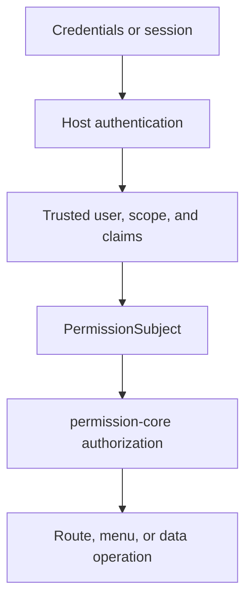

# Authentication Boundary
<!-- docs:inline-parity `PermissionSubject` `isAuthenticated: true` `permissionSubject` `userId` `scope` `req.auth` `VEXT_AUTH_REQUIRED` `INVALID_SUBJECT` `permissionPlugin(options)` `subject.resolve(req)` `resolveSubject` `auth` `req` `userId + scope` `SCOPE_CONFLICT` `claims` `permission` `permission: false` `permission: true` `req.auth.permission.can(action, resource, context?)` `req.auth.permission.data?.collection(name)` `Promise<boolean>` `req.auth.permission.assert(...)` `Promise<void>` `PermissionCoreError` `requirePermissionContext(req)` `{ subject, can, assert, data?, filterResponse }` `hasPermissionContext(req)` `can` `assert` `void` `403` `401` `503` -->

The host authenticates the request first; permission-core answers authorization questions only after it receives a trusted `PermissionSubject`.

## Responsibility Model

This section explains the operation in plain terms, including when to use it, which values must come from trusted server state, and which return fields are safe to read.


<p className="pc-diagram-text" id="pc-diagram-authentication-boundary-en-text" data-diagram-id="authentication-boundary"><strong>Text equivalent.</strong>Credentials or sessions are authenticated by the host first. The host supplies trusted user identity, scope, and claims to build a PermissionSubject. Only then does permission-core authorize the route, menu projection, or data operation; credential checks and account state remain host responsibilities.</p>
## Accepted Vext Shapes

This section explains the operation in plain terms, including when to use it, which values must come from trusted server state, and which return fields are safe to read.

```ts
req.auth = {
  isAuthenticated: true,
  permissionSubject: {
    userId: session.userId,
    scope: { tenantId: session.tenantId, appId: 'admin' },
    claims: { merchantId: session.merchantId },
  },
};
```
```ts
req.auth = {
  isAuthenticated: true,
  userId: session.userId,
  scope: { tenantId: session.tenantId, appId: 'admin' },
  claims: { merchantId: session.merchantId },
};
```
## Custom Subject Resolution

This section explains the operation in plain terms, including when to use it, which values must come from trusted server state, and which return fields are safe to read.

```ts
permissionPlugin({
  monsqlize: msq,
  subject: {
    resolve: async (req) => {
      const auth = req.auth;
      return {
        userId: String(auth.accountId),
        scope: await trustedTenantResolver(auth.sessionId, req),
        claims: { merchantId: String(auth.merchantId) },
      };
    },
  },
});
```

`subject.resolve(req)` runs lazily when a protected request first needs a permission subject. It must read only trusted authentication state and server context. The legacy `resolveSubject(auth, req)` option is still accepted for compatibility, but it is deprecated and cannot be combined with `subject.resolve(req)`.
## Protected and Public Routes

This section explains the operation in plain terms, including when to use it, which values must come from trusted server state, and which return fields are safe to read.

```ts
const allowed = await req.auth.permission.can('read', 'db:orders');
await req.auth.permission.assert('invoke', 'api:POST:/api/orders/export');
const orders = req.auth.permission.data?.collection('orders');
```

The optional data call returns an `AuthorizedCollection` bound to the same request and subject. It is only available when the Vext plugin `data` option is enabled.
## Failure Boundary and Next Step

This section explains the operation in plain terms, including when to use it, which values must come from trusted server state, and which return fields are safe to read.

Continue with [Production Operations](/guide/production-operations).
