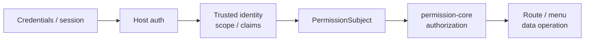

# Authentication Boundary
<!-- docs:inline-parity `PermissionSubject` `isAuthenticated: true` `permissionSubject` `userId` `scope` `req.auth` `VEXT_AUTH_REQUIRED` `INVALID_SUBJECT` `permissionPlugin(options)` `subject.resolve(req)` `resolveSubject` `auth` `req` `userId + scope` `SCOPE_CONFLICT` `claims` `permission` `permission: false` `permission: true` `req.auth.permission.can(action, resource, context?)` `req.auth.permission.data?.collection(name)` `Promise<boolean>` `req.auth.permission.assert(...)` `Promise<void>` `PermissionCoreError` `requirePermissionContext(req)` `{ subject, can, assert, data?, filterResponse }` `hasPermissionContext(req)` `can` `assert` `void` `403` `401` `503` -->

The host authenticates the request first; permission-core answers authorization questions only after it receives a trusted `PermissionSubject`. It does not issue sessions, validate passwords or tokens, refresh credentials, or provide login/logout APIs.

## Responsibility Model


<p className="pc-diagram-text" id="pc-diagram-authentication-boundary-en-text" data-diagram-id="authentication-boundary"><strong>Text equivalent.</strong>Credentials or sessions are authenticated by the host first. The host supplies trusted user identity, scope, and claims to build a PermissionSubject. Only then does permission-core authorize the route, menu projection, or data operation; credential checks and account state remain host responsibilities.</p>

Authentication owns credential checks, account status, session lifetime, and identity recovery. permission-core owns role/rule lookup, deny-first decisions, menu projection, and authorized data operations inside a trusted scope. Business handlers still own object existence and domain invariants.

## Accepted Vext Shapes

The built-in Vext resolver requires `isAuthenticated: true` and accepts exactly one subject shape:

```ts
req.auth = {
  isAuthenticated: true,
  permissionSubject: {
    userId: session.userId,
    scope: { tenantId: session.tenantId, appId: 'admin' },
    claims: { merchantId: session.merchantId },
  },
};
```
```ts
req.auth = {
  isAuthenticated: true,
  userId: session.userId,
  scope: { tenantId: session.tenantId, appId: 'admin' },
  claims: { merchantId: session.merchantId },
};
```

Do not mix `permissionSubject` with the flat `userId`/`scope` shape. Missing `req.auth`, `isAuthenticated: false`, incomplete identity, or conflicting subject shapes fail with `VEXT_AUTH_REQUIRED` or `INVALID_SUBJECT`.

These snippets show the data that the host authentication middleware writes. They are not permission-core method calls or HTTP responses. `req.auth` must be established by trusted server code before the permission middleware runs; a client JSON body with the same keys is not trusted.

## Custom Subject Resolution

Use a resolver when your authentication plugin stores identity in another trusted shape:

```ts
permissionPlugin({
  monsqlize: msq,
  subject: {
    resolve: async (req) => {
      const auth = req.auth;
      return {
        userId: String(auth.accountId),
        scope: await trustedTenantResolver(auth.sessionId, req),
        claims: { merchantId: String(auth.merchantId) },
      };
    },
  },
});
```

`permissionPlugin(options)` returns the Vext plugin synchronously. `subject.resolve(req)` runs lazily when a protected request first needs a permission subject and may return the `PermissionSubject` synchronously or asynchronously. It must read only trusted authentication state and server context; its return value is not an HTTP response.

If `req.auth` also carries a normalized `permissionSubject` or `userId + scope`, the resolver result must point to the same user and complete scope. Mismatches fail with `SCOPE_CONFLICT`; the plugin does not silently pick one. Claims can provide policy values, but copying client headers or request-body values into `claims` does not make them trusted.

## Protected and Public Routes

Routes with no `permission` option, or with `permission: false`, are public from permission-core's point of view and do not force lazy subject resolution. `permission: true` and explicit requirements require authentication and authorization before the handler runs. Application code can also request the lazy context:

```ts
const allowed = await req.auth.permission.can('read', 'db:orders');
await req.auth.permission.assert('invoke', 'api:POST:/api/orders/export');
const orders = req.auth.permission.data?.collection('orders');
```

| Method | Arguments | Raw return or failure |
|---|---|---|
| `req.auth.permission.can(action, resource, context?)` | Current request action/resource plus optional policy context | `Promise<boolean>`; denied decisions return false instead of throwing 403 |
| `req.auth.permission.assert(...)` | Same as `can` | `Promise<void>` when allowed; throws `PermissionCoreError` and Vext maps it to 403 when denied |
| `req.auth.permission.data?.collection(name)` | Protected data collection name for the current request | Returns `AuthorizedCollection`; each operation enforces scope, row rules, and field rules |
| `requirePermissionContext(req)` | A Vext request that passed permission middleware | Lazily returns `{ subject, can, assert, data?, filterResponse }`; missing auth maps to 401 |
| `hasPermissionContext(req)` | Current request | Boolean type guard only; does not trigger lazy resolution |

`can` returns a boolean. `assert` returns `void` on success and maps denied access to `403`. This API belongs to the original request; storing it for jobs, queues, or later requests fails closed.

## Historical Option

Earlier versions exposed `resolveSubject(auth, req)`. It is still present for historical migrations, but new projects should use `subject.resolve(req)` only. The two options cannot be configured together; see the [Vext Plugin API](/api/vext-plugin) for the compatibility rules.

## Failure Boundary and Next Step

Missing or invalid authenticated subjects map to `401`, authenticated-but-denied requests map to `403`, and untrusted authorization state maps to `503`. Do not downgrade database, schema, route-reload, or persistence failures to allow. Background jobs should create a fresh trusted `PermissionSubject` and call core directly.

Continue with [Multi-Tenant Model](/guide/multi-tenant), [Vext Plugin](/guide/vext-plugin), and [Errors API](/api/errors).
