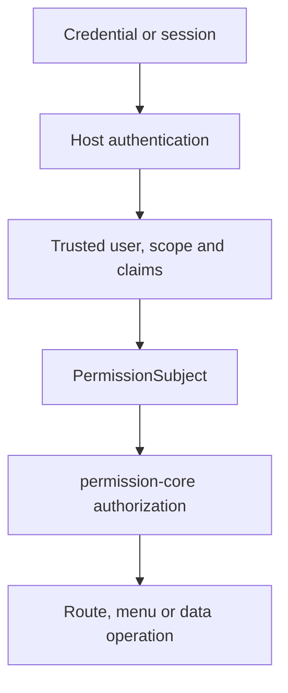

# Authentication Boundary

permission-core answers authorization questions after a host has authenticated the request. It does not issue sessions, verify passwords or tokens, refresh credentials, or provide login/logout endpoints. The boundary is a trusted `PermissionSubject`: canonical user identity, complete tenant scope, and optional trusted claims.

## Responsibility model



<p className="pc-diagram-text" id="pc-diagram-authentication-boundary-en-text" data-diagram-id="authentication-boundary"><strong>Text equivalent.</strong> Credentials or a session are validated by host authentication. The host supplies trusted user identity, scope, and claims to build a `PermissionSubject`; permission-core then authorizes the requested route, menu projection, or data operation. Authentication and account recovery remain host responsibilities.</p>

Authentication owns credential validation, account status, session lifetime, and identity recovery. permission-core owns role/rule lookup, deny-first evaluation, menu projection, and authorized data operations inside the supplied scope. Business handlers still own object existence and domain invariants.

## Accepted Vext shapes

The built-in Vext resolver requires `isAuthenticated: true` and exactly one subject representation:

```ts
req.auth = {
  isAuthenticated: true,
  permissionSubject: {
    userId: session.userId,
    scope: { tenantId: session.tenantId, appId: 'admin' },
    claims: { merchantId: session.merchantId },
  },
};
```

```ts
req.auth = {
  isAuthenticated: true,
  userId: session.userId,
  scope: { tenantId: session.tenantId, appId: 'admin' },
  claims: { merchantId: session.merchantId },
};
```

Do not mix `permissionSubject` with the flattened `userId`/`scope` representation. Missing `req.auth`, false authentication, incomplete identity, or conflicting shapes fail with `VEXT_AUTH_REQUIRED` or `INVALID_SUBJECT`.

## Custom subject resolution

Use a resolver when the authentication plugin exposes another internal shape:

```ts
permissionPlugin({
  monsqlize: msq,
  resolveSubject: async (auth, req) => ({
    userId: String(auth.accountId),
    scope: await trustedTenantResolver(auth.sessionId, req),
    claims: { merchantId: String(auth.merchantId) },
  }),
});
```

If `req.auth` also carries a canonical `permissionSubject` or `userId + scope`, the resolver result must identify the same user and complete scope. A mismatch is `SCOPE_CONFLICT`; the plugin never chooses one source silently. Claims may provide policy values, but callers must not treat a client-supplied header/body value as trusted simply because it was copied into `claims`.

## Protected and public routes

Routes without `permission`, or with `permission: false`, are public to permission-core and do not force lazy subject resolution. `permission: true` and explicit requirements require authentication and authorization before the handler. Application code can also request the lazy context:

```ts
const allowed = await req.auth.permission.can('read', 'db:orders');
await req.auth.permission.assert('invoke', 'api:POST:/api/orders/export');
```

`can` resolves to a boolean. `assert` resolves `void` on success and maps denial to `403`. The request-owned API is valid only during its original request; retaining it for jobs, queues, or later requests fails closed.

## Failure boundary and next step

Use `401` for missing/invalid authenticated subject, `403` for an authenticated subject without permission, and `503` when authorization state cannot be trusted. Do not turn database, schema, reload, or persisted-state failures into an allow. For background work, construct a fresh trusted `PermissionSubject` and call the core directly.

Continue with [Multi-Tenant Model](/guide/multi-tenant), [Vext Plugin](/guide/vext-plugin), and [Errors](/api/errors).
