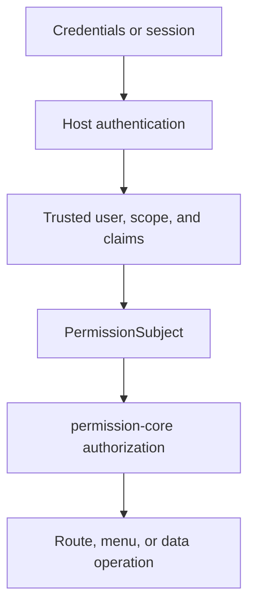

# Authentication Boundary
<!-- docs:inline-parity `PermissionSubject` `isAuthenticated: true` `permissionSubject` `userId` `scope` `req.auth` `VEXT_AUTH_REQUIRED` `INVALID_SUBJECT` `permissionPlugin(options)` `resolveSubject` `auth` `req` `userId + scope` `SCOPE_CONFLICT` `claims` `permission` `permission: false` `permission: true` `req.auth.permission.can(action, resource, context?)` `Promise<boolean>` `req.auth.permission.assert(...)` `Promise<void>` `PermissionCoreError` `requirePermissionContext(req)` `{ subject, can, assert }` `hasPermissionContext(req)` `can` `assert` `void` `403` `401` `503` -->

The host authenticates the request first; permission-core answers authorization questions only after it receives a trusted `PermissionSubject`.

## Responsibility Model

Use this section to connect the previous example with the next concrete API call. Keep the values scoped, trusted, and read from the documented response shape instead of guessing hidden state. The examples keep the same code, JSON, and public identifiers as the Chinese source so both locales describe one behavior contract. Read the raw return notes before copying a summary object into production code.


<p className="pc-diagram-text" id="pc-diagram-authentication-boundary-en-text" data-diagram-id="authentication-boundary"><strong>Text equivalent.</strong>Credentials or sessions are authenticated by the host first. The host supplies trusted user identity, scope, and claims to build a PermissionSubject. Only then does permission-core authorize the route, menu projection, or data operation; credential checks and account state remain host responsibilities.</p>
## Accepted Vext Shapes

Use this section to connect the previous example with the next concrete API call. Keep the values scoped, trusted, and read from the documented response shape instead of guessing hidden state. The examples keep the same code, JSON, and public identifiers as the Chinese source so both locales describe one behavior contract. Read the raw return notes before copying a summary object into production code.

```ts
req.auth = {
  isAuthenticated: true,
  permissionSubject: {
    userId: session.userId,
    scope: { tenantId: session.tenantId, appId: 'admin' },
    claims: { merchantId: session.merchantId },
  },
};
```
```ts
req.auth = {
  isAuthenticated: true,
  userId: session.userId,
  scope: { tenantId: session.tenantId, appId: 'admin' },
  claims: { merchantId: session.merchantId },
};
```
## Custom Subject Resolution

Use this section to connect the previous example with the next concrete API call. Keep the values scoped, trusted, and read from the documented response shape instead of guessing hidden state. The examples keep the same code, JSON, and public identifiers as the Chinese source so both locales describe one behavior contract. Read the raw return notes before copying a summary object into production code.

```ts
permissionPlugin({
  monsqlize: msq,
  resolveSubject: async (auth, req) => ({
    userId: String(auth.accountId),
    scope: await trustedTenantResolver(auth.sessionId, req),
    claims: { merchantId: String(auth.merchantId) },
  }),
});
```
## Protected and Public Routes

Use this section to connect the previous example with the next concrete API call. Keep the values scoped, trusted, and read from the documented response shape instead of guessing hidden state. The examples keep the same code, JSON, and public identifiers as the Chinese source so both locales describe one behavior contract. Read the raw return notes before copying a summary object into production code.

```ts
const allowed = await req.auth.permission.can('read', 'db:orders');
await req.auth.permission.assert('invoke', 'api:POST:/api/orders/export');
```
## Failure Boundary and Next Step

Use this section to connect the previous example with the next concrete API call. Keep the values scoped, trusted, and read from the documented response shape instead of guessing hidden state. The examples keep the same code, JSON, and public identifiers as the Chinese source so both locales describe one behavior contract. Read the raw return notes before copying a summary object into production code.

Continue with [Production Operations](/guide/production-operations).
