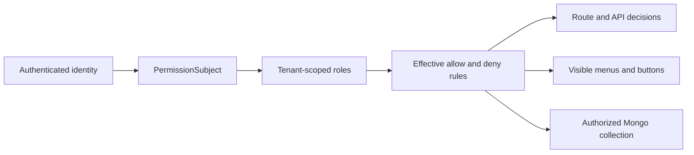

# Introduction

permission-core is a fine-grained authorization library for Node.js applications that use MonSQLize 3.1. It combines durable RBAC management with runtime checks for routes, menus, APIs, rows, and fields.

## What it owns

- tenant-scoped roles, one-parent inheritance, and direct user-role bindings
- allow and deny rules over typed `action + resource` pairs
- menu nodes, API bindings, role-menu grants, revisions, and audit records
- subject decisions, explanations, visible menu projections, and authorized collections
- optional semantic caching backed by the host MonSQLize cache

Every management mutation is persisted through MonSQLize transactions and returns revision and audit evidence. Runtime decisions fail closed when required scope, policy context, database state, or source integrity is unavailable.

## What the host owns

The application still owns authentication, request identity, secrets, its MonSQLize connection, business collections, HTTP error serialization, and operational policy. It must construct a trusted `PermissionSubject`; arbitrary tenant or user headers are not trusted automatically.

permission-core is not an identity provider, login module, ORM, API gateway, or frontend-only menu filter.

## Runtime model

A scope contains at least `tenantId` and can add `appId`, `moduleId`, or `namespace`. The same `userId` and `roleId` may exist in another scope without sharing bindings or rules.

## Supported boundary

| Surface | Supported contract |
|---|---|
| Runtime | Node.js 18 or newer |
| Persistence | A connected `monsqlize@3.1.0` instance; MongoDB is the supported database path |
| Framework | Framework-neutral core plus optional `permission-core/plugins/vext` |
| Cache | Disabled by default; optional caller-attested MonSQLize cache |
| Authentication | Supplied by the host; login is outside this package |

## Choose the next task

Begin with [Quick Start](/guide/quick-start). If you already have the core running, continue with [permission checks](/guide/check-permission), [data permissions](/guide/data-permissions), or [menu management](/guide/menu-management).
