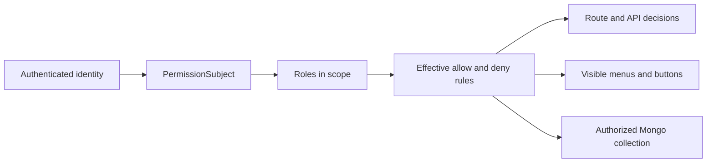

# Introduction
<!-- docs:inline-parity `action + resource` `PermissionSubject` `new PermissionCore(options)` `init()` `PermissionCoreHealth` `pc.scope(scope)` `ScopedPermissionContext` `pc.forSubject(subject, context?)` `SubjectPermissionContext` `subject.can/assert/explain` `subject.menus.*` `subject.data.collection()` `scope()` `forSubject()` `tenantId` `appId` `moduleId` `namespace` `userId` `roleId` `monsqlize@3.1.0` `permission-core/plugins/vext` `scope` `subject` -->

permission-core is a fine-grained authorization library for Node.js applications that already use MonSQLize 3.1. It keeps RBAC state, menus, API bindings, row filters, field permissions, audit evidence, and runtime checks in one tenant-aware model.

## What This Module Owns

permission-core owns tenant-scoped roles, rules, menu and API authorization state, runtime decisions, bounded diagnostics, and optional semantic cache use. Every management write persists through MonSQLize transactions. The examples keep the same code, JSON, and public identifiers as the Chinese source so both locales describe one behavior contract. Read the raw return notes before copying a summary object into production code.

## What the Host Owns

The application still owns login, credentials, sessions, MonSQLize connection lifecycle, business collections, HTTP serialization, and operational policy. permission-core does not turn untrusted request input into a trusted subject. The examples keep the same code, JSON, and public identifiers as the Chinese source so both locales describe one behavior contract. Read the raw return notes before copying a summary object into production code.

## Choosing the Four Capability Layers

The layers are incremental. A service can use only RBAC decisions, while an admin system can add menus, API bindings, row/field guards, and Vext integration later. The examples keep the same code, JSON, and public identifiers as the Chinese source so both locales describe one behavior contract. Read the raw return notes before copying a summary object into production code.

## How the Objects Work Together

`scope()` and `forSubject()` create facades without querying the database. Reads and writes happen only when the subsequent manager, subject, menu, or data methods are called. The examples keep the same code, JSON, and public identifiers as the Chinese source so both locales describe one behavior contract. Read the raw return notes before copying a summary object into production code.

## Runtime Model

The host converts authenticated identity into a `PermissionSubject`. permission-core resolves effective rules in the scope and uses the same state for API decisions, menu projection, button state, and guarded collections. The examples keep the same code, JSON, and public identifiers as the Chinese source so both locales describe one behavior contract. Read the raw return notes before copying a summary object into production code.

<strong>Text equivalent.</strong>The host turns authenticated identity into a complete PermissionSubject. permission-core resolves roles and effective allow or deny rules inside that scope, then uses the same authorization state for route and API checks, visible menus and buttons, and guarded Mongo collection operations.

## Support Boundary

The current supported persistence path is a connected `monsqlize@3.1.0` MongoDB runtime. Authentication remains outside this package, and the optional Vext plugin is imported from `permission-core/plugins/vext`. The examples keep the same code, JSON, and public identifiers as the Chinese source so both locales describe one behavior contract. Read the raw return notes before copying a summary object into production code.

## Choose the Next Task

If the terms are new, read the core concepts page; otherwise go to the quick start, role/user management, permission checks, data permissions, or menu management based on your next job. The examples keep the same code, JSON, and public identifiers as the Chinese source so both locales describe one behavior contract. Read the raw return notes before copying a summary object into production code.

Continue with [Quick Start](/guide/quick-start).
