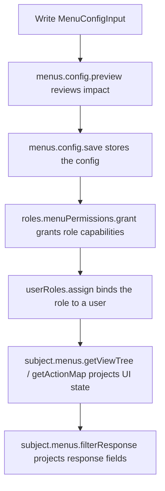

# Manage Menus

Menu management starts from one `MenuConfigInput`: declare menus, views, view load APIs, action APIs, and response fields. permission-core compiles that config into internal inventory when you save it, so most admin systems do not need to manage low-level nodes or API bindings directly.

The basic flow is:



<p className="pc-diagram-text" id="pc-diagram-menu-config-lifecycle-en-text" data-diagram-id="menu-config-lifecycle"><strong>Text equivalent.</strong> The backend writes a MenuConfigInput, previews its impact, and saves it as the source inventory for an admin console. A role-menu grant assigns the relevant views, load APIs, actions, and response fields. After a user receives that role, subject menu runtime projects the visible navigation, action state, view state, and filtered API response.</p>

Saving a menu config does not authorize users. It records what the system can expose; role grants and user-role assignments decide what each user can access.

## A Complete Config

```ts
const menuConfig = {
  configId: 'admin',
  title: 'Admin console',
  menus: [{
    id: 'orders',
    title: 'Orders',
    icon: 'shopping-cart',
    views: [{
      id: 'orders-list',
      type: 'page',
      title: 'Orders',
      path: '/orders',
      component: 'OrdersPage',
      load: [{
        resource: 'api:GET:/api/orders',
        response: {
          target: 'items',
          preserve: ['total'],
          fields: [
            { field: 'orderNo', title: '订单号' },
            { field: 'status', title: '状态' },
            { field: 'amount', title: '金额' },
          ],
        },
      }],
      actions: [{
        id: 'export',
        title: '导出订单',
        resource: 'api:POST:/api/orders/export',
        response: [{ field: 'downloadUrl', title: '下载地址' }],
      }],
    }],
  }],
};
```

| Field | Meaning | Runtime effect |
|---|---|---|
| `configId` | Stable ID for one menu config | Grants and runtime reads use it to find this admin menu. |
| `menus[]` | Navigation groups | A group is not an API permission by itself. |
| `views[]` | Pages, drawers, dialogs, or tabs | `getViewTree()` and `getViewState()` project these per user. |
| `load[].resource` | API called when the page opens | Use `api:METHOD:/path`; action is automatically `invoke`. |
| `actions[].resource` | API or UI resource used by a page action | Supports backend `api:*` and frontend `ui:*` resources. |
| `response` | Fields that can be returned to the frontend | `filterResponse()` projects data according to granted fields. |

`load.resource` must be an `api:` resource, for example `api:GET:/api/orders`. This lets Vext route guards, role-menu grants, and response-field projection use the same resource ID.

## Response Fields

Use an array when the endpoint returns an object or array directly:

```ts
response: [
  { field: 'orderNo', title: '订单号' },
  { field: 'buyer.name', title: '买家姓名' },
]
```

Use an object for common paginated responses:

```ts
response: {
  target: 'items',
  preserve: ['total'],
  fields: [
    { field: 'orderNo', title: '订单号' },
    { field: 'status', title: '状态' },
  ],
}
```

`field` supports dot paths such as `buyer.name`. `target` points to the array or object to project, and `preserve` keeps outer structural fields such as totals or cursors. For a payload shaped like `{ items, total }`, set `target` to `items` and keep `total` in `preserve`. When granting the role later, `include.responseFields: 'none'` means only explicitly selected fields are exposed.

## Preview and Save

```ts
const scoped = pc.scope({ tenantId: 'acme', appId: 'admin' });

const preview = await scoped.menus.config.preview(menuConfig, {
  actorId: 'admin',
});
if (!preview.executable) {
  throw new Error('菜单配置存在冲突，需要先处理');
}

const saved = await scoped.menus.config.save(menuConfig, {
  ...preview.expected,
  previewToken: preview.previewToken,
  actorId: 'admin',
  idempotencyKey: 'admin-menu-v1',
});
```

```json
{
  "changed": true,
  "data": {
    "config": {
      "configId": "admin",
      "revision": 1,
      "menus": [{ "id": "orders", "views": [{ "id": "orders-list" }] }]
    },
    "manifestOperations": { "total": 3 },
    "retainedGrantCount": 0,
    "revokedGrantCount": 0
  }
}
```

`menus.config.preview(config)` computes impact without writing. `menus.config.save(config, options)` writes the config and synchronizes internal menu, API, and response-field assets. Pass the returned `expected` vector and `previewToken` to avoid saving a stale model.

## Change or Remove Configs

Read configs:

```ts
const current = await scoped.menus.config.get('admin');
const page = await scoped.menus.config.list({ first: 20 });
```

Remove a config:

```ts
const previewRemove = await scoped.menus.config.previewRemove('admin');
if (previewRemove.executable) {
  await scoped.menus.config.remove('admin', {
    ...previewRemove.expected,
    previewToken: previewRemove.previewToken,
    actorId: 'admin',
  });
}
```

Apply multiple changes:

```ts
const changes = [
  { operation: 'save', config: menuConfig },
  { operation: 'remove', configId: 'legacy-admin' },
];
const previewChanges = await scoped.menus.config.previewChanges(changes);
if (previewChanges.executable) {
  await scoped.menus.config.applyChanges(changes, {
    ...previewChanges.expected,
    previewToken: previewChanges.previewToken,
  });
}
```

Use single saves for normal admin edits. Use `previewChanges/applyChanges` for plugin installation, module upgrades, or importing several configs at once.

## Grant the Role

After saving the config, the role still has no permission. Grant the page, its load API, its actions, and selected response fields:

```ts
const selection = {
  configId: 'admin',
  views: ['orders-list'],
  responseFields: [{
    apiResource: 'api:GET:/api/orders',
    fields: ['orderNo', 'status'],
  }],
  include: {
    loads: true,
    actions: true,
    responseFields: 'none',
  },
};

const grantPreview = await scoped.roles.menuPermissions.preview(
  'order-operator',
  { operation: 'grant', selection },
);
const granted = await scoped.roles.menuPermissions.grant(
  'order-operator',
  selection,
  {
    ...grantPreview.expected,
    previewToken: grantPreview.previewToken,
  },
);
```

`views` is what the admin selected. `include.loads: true` grants the page load APIs, `include.actions: true` grants page actions, and `responseFields` grants only the named response fields. The grant response includes `generatedSources`, `generatedResponseFields`, and `grantIds` so an admin screen can explain exactly what changed.

## Runtime Reads

```ts
await scoped.userRoles.assign('u-menu', 'order-operator');

const subjectMenus = pc.forSubject({
  userId: 'u-menu',
  scope: { tenantId: 'acme', appId: 'admin' },
}).menus;

const tree = await subjectMenus.getViewTree({ configId: 'admin' });
const state = await subjectMenus.getViewState({ configId: 'admin', viewId: 'orders-list' });
const actions = await subjectMenus.getActionMap({ configId: 'admin', viewId: 'orders-list' });
const response = await subjectMenus.filterResponse('api:GET:/api/orders', {
  items: [{ orderNo: 'O-1001', status: 'paid', amount: 88, internalCost: 51 }],
  total: 1,
  debug: true,
});
```

```json
{
  "viewTreeIds": ["orders"],
  "viewAllowed": true,
  "exportEnabled": true,
  "projectedResponse": {
    "items": [{ "orderNo": "O-1001", "status": "paid" }],
    "total": 1
  }
}
```

`getViewTree()` feeds navigation, `getViewState()` checks page access, `getActionMap()` returns action state, and `filterResponse()` checks `invoke` before projecting response fields on the server.

## Common Mistakes

| Mistake | Correct model |
|---|---|
| Saving a menu gives users access | Save records capabilities; `roles.menuPermissions.grant` and `userRoles.assign` grant access. |
| `load` needs `action: 'invoke'` | It does not. `load.resource` automatically compiles to `invoke`. |
| Response fields are shallow only | Dot paths and `{ target, preserve, fields }` are supported. |
| `filterResponse()` replaces API guards | It does not. Protect business APIs with `subject.assert()` or a Vext guard. |

See the runnable [menu admin example](/examples/menu-admin), [Menus API](/api/menus), and [Configure APIs and Response Fields](/api/api-bindings).
