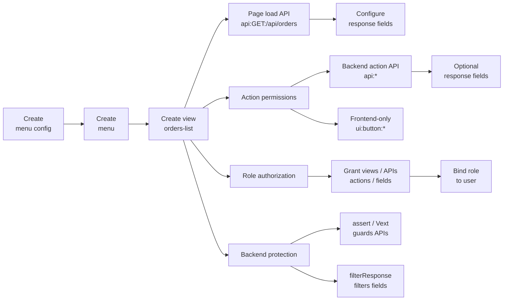

# Manage Menus

The recommended menu-management workflow follows the way an admin UI is usually built: create a menu config first, then create menus, views, page load APIs, actions, and response fields. permission-core compiles those operations into internal menu nodes, API permissions, and response-field inventory; you do not need to maintain `nodes`, `apiBindings`, or owner relationships by hand.

The smallest useful mental model is:



<p className="pc-diagram-text" id="pc-diagram-menu-config-lifecycle-en-text" data-diagram-id="menu-config-lifecycle"><strong>Text equivalent.</strong> The management side creates a menu config, then creates menus and views under it. A view branches into page load APIs, action permissions, role authorization, and backend protection. Load APIs and backend API actions can declare response fields; frontend-only actions use UI permissions. Role authorization grants views, APIs, actions, and fields, role binding makes them effective for users, and backend code protects APIs and response fields with assert, Vext, and filterResponse.</p>

Saving menus is not user authorization. It records what the system can expose; role grants decide what each user can see and invoke. To make those permissions effective for a user, bind the role with `userRoles.assign()` or `userRoles.set()`.

If you are building a normal admin UI, read the first half first and use the incremental object methods. The later `MenuConfigInput`, `menus.config.save()`, and batch-import sections are mainly for plugins, CI/CD, and config-as-code.

## New Projects and Existing Projects

For new projects, keep one main line in mind: manage config with `menus.configs/items/views/loadApis/actions/responses`, grant roles with `roles.menuPermissions`, and project runtime state with `subject.menus.*`.

The older `nodes`, `apiBindings`, and owner model still exists internally for v2 manifests, batch import, and migration compatibility. A normal admin UI should not maintain those records by hand. When you see `menus.config.*`, treat it as the advanced full-config entrypoint for import or config-as-code, not the default save method for form screens.

| What you are building | Use this |
|---|---|
| New admin screens that create menus, views, actions, APIs, and fields one object at a time | `menus.configs/items/views/loadApis/actions/responses` |
| Role authorization for menus, views, actions, APIs, and fields | `roles.menuPermissions.*` |
| Runtime visible menu tree and action state for the current user | `subject.menus.getViewTree()` / `getActionMap()` |
| Plugin install, CI/CD, or full config import | `MenuConfigInput` + `menus.config.save()` |
| Historical v2 manifest maintenance or compatibility migration | Migration tooling that handles `nodes` / `apiBindings` / owner records |

## Open the management page: read the full tree first

When a menu-management page opens, the first step is usually not creating a menu. Read the full tree first:

```ts
const current = await scoped.menus.configs.get('admin');
const menuTree = current.data.menus;
```

`menuTree` is the complete management config tree. It includes menus, child menus, views, page load APIs, actions, and response-field config.

Do not use `list()` to read the tree. `menus.configs.list()` / `menus.config.list()` only pages through summaries for multiple menu configs, such as `admin`, `merchant-console`, and `ops-console`; it does not return tree nodes.

Do not confuse this with user runtime `subject.menus.getViewTree()`: that method filters by the current user's grants and is for frontend navigation. A management config page should read the complete tree with `scoped.menus.configs.get(configId)`.

## Recommended admin page layout

The easiest admin page to understand looks like this:

```text
Left: menu tree
Right: config area for the selected node
  - Menu info
  - Views
  - Page load APIs
  - Action permissions
  - Response fields
```

The user selects a menu or view on the left, and the right side shows only the things that node can configure. The frontend forms then map almost directly to backend methods:

| Right-side form | Save method | Mental model |
|---|---|---|
| Menu info | `menus.items.create()` / `update()` | Create or edit a left-side navigation node. |
| Views | `menus.views.create()` / `update()` | Attach a page, tab, dialog, or drawer under a menu. |
| Page load APIs | `menus.loadApis.add()` | Register the backend API called when the page opens. |
| Action permissions | `menus.actions.create()` | Register page actions; `resource` decides backend API vs frontend-only UI permission. |
| Response fields | `menus.responses.set()` | Declare which response fields can be granted to roles. |

## Which entrypoint should I use?

Normal admin screens should use the incremental methods first. Use the advanced entries only for batch import or config-as-code.

| Scenario | Recommended entrypoint | Notes |
|---|---|---|
| Admin page saves one form at a time | `menus.configs/items/views/loadApis/actions/responses` | Default choice; each form saves the object it owns. |
| One Save button commits several form actions | `menus.management.applyChanges()` | For example, create a menu, view, and load API together. |
| Plugin install, CI/CD, or full menu import | `MenuConfigInput` + `menus.config.save()` | Advanced entry; means “replace the full config”. |

## Recommended admin UI workflow

With the left tree and right-side forms in place, each form saves only the thing it owns.

```ts
const scoped = pc.scope(
  { tenantId: 'acme', appId: 'admin' },
  { actorId: 'admin', requestId: 'req-menu-admin-save' },
);

await scoped.menus.configs.create({
  configId: 'admin',
  title: 'Admin console',
});

await scoped.menus.items.create('admin', {
  id: 'orders',
  title: '订单中心',
  icon: 'shopping-cart',
});

await scoped.menus.views.create('admin', 'orders', {
  id: 'orders-list',
  type: 'page',
  title: '订单列表',
  path: '/orders',
  component: 'OrdersPage',
});

await scoped.menus.loadApis.add('admin', 'orders-list', {
  resource: 'api:GET:/api/orders',
});

await scoped.menus.actions.create('admin', 'orders-list', {
  id: 'export',
  title: '导出订单',
  resource: 'api:POST:/api/orders/export',
});

await scoped.menus.responses.set('admin', {
  owner: {
    ownerType: 'load',
    viewId: 'orders-list',
    resource: 'api:GET:/api/orders',
  },
  response: {
    target: 'items',
    preserve: ['total'],
    fields: [
      { field: 'orderNo', title: '订单号' },
      { field: 'status', title: '状态' },
    ],
  },
});
```

The first `scope` argument is still only the permission namespace, such as tenant and app. The second argument is the default audit context for this admin request. That keeps `actorId` out of the tenant scope while avoiding repeated options on every write.

That is the usual persistence order for a menu-management page:

| Step | Admin form | Method | What it saves |
|---|---|---|---|
| 1 | Create menu config | `menus.configs.create()` | Creates an empty config, such as `admin`. |
| 2 | Create menu | `menus.items.create()` | Creates a left-side menu, such as Orders. |
| 3 | Create view | `menus.views.create()` | Attaches the orders list page under the orders menu. |
| 4 | Configure page API | `menus.loadApis.add()` | Registers `api:GET:/api/orders` as the API called when the page opens. |
| 5 | Configure action | `menus.actions.create()` | Creates the export action; if it is `api:*`, the action calls the backend. |
| 6 | Configure response fields | `menus.responses.set()` | Declares which fields of the orders API can be granted to roles. |

A real admin usually has more than one menu. Extend the same model like this:

| Left menu | Right-side view | Page load API | Actions |
|---|---|---|---|
| Orders | Orders list | `api:GET:/api/orders` | Export, approve, delete |
| Merchants | Merchant list | `api:GET:/api/merchants` | Disable, view details |
| Settings | User management | `api:GET:/api/users` | Reset password, assign roles |

For ordinary create/update/add/set work, call the execution method directly as above. permission-core internally previews the change, commits it if there is no conflict, and throws `MENU_MANAGEMENT_PREVIEW_CONFLICT` when the change is not safe to auto-commit. At that point, show an explicit preview to the administrator.

If one admin page needs to commit several form actions with one Save button, use `menus.management.applyChanges()`:

```ts
const result = await scoped.menus.management.applyChanges('admin', [
  {
    operation: 'menu.create',
    input: { id: 'merchant', title: '商户中心' },
  },
  {
    operation: 'view.create',
    menuId: 'merchant',
    input: { id: 'merchant-list', type: 'page', title: '商户列表', path: '/merchants', component: 'MerchantListPage' },
  },
  {
    operation: 'loadApi.add',
    viewId: 'merchant-list',
    input: { resource: 'api:GET:/api/merchants' },
  },
]);
```

| Admin action | Method |
|---|---|
| Create an empty config | `menus.configs.previewCreate()` / `menus.configs.create()` |
| Create, rename, or delete menus | `menus.items.previewCreate()` / `create()` / `previewUpdate()` / `update()` / `previewRemove()` / `remove()` |
| Create, update, or delete views | `menus.views.*` |
| Add page load APIs | `menus.loadApis.previewAdd()` / `add()` |
| Add buttons or actions | `menus.actions.previewCreate()` / `create()` |
| Configure API response fields | `menus.responses.previewSet()` / `set()` |

`menus.configs.create()` can create an empty config so the admin UI can build the tree gradually. `menus.config.save({ menus: [] })` still fails because that legacy batch entrypoint means “replace the full config”; an empty array can accidentally delete the whole menu model.

When should you use explicit preview?

| Scenario | Recommendation |
|---|---|
| Ordinary menu/view/API/action/field create or update | Bind `actorId/requestId` with `pc.scope(scope, defaults)`, then call `create/update/add/set` directly. |
| Delete with `cascade: true` or `revokeGrants: true` | Call `previewRemove()` first, show impact, then execute with `expected/previewToken`. |
| The method throws `MENU_MANAGEMENT_PREVIEW_CONFLICT` | Show `error.details.operations/conflicts`, then ask the admin to confirm or change the input. |
| The admin UI needs to show “what will change” before saving | Call `preview*()` first, then execute with the same input. |

`idempotencyKey` is an optional advanced override. Normal code does not need to write it by hand. When `requestId` is present, permission-core derives an internal idempotency key for duplicate-submission protection: double-clicked Save buttons, browser timeout retries, or gateway redelivery. Pass `idempotencyKey` explicitly only when integrating an external gateway, queue, or existing idempotency protocol.

With explicit preview, `preview.executable === true` means the current change has no conflicts and can be executed with the same input. `preview.executable === false` means it cannot be submitted; show `preview.conflicts` instead. Do not mutate the input after preview and before execution.

## Management actions in detail

Object methods are best for normal admin forms. Every write follows the same pattern:

```ts
const result = await scoped.menus.items.create('admin', input);
```

`create/update/add/set()` returns `MutationResult<MenuManagementResult>` and really writes the config, internal menu nodes, API contracts, and response-field inventory. `preview*()` returns `ImpactPreview<MenuManagementPlan>` and is read-only; use it for deletes, capacity risk, or UIs that need to show impact before committing.

Prefer binding `actorId/requestId` once with `pc.scope(scope, defaults)`. Per-call `options` are only needed to override defaults, submit explicit preview credentials, or acknowledge capacity risk. `idempotencyKey` is not part of the permission model; it only overrides the default strategy for advanced integrations.

This section focuses on which method to use and when. Detailed response fields such as `revisions`, `operationId`, `auditId`, `manifestOperations`, and other debug counters can be skipped at first; use the [Menus API](/api/menus) when you need the exact shape.

### Create an empty config

When initializing menu management, the backend usually reads the config by `configId` first; if it does not exist, call `menus.configs.create()` to create the empty container. The UI does not need a separate first-visit flag and should not call `create` on every page open. Existing configs should be read or updated, then menus and views can be added incrementally.

```ts
const input = {
  configId: 'admin',
  title: 'Admin console',
};

const created = await scoped.menus.configs.create(input);
```

If the UI wants to show impact first, call `previewCreate()`. A successful write returns the latest config, an operation summary, and an audit ID; see the [Menus API](/api/menus) for the exact response shape.

### Create, update, and delete menus

A menu is a left-side navigation node. Omit `parentId` for a top-level menu; pass `parentId` for a child menu.

```ts
const menuInput = {
  id: 'orders',
  title: '订单中心',
  icon: 'shopping-cart',
};

const created = await scoped.menus.items.create('admin', menuInput);
```

After creation, this menu node appears in `current.data.menus`. See the [Menus API](/api/menus) when you need the full response fields.

Rename the menu or change its icon:

```ts
await scoped.menus.items.update('admin', 'orders', {
  title: '订单管理',
  icon: 'receipt',
});
```

Delete a menu:

```ts
const preview = await scoped.menus.items.previewRemove('admin', 'orders', {
  cascade: true,
  revokeGrants: true,
});

await scoped.menus.items.remove('admin', 'orders', {
  cascade: true,
  revokeGrants: true,
}, {
  ...preview.expected,
  previewToken: preview.previewToken,
});
```

`cascade: true` deletes descendant menus, views, actions, and response fields together. `revokeGrants: true` also revokes role-menu grants that would become invalid.

### Create, update, and delete views

Views live under menus. A single menu can have several pages, and can also contain `tab`, `dialog`, or `drawer` views.

```ts
const viewInput = {
  id: 'orders-list',
  type: 'page',
  title: '订单列表',
  path: '/orders',
  component: 'OrdersPage',
};

await scoped.menus.views.create('admin', 'orders', viewInput);
```

After creation, this view appears under the owning menu's `views`.

Update a view:

```ts
await scoped.menus.views.update('admin', 'orders-list', {
  title: '订单查询',
  component: 'OrderSearchPage',
});
```

Delete a view:

```ts
const preview = await scoped.menus.views.previewRemove('admin', 'orders-list', {
  cascade: true,
  revokeGrants: true,
});

await scoped.menus.views.remove('admin', 'orders-list', {
  cascade: true,
  revokeGrants: true,
}, {
  ...preview.expected,
  previewToken: preview.previewToken,
});
```

Deleting a view can affect its load APIs, actions, and response fields. Check `preview.plan.affectedRoles` before executing.

### Add, update, and delete page load APIs

A page load API is a backend API that must be called when the page opens. You do not write `action: 'invoke'`; the system compiles it into `invoke + api:*`.

```ts
const loadInput = {
  resource: 'api:GET:/api/orders',
};

await scoped.menus.loadApis.add('admin', 'orders-list', loadInput);
```

After saving, this API appears in the view's `load` list and becomes part of later role authorization and backend API protection.

Update load API response fields or metadata:

```ts
await scoped.menus.loadApis.update(
  'admin',
  'orders-list',
  'api:GET:/api/orders',
  {
    response: {
      target: 'items',
      preserve: ['total'],
      fields: [
        { field: 'orderNo', title: '订单号' },
        { field: 'status', title: '状态' },
      ],
    },
  },
);
```

Ordinary updates do not need per-call `options`. If `actorId/requestId` were bound with `pc.scope(scope, defaults)`, audit and idempotency context are carried automatically.

Delete a load API:

```ts
const preview = await scoped.menus.loadApis.previewRemove(
  'admin',
  'orders-list',
  'api:GET:/api/orders',
  { revokeGrants: true },
);

await scoped.menus.loadApis.remove(
  'admin',
  'orders-list',
  'api:GET:/api/orders',
  { revokeGrants: true },
  {
    ...preview.expected,
    previewToken: preview.previewToken,
  },
);
```

### Create, update, and delete actions

Actions live under views. If `resource` is `api:*`, the action calls a backend endpoint; if `resource` is `ui:button:*`, it is a frontend-only permission point.

```ts
const actionInput = {
  id: 'export',
  title: '导出订单',
  resource: 'api:POST:/api/orders/export',
};

await scoped.menus.actions.create('admin', 'orders-list', actionInput);
```

After saving, this action appears in the view's `actions`. Role authorization can select it, and runtime code uses `getActionMap()` to project its state.

Frontend-only action:

```ts
await scoped.menus.actions.create('admin', 'orders-list', {
  id: 'show-cost-column',
  title: '显示成本列',
  resource: 'ui:button:orders.show-cost-column',
});
```

Update an action:

```ts
await scoped.menus.actions.update('admin', 'orders-list', 'export', {
  title: '导出订单 Excel',
  enabled: true,
});
```

Delete an action:

```ts
const preview = await scoped.menus.actions.previewRemove('admin', 'orders-list', 'export', {
  revokeGrants: true,
});

await scoped.menus.actions.remove('admin', 'orders-list', 'export', {
  revokeGrants: true,
}, {
  ...preview.expected,
  previewToken: preview.previewToken,
});
```

### Set and delete API response fields

Response-field permissions belong to the API response DTO, not to database fields. Field configuration must point to an existing page load API or API action.

```ts
const responseInput = {
  owner: {
    ownerType: 'load',
    viewId: 'orders-list',
    resource: 'api:GET:/api/orders',
  },
  response: {
    target: 'items',
    preserve: ['total'],
    fields: [
      { field: 'orderNo', title: '订单号' },
      { field: 'status', title: '状态' },
      { field: 'amount', title: '金额' },
    ],
  },
};

await scoped.menus.responses.set('admin', responseInput);
```

After saving, these fields become selectable in role authorization. Whether a user actually receives them still depends on role-menu grants.

Action APIs can also declare response fields:

```ts
await scoped.menus.responses.set('admin', {
  owner: {
    ownerType: 'action',
    viewId: 'orders-list',
    actionId: 'export',
  },
  response: {
    fields: [
      { field: 'downloadUrl', title: '下载地址' },
    ],
  },
});
```

Delete selected fields:

```ts
const preview = await scoped.menus.responses.previewRemove('admin', {
  owner: {
    ownerType: 'load',
    viewId: 'orders-list',
    resource: 'api:GET:/api/orders',
  },
  target: 'items',
  fields: ['amount'],
  revokeGrants: true,
});

await scoped.menus.responses.remove('admin', {
  owner: {
    ownerType: 'load',
    viewId: 'orders-list',
    resource: 'api:GET:/api/orders',
  },
  target: 'items',
  fields: ['amount'],
  revokeGrants: true,
}, {
  ...preview.expected,
  previewToken: preview.previewToken,
});
```

Omit `fields` to delete the whole response-field config for the API. If fields have already been granted to roles, use `revokeGrants: true` to avoid stale field grants.

### Commit several admin-form actions at once

If one admin page saves a menu, view, API, and action together, use `menus.management.applyChanges()`. It uses the same compiler as the object methods, but combines many changes into one internal preview and one commit. If the page wants to show impact first, call `previewChanges()` before executing.

```ts
const changes = [
  { operation: 'menu.create', input: { id: 'merchant', title: '商户中心' } },
  {
    operation: 'view.create',
    menuId: 'merchant',
    input: {
      id: 'merchant-list',
      type: 'page',
      title: '商户列表',
      path: '/merchants',
      component: 'MerchantListPage',
    },
  },
  {
    operation: 'loadApi.add',
    viewId: 'merchant-list',
    input: { resource: 'api:GET:/api/merchants' },
  },
] as const;

await scoped.menus.management.applyChanges('admin', changes);
```

If the admin UI wants to show “what will be created”, call `previewChanges()` first. A successful commit returns a summary of created, updated, and deleted assets; see the [Menus API](/api/menus) for the exact response shape.

## Advanced: config-as-code and batch imports

If plugins, CI/CD jobs, or config files import a complete menu, keep the large `MenuConfigInput` workflow out of the normal admin path. Read the dedicated advanced page instead: [Menu Config as Code and Batch Imports](/guide/menu-config-as-code).

## Grant menu capabilities to a role

After saving the config, the role still has no permission. To let the role see the orders page, call the load API, see the export action, and receive only selected fields, grant the menu capabilities separately:

```ts
const selection = {
  configId: 'admin',
  views: ['orders-list'],
  responseFields: [{
    apiResource: 'api:GET:/api/orders',
    target: 'items',
    fields: ['orderNo', 'status'],
  }],
  include: {
    loads: true,
    actions: true,
    responseFields: 'none',
  },
};

const grantPreview = await scoped.roles.menuPermissions.preview(
  'order-operator',
  { operation: 'grant', selection },
);
const granted = await scoped.roles.menuPermissions.grant(
  'order-operator',
  selection,
  {
    ...grantPreview.expected,
    previewToken: grantPreview.previewToken,
  },
);
```

`views` is what the administrator selected. By default, the selection includes page load APIs, does not automatically include actions, and does not select all response fields. `include.loads: true` grants the page load APIs; `include.actions: true` grants the page buttons or operations; `responseFields` explicitly grants selected fields. For paginated responses, use `target: 'items'` to name the projected array. `include.responseFields: 'none'` means only fields listed in `responseFields` are granted.

See [Authorize Role Menus](/guide/role-menu-authorization) for the full authorization rules.

## Read user menus and API responses

```ts
await scoped.userRoles.assign('u-menu', 'order-operator');

const subjectMenus = pc.forSubject({
  userId: 'u-menu',
  scope: { tenantId: 'acme', appId: 'admin' },
}).menus;

const tree = await subjectMenus.getViewTree({ configId: 'admin' });
const state = await subjectMenus.getViewState({ configId: 'admin', viewId: 'orders-list' });
const actions = await subjectMenus.getActionMap({ configId: 'admin', viewId: 'orders-list' });
const response = await subjectMenus.filterResponse('api:GET:/api/orders', {
  items: [{ orderNo: 'O-1001', status: 'paid', amount: 88, internalCost: 51 }],
  total: 1,
  debug: true,
});
const projectedResponse = response.data;
```

```json
{
  "viewTreeIds": ["orders"],
  "viewAllowed": true,
  "exportEnabled": true,
  "projectedResponse": {
    "items": [{ "orderNo": "O-1001", "status": "paid" }],
    "total": 1
  }
}
```

`getViewTree()` feeds frontend navigation; `getViewState()` decides whether a view can be entered; `getActionMap()` returns visibility and enabled state for each action; `filterResponse()` first checks whether the user can `invoke` the `api:` resource and then projects the response according to field grants. The actual projected business payload is in `response.data`. This is backend response filtering, not frontend field hiding.

## Common misunderstandings

| Misunderstanding | Correct model |
|---|---|
| Saving menus gives users permission | Saving only records system capabilities; you still need `roles.menuPermissions.grant` and `userRoles.assign`. |
| `load` must include `action: 'invoke'` | No. `load.resource` with `api:` is compiled into `invoke`. |
| Response fields only support one level | They support dot paths, and `{ target, preserve, fields }` handles paginated responses. |
| Selecting a view automatically grants all response fields | No. Views grant load APIs by default, not fields; select fields explicitly or set `include.responseFields: 'all'`. |
| `filterResponse()` can replace API authorization | No. It checks API permission too, but business endpoints should still use `subject.assert()` or a Vext guard at the entrypoint. |

Next, configure page load APIs, action APIs, and response fields in [Configure APIs and Response Fields](/guide/api-bindings). See the runnable [Menu Admin Example](/examples/menu-admin), exact [Menus API](/api/menus), and [Configure APIs and Response Fields API](/api/api-bindings).
