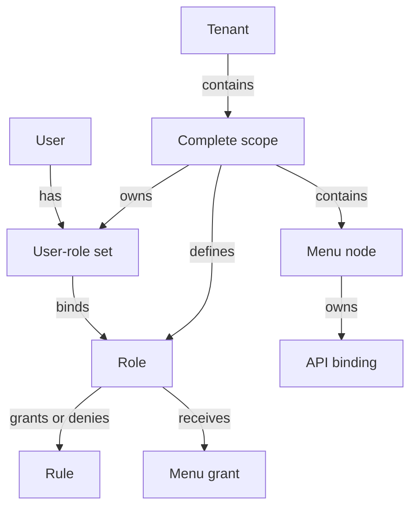

# Multi-Tenant Model

Tenant isolation is part of every authorization identity, not a filter added by convention. Roles, user bindings, rules, menus, API bindings, revisions, audit state, cache keys, and data operations all live inside a normalized scope.

## Relationship model



<p className="pc-diagram-text" id="pc-diagram-tenant-relationship-en-text" data-diagram-id="tenant-relationship"><strong>Text equivalent.</strong> A tenant contains one or more complete scopes. Each scope independently owns roles, user-role sets, menu nodes, and their API bindings; users bind to roles through the user-role set, while roles own allow/deny rules and menu grants. Reusing a user ID or role ID in another scope does not share authorization state.</p>

`tenantId` is required. `appId`, `moduleId`, and `namespace` are optional additional dimensions. A user is identified by `userId` plus the complete scope; a role ID has meaning only inside that same complete scope.

## Same identifiers, isolated state

```ts
const scopeA = { tenantId: 'tenant-a', appId: 'admin' };
const scopeB = { tenantId: 'tenant-b', appId: 'admin' };
const tenantA = pc.scope(scopeA);
const tenantB = pc.scope(scopeB);

await tenantA.roles.create({ id: 'manager', label: 'A manager' });
await tenantA.roles.allow('manager', {
  action: 'read', resource: 'ui:page:tenant-a-dashboard',
});
await tenantA.userRoles.assign('same-user', 'manager');

await tenantB.roles.create({ id: 'manager', label: 'B manager' });
await tenantB.roles.allow('manager', {
  action: 'read', resource: 'ui:page:tenant-b-dashboard',
});
await tenantB.userRoles.assign('same-user', 'manager');
```

```json
{
  "tenantAOwnResource": true,
  "tenantACrossResource": false,
  "tenantBOwnResource": true,
  "tenantBCrossResource": false
}
```

The database may contain the same `roleId` and `userId` values for both tenants, but their canonical scope keys and indexes differ. No global role lookup or unscoped user assignment exists in the public management API.

## Construct trusted subjects

Build the scope from authenticated server state or a trusted server-side resolver. Do not copy arbitrary `x-tenant-id` or request-body values into `PermissionSubject` merely because they are present. When two trusted sources disagree, reject with `SCOPE_CONFLICT` rather than choosing one.

```ts
const subject = pc.forSubject({
  userId: session.userId,
  scope: {
    tenantId: session.tenantId,
    appId: 'admin',
  },
  claims: { merchantId: session.merchantId },
});
```

Scope and subject IDs are trimmed, bounded to 128 UTF-8 bytes, and reject control characters, malformed Unicode, unknown keys, and reserved identifiers.

## Enforce scope in business data

Authorized collections require an explicit field mapping for every scope dimension in use:

```ts
const orders = subject.data.collection('orders', {
  resource: 'db:orders',
  scopeFields: {
    tenantId: 'tenantId',
    appId: 'applicationId',
  },
});
```

Reads and writes add exact scalar equality for these fields. Array, object, missing, or mismatched values do not count as the tenant value. Inserts receive trusted scope values; updates cannot mutate scope fields outside the authorized scope.

## Persistence, cache, and audit isolation

Permission collections use a canonical scope key and scope-aware unique indexes. Revision vectors are advanced within that scope. Semantic cache keys include the core namespace, scope, subject, claims/context fingerprints, and read family. Invalidation targets affected scope/role/user families rather than flushing another tenant.

Mutation audit evidence includes scope-owned revision and operation identity. Logs and metrics should expose a tenant-safe hash or approved label, not accept an untrusted tenant string as the only correlation key.

## Operational checks

- Test the same user and role IDs in two scopes, including cross-resource denials.
- Test every configured `scopeFields` dimension on find, count, insert, update, and delete.
- Use the same scope dimensions on every service instance and in Vext authentication integration.
- Treat changing the scope model as a schema contract change, not a UI setting.

Run the [Multi-Tenant example](/examples/multi-tenant), then use [Core and Contexts](/api/core-and-contexts) for exact subject and scope signatures.
