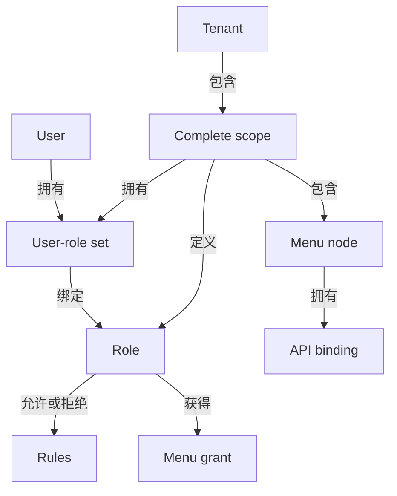

# Multi-Tenant Model
<!-- docs:inline-parity `tenantId` `appId` `moduleId` `namespace` `userId` `can()` `pc.scope(scope)` `roles.create/allow` `userRoles.assign` `pc.forSubject(input)` `subject.can(action, resource)` `roleId` `x-tenant-id` `PermissionSubject` `SCOPE_CONFLICT` `forSubject()` `claims` `scope` `data.collection()` `AuthorizedCollection` `name='orders'` `resource='db:orders'` `scopeFields` -->

Tenant isolation is part of every authorization identity. Roles, bindings, menus, APIs, revisions, audit state, cache keys, and data operations all live inside a normalized scope.

## Relationship Model

Use this section to connect the previous example with the next concrete API call. Keep the values scoped, trusted, and read from the documented response shape instead of guessing hidden state. The examples keep the same code, JSON, and public identifiers as the Chinese source so both locales describe one behavior contract. Read the raw return notes before copying a summary object into production code.


<p className="pc-diagram-text" id="pc-diagram-tenant-relationship-en-text" data-diagram-id="tenant-relationship"><strong>Text equivalent.</strong>A tenant contains one or more complete scopes. Each scope independently owns roles, user-role sets, menu nodes, and API bindings. Users bind to roles through a scoped assignment set, and roles hold allow or deny rules plus menu grants. Reusing the same userId or roleId in another scope does not share authorization state.</p>
## Same Identifiers, Isolated State

Use this section to connect the previous example with the next concrete API call. Keep the values scoped, trusted, and read from the documented response shape instead of guessing hidden state. The examples keep the same code, JSON, and public identifiers as the Chinese source so both locales describe one behavior contract. Read the raw return notes before copying a summary object into production code.

```ts
const scopeA = { tenantId: 'tenant-a', appId: 'admin' };
const scopeB = { tenantId: 'tenant-b', appId: 'admin' };
const tenantA = pc.scope(scopeA);
const tenantB = pc.scope(scopeB);

await tenantA.roles.create({ id: 'manager', label: 'A manager' });
await tenantA.roles.allow('manager', {
  action: 'read', resource: 'ui:page:tenant-a-dashboard',
});
await tenantA.userRoles.assign('same-user', 'manager');

await tenantB.roles.create({ id: 'manager', label: 'B manager' });
await tenantB.roles.allow('manager', {
  action: 'read', resource: 'ui:page:tenant-b-dashboard',
});
await tenantB.userRoles.assign('same-user', 'manager');

const subjectA = pc.forSubject({ userId: 'same-user', scope: scopeA });
const subjectB = pc.forSubject({ userId: 'same-user', scope: scopeB });
const tenantAOwnResource = await subjectA.can('read', 'ui:page:tenant-a-dashboard');
const tenantACrossResource = await subjectA.can('read', 'ui:page:tenant-b-dashboard');
const tenantBOwnResource = await subjectB.can('read', 'ui:page:tenant-b-dashboard');
const tenantBCrossResource = await subjectB.can('read', 'ui:page:tenant-a-dashboard');
```
```json
{
  "tenantAOwnResource": true,
  "tenantACrossResource": false,
  "tenantBOwnResource": true,
  "tenantBCrossResource": false
}
```
## Construct a Trusted Subject

Use this section to connect the previous example with the next concrete API call. Keep the values scoped, trusted, and read from the documented response shape instead of guessing hidden state. The examples keep the same code, JSON, and public identifiers as the Chinese source so both locales describe one behavior contract. Read the raw return notes before copying a summary object into production code.

```ts
const subject = pc.forSubject({
  userId: session.userId,
  scope: {
    tenantId: session.tenantId,
    appId: 'admin',
  },
  claims: { merchantId: session.merchantId },
});
```
## Enforce Scope in Business Data

Use this section to connect the previous example with the next concrete API call. Keep the values scoped, trusted, and read from the documented response shape instead of guessing hidden state. The examples keep the same code, JSON, and public identifiers as the Chinese source so both locales describe one behavior contract. Read the raw return notes before copying a summary object into production code.

```ts
const orders = subject.data.collection('orders', {
  resource: 'db:orders',
  scopeFields: {
    tenantId: 'tenantId',
    appId: 'applicationId',
  },
});
```
## Persistence, Cache, and Audit Isolation

Use this section to connect the previous example with the next concrete API call. Keep the values scoped, trusted, and read from the documented response shape instead of guessing hidden state. The examples keep the same code, JSON, and public identifiers as the Chinese source so both locales describe one behavior contract. Read the raw return notes before copying a summary object into production code.

## Operational Checks

Use this section to connect the previous example with the next concrete API call. Keep the values scoped, trusted, and read from the documented response shape instead of guessing hidden state. The examples keep the same code, JSON, and public identifiers as the Chinese source so both locales describe one behavior contract. Read the raw return notes before copying a summary object into production code.

Continue with [Cache](/guide/cache).
