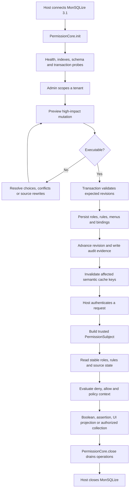

# Permission Lifecycle

Authorization is a lifecycle, not one `can()` call. The host establishes trusted identity and database ownership; management writes create durable state; request-time reads build a consistent snapshot; cache and audit evidence follow committed revisions.

## End-to-end flow



<p className="pc-diagram-text" id="pc-diagram-permission-lifecycle-en-text" data-diagram-id="permission-lifecycle"><strong>Text equivalent.</strong> The host connects MonSQLize and initializes PermissionCore. Administrators preview and transactionally commit revisioned roles, rules, menus, bindings, audit evidence, and cache invalidation. Each authenticated request becomes a trusted subject whose stable snapshot produces a decision or authorized operation. Shutdown first drains PermissionCore work, then the host closes MonSQLize.</p>

## Initialization

`init()` validates the MonSQLize capability contract, database health, permission indexes, transaction support, schema contract, custom resource probes, and optional cache backend. Until it reaches `lifecycle: 'ready'`, runtime operations fail with `NOT_INITIALIZED` or a more specific configuration/database error.

A configured `tokenSecret` makes preview and cursor tokens stable across instances that share the same permission namespace. The generated default is process-local and should not be used when tokens cross instances or restarts.

## Management write path

Small additive writes such as role creation and one rule grant execute directly. Destructive, structural, replacement, or high-impact changes use preview plus execute. The signed preview binds the request, impact plan, capacity assessment, and expected revision vector.

Inside one MonSQLize transaction the runtime rechecks revisions, source integrity, hierarchy, capacity, and idempotency before committing. A successful `MutationResult` includes:

```json
{
  "committed": true,
  "changed": true,
  "revision": 12,
  "revisions": { "global": 12, "rbac": 7, "menu": 5, "audit": 12 },
  "operationId": "...",
  "auditId": "...",
  "replayed": false,
  "cache": { "status": "completed" },
  "warnings": { "total": 0, "items": [], "truncated": false }
}
```

`revision` is a convenient aggregate revision; `revisions` identifies the affected domains and entities. Admin clients should use the expected revision returned by their read or preview, handle `REVISION_CONFLICT`, and never manufacture a new expected value.

## Request decision path

The host converts authenticated server state into a `PermissionSubject`. A decision reads a stable user-role set, active role chain, manual and menu-generated rules, source integrity, claims, and explicit policy context. Applicable denies win over allows; no allow is default deny; unknown required context fails closed.

`can` returns a boolean, `assert` throws on denial, `explain` returns a bounded trace, menu methods project safe UI state, and `AuthorizedCollection` executes data operations with the same authorization snapshot. Authentication remains outside this lifecycle.

## Cache and audit ordering

The database is the source of truth. When caching is enabled, a read may use a revision-bound semantic entry; mutations commit first and then invalidate affected key families. Cache failure degrades health and causes database fallback where safe. It never turns an old allow into authoritative state.

Every committed management mutation writes durable audit evidence in the same transactional workflow and returns `operationId` and `auditId`. The public API exposes these identifiers and audit revision evidence; the host should correlate them with request and business audit logs without recording untrusted tenant data as authority.

## Failure and shutdown

Schema mismatch, corrupted persisted state, missing policy context, stale previews, database outages, and route-manifest reloads close the affected path. Recovery must restore a coherent source of truth; bypassing checks or serving stale authorization is not a supported fallback.

`close()` stops new leases and waits up to `closeDrainTimeoutMs` for active operations and borrowed transactions. It closes permission-owned state only. The host closes MonSQLize after permission-core has drained.

Use [Production Operations](/guide/production-operations) for readiness and incident handling, and [Audit and Health](/api/audit-and-health) for the exact public evidence surface.
