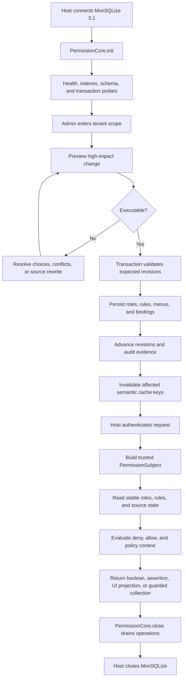

# Permission Lifecycle
<!-- docs:inline-parity `can()` `pc.init()` `PermissionCoreHealth` `pc.scope()` `forSubject()` `roles.create/allow` `userRoles.assign` `subject.can()` `pc.close()` `Promise<void>` `msq.close()` `init()` `lifecycle: 'ready'` `NOT_INITIALIZED` `tokenSecret` `MutationResult` `ruleResult` `ruleResult.data` `close()` `revision` `revisions` `REVISION_CONFLICT` `PermissionSubject` `can` `assert` `explain` `AuthorizedCollection` `operationId` `auditId` `closeDrainTimeoutMs` -->

Authorization is a lifecycle: the host owns identity and database connections, administrators commit versioned state, requests evaluate stable snapshots, and shutdown drains permission work before the database closes.

## End-to-End Flow

Use this section to connect the previous example with the next concrete API call. Keep the values scoped, trusted, and read from the documented response shape instead of guessing hidden state. The examples keep the same code, JSON, and public identifiers as the Chinese source so both locales describe one behavior contract. Read the raw return notes before copying a summary object into production code.


<p className="pc-diagram-text" id="pc-diagram-permission-lifecycle-en-text" data-diagram-id="permission-lifecycle"><strong>Text equivalent.</strong>The host connects MonSQLize and initializes PermissionCore. Administrators preview and commit revisioned roles, rules, menus, bindings, audit evidence, and cache invalidation. Each authenticated request becomes a trusted subject and reads a stable snapshot. Shutdown drains PermissionCore before the host closes MonSQLize.</p>
```ts
const pc = new PermissionCore({ monsqlize: msq, tokenSecret });
const initialHealth = await pc.init();

const scoped = pc.scope({ tenantId: 'acme' });
await scoped.roles.create({ id: 'reader', label: 'Reader' });
const ruleResult = await scoped.roles.allow('reader', {
  action: 'read', resource: 'db:orders',
});
await scoped.userRoles.assign('u-1', 'reader');

const subject = pc.forSubject({
  userId: 'u-1', scope: { tenantId: 'acme' },
});
const allowed = await subject.can('read', 'db:orders');

await pc.close();
await msq.close();
```
## Initialization

Use this section to connect the previous example with the next concrete API call. Keep the values scoped, trusted, and read from the documented response shape instead of guessing hidden state. The examples keep the same code, JSON, and public identifiers as the Chinese source so both locales describe one behavior contract. Read the raw return notes before copying a summary object into production code.

## Management Write Path

Small incremental writes can commit directly, such as creating a role, appending one allow rule, or incrementally assigning a role to a user. Structural, source-affecting, capacity-affecting, or high-impact writes must use preview before execute, such as moving or removing menus, replacing API bindings, changing parent roles, role-menu authorization, and stale repair. Preview only answers "what would happen if this ran now"; execute writes the database and must submit the same input, `expectedRevisions`, and `previewToken`.

```json
{
  "committed": true,
  "changed": true,
  "revision": 12,
  "revisions": { "global": 12, "rbac": 7, "menu": 5, "audit": 12 },
  "operationId": "...",
  "auditId": "...",
  "replayed": false,
  "cache": { "status": "completed" },
  "warnings": { "total": 0, "items": [], "truncated": false }
}
```
## Request Decision Path

Use this section to connect the previous example with the next concrete API call. Keep the values scoped, trusted, and read from the documented response shape instead of guessing hidden state. The examples keep the same code, JSON, and public identifiers as the Chinese source so both locales describe one behavior contract. Read the raw return notes before copying a summary object into production code.

## Cache and Audit Order

Use this section to connect the previous example with the next concrete API call. Keep the values scoped, trusted, and read from the documented response shape instead of guessing hidden state. The examples keep the same code, JSON, and public identifiers as the Chinese source so both locales describe one behavior contract. Read the raw return notes before copying a summary object into production code.

## Failures and Shutdown

Use this section to connect the previous example with the next concrete API call. Keep the values scoped, trusted, and read from the documented response shape instead of guessing hidden state. The examples keep the same code, JSON, and public identifiers as the Chinese source so both locales describe one behavior contract. Read the raw return notes before copying a summary object into production code.

Continue with [Resources and Rules](/guide/resources-and-rules).
