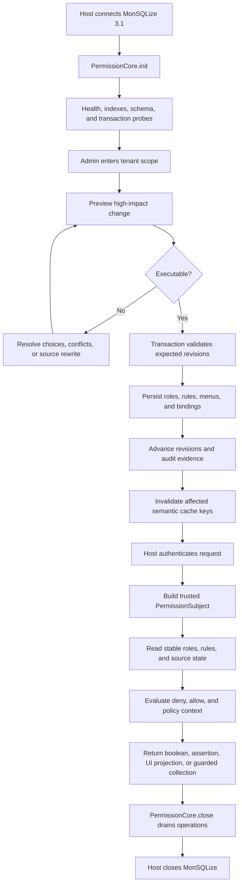

# Permission Lifecycle
<!-- docs:inline-parity `can()` `pc.init()` `PermissionCoreHealth` `pc.scope()` `forSubject()` `roles.create/allow` `userRoles.assign` `subject.can()` `pc.close()` `Promise<void>` `msq.close()` `init()` `lifecycle: 'ready'` `NOT_INITIALIZED` `tokenSecret` `MutationResult` `ruleResult` `ruleResult.data` `close()` `revision` `revisions` `REVISION_CONFLICT` `PermissionSubject` `can` `assert` `explain` `AuthorizedCollection` `operationId` `auditId` `closeDrainTimeoutMs` -->

Authorization is a lifecycle: the host owns identity and database connections, administrators commit versioned state, requests evaluate stable snapshots, and shutdown drains permission work before the database closes.

## When to Read This Page

If this is your first integration, start with [Quick Start](/guide/quick-start) and [Check Permissions](/guide/check-permission). This page is for these situations:

| Scenario | Read this page? |
|---|---|
| Designing startup, shutdown, health checks, and database ownership | Yes |
| Debugging why a recent permission change is not visible to a request yet | Yes |
| Debugging revision conflicts, expired previews, cache invalidation, or audit evidence | Yes |
| Only learning how to call `can()` / `assert()` in business code | Skip for now; use Check Permissions |

## End-to-End Flow


<p className="pc-diagram-text" id="pc-diagram-permission-lifecycle-en-text" data-diagram-id="permission-lifecycle"><strong>Text equivalent.</strong>The host connects MonSQLize and initializes PermissionCore. Administrators preview and commit revisioned roles, rules, menus, bindings, audit evidence, and cache invalidation. Each authenticated request becomes a trusted subject and reads a stable snapshot. Shutdown drains PermissionCore before the host closes MonSQLize.</p>

The minimal code order that matches the diagram is:

```ts
const pc = new PermissionCore({ monsqlize: msq, tokenSecret });
const initialHealth = await pc.init();

const scoped = pc.scope({ tenantId: 'acme' });
await scoped.roles.create({ id: 'reader', label: 'Reader' });
const ruleResult = await scoped.roles.allow('reader', {
  action: 'read', resource: 'db:orders',
});
await scoped.userRoles.assign('u-1', 'reader');

const subject = pc.forSubject({
  userId: 'u-1', scope: { tenantId: 'acme' },
});
const allowed = await subject.can('read', 'db:orders');

await pc.close();
await msq.close();
```

| Call | What to know | Lifecycle role |
|---|---|---|
| `pc.init()` | Returns `PermissionCoreHealth` | Moves from new/initializing to ready; failure should fail startup |
| `pc.scope()` / `forSubject()` | Synchronous facade | Binds a management scope or request subject; does not write the database |
| `roles.create/allow`, `userRoles.assign` | Returns a management write result with revision and audit clues | Commits management state and audit evidence in a transaction |
| `subject.can()` | Returns boolean | Evaluates the current stable authorization state |
| `pc.close()` | `Promise<void>` | Stops new leases and drains permission work; does not close `msq` |
| `msq.close()` | MonSQLize-owned result | The host closes the database after permission-core drains |

## Initialization

`init()` checks the MonSQLize capability contract, database health, permission indexes, transaction support, schema contract, custom resource probes, and optional cache backend. Before `lifecycle: 'ready'`, runtime operations fail with `NOT_INITIALIZED` or a more specific configuration/database error.

After `tokenSecret` is configured, instances that share the same permission namespace can verify preview and cursor tokens consistently. The auto-generated default is process-local and is not suitable for tokens that must survive restarts or cross instances.

## Management Write Path

Small incremental writes can commit directly, such as creating a role, appending one allow rule, or incrementally assigning a role to a user. Structural, source-affecting, capacity-affecting, or high-impact writes must use preview before execute, such as moving or removing menus, replacing API bindings, changing parent roles, role-menu authorization, and stale repair. Preview only answers "what would happen if this ran now"; execute writes the database and must submit the same input, `expectedRevisions`, and `previewToken`.

Inside a MonSQLize transaction, permission-core rechecks revisions, source integrity, hierarchy, capacity, and idempotency before committing. For normal integration work, remember that a successful management write tells you whether it committed, current revision clues, audit IDs, cache handling, and warnings. For debugging, a `MutationResult` looks like this:

```json
{
  "committed": true,
  "changed": true,
  "revision": 12,
  "revisions": { "global": 12, "rbac": 7, "menu": 5, "audit": 12 },
  "operationId": "...",
  "auditId": "...",
  "replayed": false,
  "cache": { "status": "completed" },
  "warnings": { "total": 0, "items": [], "truncated": false }
}
```

This is an envelope excerpt for management writes such as `ruleResult`; the domain result is still in `ruleResult.data`. It is not the return shape of `can()`, `init()`, or `close()`. Use the API reference for exact fields instead of memorizing this shape from the lifecycle page.

## Request Decision Path

The host converts already-authenticated server state into a `PermissionSubject`. A decision reads the user's role set, active role chain, manual and menu-generated rules, source integrity, claims, and explicit policy context from a stable snapshot. Matching deny beats allow; no allow means default deny; unknown required context tightens access.

`can` returns a boolean, `assert` throws on denial, `explain` returns a bounded trace, menu methods project safe UI state, and `AuthorizedCollection` uses the same authorization snapshot for data operations. Authentication is outside this lifecycle.

## Cache and Audit Order

The database is the source of truth. With cache enabled, reads may use semantic entries bound to revisions; changes commit first and then invalidate affected key families. Cache failure may lower health and safely fall back to database reads, but stale allow data must not become authoritative.

Every committed management change writes durable audit evidence in the same transaction workflow and returns `operationId` and `auditId`. Hosts should correlate these IDs with request and business audit logs, but must not treat untrusted tenant input as authoritative.

## Failures and Shutdown

Schema mismatch, corrupted persisted state, missing policy context, expired preview, database unavailability, and route manifest reloads close affected paths. Recovery must rebuild a consistent source of truth; bypassing checks or serving stale authorization is not a supported fallback.

`close()` stops new leases and waits up to `closeDrainTimeoutMs` for active operations and borrowed transactions. It only closes state owned by the permission module. After permission-core drains, the host closes MonSQLize.

For readiness and event handling, see [Production Operations](/guide/production-operations). For exact public evidence fields, see [Audit and Health API](/api/audit-and-health). Continue with [Resources and Rules](/guide/resources-and-rules).
