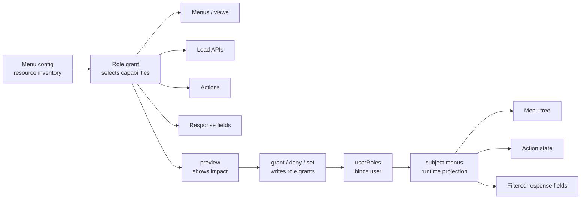

# Authorize Role Menus

Role-menu authorization answers the common admin-system question: which menus, views, actions, APIs, and response fields a role can use.

It does not bind users automatically. First save menu grants on a role, then use `userRoles.assign()` or `userRoles.set()` to give that role to a user.
Every generated API permission still resolves to `invoke + apiResource` internally; the role-menu API keeps that detail traceable without asking administrators to write low-level rules by hand.

## Minimal Admin-Page Flow

If you are building a role authorization page, think in this order:

| Step | Admin action | Method |
|---|---|---|
| 1 | Open the role authorization page and read the selectable tree | `roles.menuPermissions.getAuthorizationTree()` |
| 2 | Let the administrator select menus, views, actions, and fields | Build `selection` or `assignments` |
| 3 | Preview the impact before saving | `roles.menuPermissions.preview()` |
| 4 | Confirm and save when there are no conflicts | Usually `roles.menuPermissions.set()`; use `grant()` for append-only grants |
| 5 | Give the role to users | `userRoles.assign()` or `userRoles.set()` |
| 6 | Project the result at request time | `subject.menus.getViewTree()` / `getActionMap()` / `filterResponse()` |

The most common admin page saves the whole authorization tree: read `getAuthorizationTree()`, let the user select items, call `preview({ operation: 'set', assignments })`, then call `set()` after confirmation. The example below uses `grant()` only to keep the snippet short; for a full role authorization form, prefer `set()`.

## How the Objects Connect



<p className="pc-diagram-text" id="pc-diagram-role-menu-relationship-en-text" data-diagram-id="role-menu-relationship"><strong>Text equivalent.</strong> The menu config is only the grantable resource inventory. The role authorization UI selects menus, views, load APIs, actions, and response fields from that inventory. preview only shows impact; grant, deny, or set writes role-menu authorization. After userRoles binds the role to a user, subject.menus projects that user's visible menu tree, action state, and returnable response fields.</p>

The main line is:

menu config → role-menu authorization → user-role binding → subject runtime projection

Do not treat `MenuConfigInput` as the permission result. It is the inventory that can be granted. Role grants and user-role assignments decide what a user can access.

## How UI Selections Become `selection`

Think of `selection` as “the capabilities selected in this admin form submission.” You do not need to memorize the whole type first; start with this mapping:

| Admin UI action | Field | Meaning |
|---|---|---|
| Select a menu group | `menus` | Selects the menu node itself; pair it with `include.descendants` to include descendants. |
| Select a view | `views` | The most common selection; views often bring their page load APIs with them. |
| Select page load APIs | `loads` or `include.loads` | Use `loads` for exact APIs; use `include.loads: true` to include load APIs from selected views. |
| Select button permissions | `actions` or `include.actions` | Use `actions` for exact actions; use `include.actions: true` to include all actions from selected views. |
| Select API response fields | `responseFields` | Fields must have been declared in “APIs and Response Fields” first. |
| Do not auto-grant fields | `include.responseFields: 'none'` | Recommended default, so newly added sensitive fields do not reach old roles automatically. |
| Explicitly grant every field | `include.responseFields: 'all'` | Use only when this role should receive every declared field on the page. |

## Build a Selection

The selection below grants the `order-operator` role the orders list view in the `admin` config, includes the view's load API and actions, and allows only `orderNo` and `status` in the orders response.

```ts
const selection = {
  configId: 'admin',
  views: ['orders-list'],
  responseFields: [{
    apiResource: 'api:GET:/api/orders',
    target: 'items',
    fields: ['orderNo', 'status'],
  }],
  include: {
    loads: true,
    actions: true,
    responseFields: 'none',
  },
};
```

| Field | Example | Meaning |
|---|---|---|
| `configId` | `admin` | Which menu config to grant from. |
| `views` | `['orders-list']` | Selects the orders list view. |
| `menus` | not set | Optionally selects menu groups and works with `descendants`. |
| `loads` | not set | Optionally selects exact load API resources. |
| `actions` | not set | Optionally selects exact action IDs. |
| `responseFields` | orders fields | Selects returnable fields for an API. |
| `include.loads` | `true` | Includes `load.resource` from selected views. |
| `include.actions` | `true` | Includes `actions[].resource` from selected views. |
| `include.responseFields` | `'none'` | Uses only explicit `responseFields`; does not auto-grant all fields. |

Defaults are `descendants: false`, `loads: true`, `actions: false`, and `responseFields: 'none'`. Selecting a view therefore grants page load APIs by default, but does not automatically grant actions or response fields. Use `include.responseFields: 'all'` when selecting a view should grant every declared response field. Admin systems often prefer explicit fields so newly added sensitive fields are not automatically exposed to old roles.

For paginated or nested responses, write `target`. For an API returning `{ items, total }`, `target: 'items'` means the grant applies to fields inside each `items` row. The mode value `'all'` grants every declared field. Pagination metadata such as `total` belongs in response config `preserve`, not in role field grants.

## Preview, Then Commit

Unlike creating menus, views, or API records, role-menu authorization changes what a role can actually access and can affect many users immediately. It therefore keeps explicit preview before commit. Ordinary administrators do not need to understand revision internals; the role editor previews impact first, then submits the same selection with the preview credentials.

Preview first:

```ts
const scoped = pc.scope(
  { tenantId: 'acme', appId: 'admin' },
  { actorId: 'admin', requestId: 'req-grant-order-operator-menu' },
);

const preview = await scoped.roles.menuPermissions.preview(
  'order-operator',
  { operation: 'grant', selection },
);

if (!preview.executable) {
  throw new Error('ROLE_MENU_PERMISSION_CONFLICT');
}
```

When there are no conflicts, the admin UI mainly cares about `executable: true`, affected users, and the authorization records that would be generated. Read the response like this:

```json
{
  "executable": true,
  "previewToken": "preview_...",
  "summary": {
    "affectedUsers": { "total": 1, "sampleIds": ["u-menu"] },
    "grants": { "total": 1 },
    "removals": { "total": 0 }
  }
}
```

After confirmation, pass the same `selection` and the preview credentials to the write method:

```ts
const granted = await scoped.roles.menuPermissions.grant(
  'order-operator',
  selection,
  {
    ...preview.expected,
    previewToken: preview.previewToken,
  },
);
```

```json
{
  "changed": true,
  "data": {
    "roleId": "order-operator",
    "grantIds": { "total": 1, "items": ["grant_..."] },
    "generatedSources": 3,
    "generatedResponseFields": 2,
    "removedSources": 0
  }
}
```

`menuPermissions.preview(roleId, change)` reads only and computes sources, affected users, and conflicts. `menuPermissions.grant(roleId, selection, options)` writes the allow grant. Execution must include the preview's `expected` vector and `previewToken`. The result exposes `generatedSources`, `generatedResponseFields`, and each `grantId` for the committed `operation`.

## Grant, Deny, Revoke, or Replace

These four methods are not equal in day-to-day admin UI work. A normal role authorization page usually uses `set()` to save the whole tree; the other methods are for append-only grants, explicit overrides, or precise deletion.

| Method | Use it for | Write semantics |
|---|---|---|
| `set(roleId, assignments, options)` | Save a complete authorization tree form | Replaces all direct role-menu grants for the role. |
| `grant(roleId, selection, options)` | Add allowed menu capabilities | Appends an allow grant. |
| `deny(roleId, selection, options)` | Explicitly forbid menu capabilities | Appends a deny grant. |
| `revoke(roleId, { grantIds }, options)` | Remove specific grant records | Removes only the named grants. |

`set()` replaces menu grants only. It does not replace manual `roles.allow()` or `roles.deny()` rules, and it does not change user-role bindings. Every write method requires a matching preview operation.

## Read Role Authorization

```ts
const direct = await scoped.roles.menuPermissions.getDirect('order-operator');
const effective = await scoped.roles.menuPermissions.getEffective('order-operator');
const tree = await scoped.roles.menuPermissions.getAuthorizationTree(
  'order-operator',
  { configId: 'admin' },
);
```

| Method | Use it when |
|---|---|
| `getAuthorizationTree(roleId, { configId })` | Opening the admin role authorization page; renders selectable nodes and direct, inherited, conflict, and partial states. |
| `getDirect(roleId)` | Debugging grants saved directly on this role. |
| `getEffective(roleId)` | Debugging final grants after parent-role inheritance. |
| `listDirect(roleId, query?)` | Paginating a large direct grant set. |

Exact return types live in the [Role Menu Permissions API](/api/role-menu-permissions). For this guide, remember: `getAuthorizationTree()` is for the administrator editor. User navigation uses `subject.menus.getViewTree({ configId })`.

## User Runtime Result

### Verify Menus and Actions

After saving authorization, bind the role to a user and read the menu tree and action state from that user's subject:

```ts
await scoped.userRoles.assign('u-menu', 'order-operator');

const menus = pc.forSubject({
  userId: 'u-menu',
  scope: { tenantId: 'acme', appId: 'admin' },
}).menus;

const tree = await menus.getViewTree({ configId: 'admin' });
const actions = await menus.getActionMap({ configId: 'admin', viewId: 'orders-list' });
const state = await menus.getViewState({ configId: 'admin', viewId: 'orders-list' });
```

### Project API Responses

Before a business API returns data, project response fields with the same subject:

```ts
const projected = await menus.filterResponse('api:GET:/api/orders', {
  items: [{ orderNo: 'O-1001', status: 'paid', amount: 88, internalCost: 51 }],
  total: 1,
});
const projectedData = projected.data;
```

```json
{
  "tree": [{ "id": "orders", "enabled": true }],
  "actions": { "export": { "visible": true, "enabled": true } },
  "state": { "allowed": true, "navigationReachable": true },
  "projectedData": {
    "items": [{ "orderNo": "O-1001", "status": "paid" }],
    "total": 1
  }
}
```

`filterResponse(apiResource, payload)` first checks whether the current user can `invoke` the API resource, then projects the payload according to response-field grants. The projected payload is in `projected.data`. Ungranted fields are removed; missing invoke permission fails instead of returning unprojected data.

## Role, User, and Menu Boundaries

| Object | Provided by | What permission-core stores |
|---|---|---|
| User | Host login system | Only `userId` and role bindings, not login or passwords. |
| Role | permission-core management API | Roles, parent roles, manual rules, and menu grants. |
| Menu config | Admin backend or plugin | Grantable menus, views, APIs, actions, and response fields. |
| Subject | Authenticated request | Current effective permissions under the trusted scope. |

See the runnable [menu admin example](/examples/menu-admin) and the [Role Menu Permissions API](/api/role-menu-permissions).
