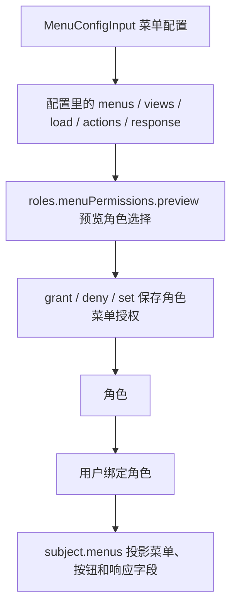

# Authorize Role Menus

Role-menu authorization answers the common admin-system question: which menus, views, actions, APIs, and response fields a role can use.

It does not bind users automatically. First save menu grants on a role, then use `userRoles.assign()` or `userRoles.set()` to give that role to a user.
Every generated API permission still resolves to `invoke + apiResource` internally; the role-menu API keeps that detail traceable without asking administrators to write low-level rules by hand.

## How the Objects Connect



<p className="pc-diagram-text" id="pc-diagram-role-menu-relationship-en-text" data-diagram-id="role-menu-relationship"><strong>Text equivalent.</strong> Save a menu config first, then select menus, views, APIs, actions, and response fields in the role authorization UI. preview only shows impact; grant, deny, or set writes role-menu authorization. After a user receives the role, subject runtime projects visible menus, action state, and response fields.</p>

The main line is:

`菜单配置 -> 角色菜单授权 -> 用户角色绑定 -> 当前用户运行时投影`

Do not treat `MenuConfigInput` as the permission result. It is the inventory that can be granted. Role grants and user-role assignments decide what a user can access.

## Build a Selection

The selection below grants the `order-operator` role the orders list view in the `admin` config, includes the view's load API and actions, and allows only `orderNo` and `status` in the orders response.

```ts
const selection = {
  configId: 'admin',
  views: ['orders-list'],
  responseFields: [{
    apiResource: 'api:GET:/api/orders',
    fields: ['orderNo', 'status'],
  }],
  include: {
    loads: true,
    actions: true,
    responseFields: 'none',
  },
};
```

| Field | Example | Meaning |
|---|---|---|
| `configId` | `admin` | Which menu config to grant from. |
| `views` | `['orders-list']` | Selects the orders list view. |
| `menus` | not set | Optionally selects menu groups and works with `descendants`. |
| `loads` | not set | Optionally selects exact load API resources. |
| `actions` | not set | Optionally selects exact action IDs. |
| `responseFields` | orders fields | Selects returnable fields for an API. |
| `include.loads` | `true` | Includes `load.resource` from selected views. |
| `include.actions` | `true` | Includes `actions[].resource` from selected views. |
| `include.responseFields` | `'none'` | Uses only explicit `responseFields`; does not auto-grant all fields. |

Use `include.responseFields: 'all'` when selecting a view should grant every declared response field. The mode values are `'none'` and `'all'`. Admin systems often prefer explicit fields so newly added sensitive fields are not automatically exposed to old roles.

## Preview, Then Commit

```ts
const preview = await scoped.roles.menuPermissions.preview(
  'order-operator',
  { operation: 'grant', selection },
  { actorId: 'admin' },
);

if (!preview.executable) {
  throw new Error('角色菜单授权存在冲突，需要先处理');
}

const granted = await scoped.roles.menuPermissions.grant(
  'order-operator',
  selection,
  {
    ...preview.expected,
    previewToken: preview.previewToken,
    actorId: 'admin',
    idempotencyKey: 'grant-order-operator-menu-v1',
  },
);
```

```json
{
  "changed": true,
  "data": {
    "roleId": "order-operator",
    "grantIds": { "total": 1, "items": ["grant_..."] },
    "generatedSources": 3,
    "generatedResponseFields": 2,
    "removedSources": 0
  }
}
```

`menuPermissions.preview(roleId, change)` reads only and computes sources, affected users, and conflicts. `menuPermissions.grant(roleId, selection, options)` writes the allow grant. Execution must include the preview's `expected` vector and `previewToken`. The result exposes `generatedSources`, `generatedResponseFields`, and each `grantId` for the committed `operation`.

## Grant, Deny, Revoke, or Replace

| Method | Use it for | Write semantics |
|---|---|---|
| `grant(roleId, selection, options)` | Add allowed menu capabilities | Appends an allow grant. |
| `deny(roleId, selection, options)` | Explicitly forbid menu capabilities | Appends a deny grant. |
| `revoke(roleId, { grantIds }, options)` | Remove specific grant records | Removes only the named grants. |
| `set(roleId, assignments, options)` | Save a complete authorization tree form | Replaces all direct role-menu grants for the role. |

`set()` replaces menu grants only. It does not replace manual `roles.allow()` or `roles.deny()` rules, and it does not change user-role bindings. Every write method requires a matching preview operation.

## Read Role Authorization

```ts
const direct = await scoped.roles.menuPermissions.getDirect('order-operator');
const effective = await scoped.roles.menuPermissions.getEffective('order-operator');
const tree = await scoped.roles.menuPermissions.getAuthorizationTree(
  'order-operator',
  { configId: 'admin' },
);
```

| Method | Return | Use |
|---|---|---|
| `getDirect(roleId)` | `VersionedResult<MenuBusinessDirectPermissionSnapshot>` | Reads grants saved directly on this role. |
| `listDirect(roleId, query?)` | `PageResult<MenuBusinessGrantSnapshot>` | Paginates large direct grant sets. |
| `getEffective(roleId)` | `VersionedResult<MenuBusinessEffectivePermissionSnapshot>` | Merges grants inherited from parent roles. |
| `getAuthorizationTree(roleId, { configId })` | `VersionedResult<MenuBusinessAuthorizationTree>` | Renders direct, inherited, conflict, and partial states in an admin tree. |

`getAuthorizationTree()` is for the administrator editor. User navigation uses `subject.menus.getViewTree({ configId })`.

## User Runtime Result

```ts
await scoped.userRoles.assign('u-menu', 'order-operator');

const menus = pc.forSubject({
  userId: 'u-menu',
  scope: { tenantId: 'acme', appId: 'admin' },
}).menus;

const tree = await menus.getViewTree({ configId: 'admin' });
const actions = await menus.getActionMap({ configId: 'admin', viewId: 'orders-list' });
const state = await menus.getViewState({ configId: 'admin', viewId: 'orders-list' });
const projected = await menus.filterResponse('api:GET:/api/orders', {
  items: [{ orderNo: 'O-1001', status: 'paid', amount: 88, internalCost: 51 }],
  total: 1,
});
```

```json
{
  "tree": [{ "id": "orders", "enabled": true }],
  "actions": { "export": { "visible": true, "enabled": true } },
  "state": { "allowed": true, "navigationReachable": true },
  "projected": {
    "items": [{ "orderNo": "O-1001", "status": "paid" }],
    "total": 1
  }
}
```

`filterResponse(apiResource, payload)` first checks whether the current user can `invoke` the API resource, then projects the payload according to response-field grants. Ungranted fields are removed; missing invoke permission fails instead of returning unprojected data.

## Role, User, and Menu Boundaries

| Object | Provided by | What permission-core stores |
|---|---|---|
| User | Host login system | Only `userId` and role bindings, not login or passwords. |
| Role | permission-core management API | Roles, parent roles, manual rules, and menu grants. |
| Menu config | Admin backend or plugin | Grantable menus, views, APIs, actions, and response fields. |
| Subject | Authenticated request | Current effective permissions under the trusted scope. |

See the runnable [menu admin example](/examples/menu-admin) and the [Role Menu Permissions API](/api/role-menu-permissions).
