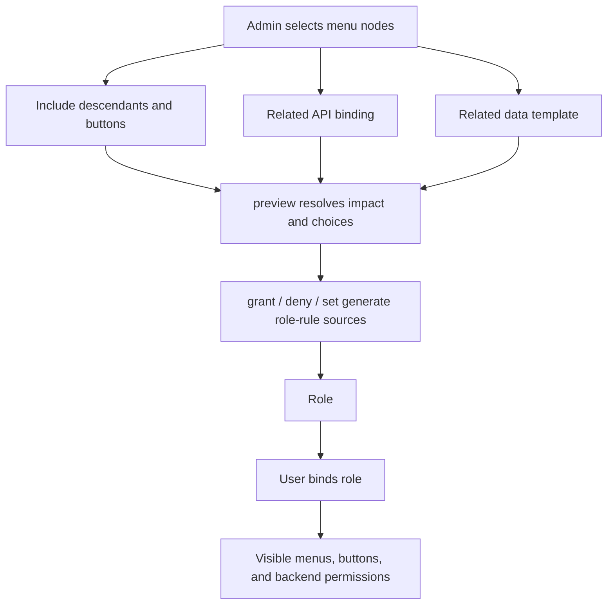

# Authorize Role Menus
<!-- docs:inline-parity `nodes` `apiBindings` `nodeIds` `descendants` `buttons` `apis` `dataPermissions` `apiChoices` `any` `['orders']` `descendants/buttons` `true` `required` `required=true` `all` `availability-any` `authorization-any` `expected` `previewToken` `preview()` `ImpactPreview<MenuPermissionPlan>` `plan` `expected/previewToken` `executable` `conflicts` `choiceRequirements` `grant()` `MutationResult<MenuPermissionGrantResult>` `data.grantIds.items` `revoke()` `generatedSources` `grant` `deny` `revoke` `set` `grant(roleId, selection, options)` `{ operation:'grant', selection }` `deny(...)` `{ operation:'deny', selection }` `revoke(roleId, { grantIds }, options)` `{ operation:'revoke', grantIds }` `MutationResult<BatchMutationSummary>` `set(roleId, assignments, options)` `{ operation:'set', assignments }` `direct` `VersionedResult<DirectMenuPermissionSnapshot>` `effective` `VersionedResult<EffectiveMenuPermissionSnapshot>` `tree` `VersionedResult<AuthorizationTreeNode[]>` `subject.can()` `assert()` `visible.data` `buttons.data` `route.data` `SubjectRuntimeResult<T>` `detailBudget` `getVisibleTree({ rootId? })` `getButtonMap(ownerNodeId)` `getRouteState(path)` `allowed` `navigationReachable` `refresh-available` `listStale` `previewRepairStale` `repairStale` `listStale(query?)` `previewRepairStale(input)` `repairStale(input, options)` -->

Role-menu authorization converts an administrator's structural selection into durable, provenance-tracked rules. It does not bind users automatically.

## How the Objects Connect

Use this section to connect the previous example with the next concrete API call. Keep the values scoped, trusted, and read from the documented response shape instead of guessing hidden state. The examples keep the same code, JSON, and public identifiers as the Chinese source so both locales describe one behavior contract. Read the raw return notes before copying a summary object into production code.


<p className="pc-diagram-text" id="pc-diagram-role-menu-relationship-en-text" data-diagram-id="role-menu-relationship"><strong>Text equivalent.</strong>An administrator selects menu nodes plus optional descendants, buttons, API bindings, and data templates. Preview resolves that structure into traceable role-rule sources. After grant, deny, or set commits, the role owns those generated sources and users receive visible menu, button, and backend permissions only through normal role bindings.</p>
## Build a Selection

Use this section to connect the previous example with the next concrete API call. Keep the values scoped, trusted, and read from the documented response shape instead of guessing hidden state. The examples keep the same code, JSON, and public identifiers as the Chinese source so both locales describe one behavior contract. Read the raw return notes before copying a summary object into production code.

```ts
const selection = {
  nodeIds: ['orders'],
  include: {
    descendants: true,
    buttons: true,
    apis: 'required',
    dataPermissions: true,
  },
  apiChoices: {
    bindingIds: [],
    permissionsByBinding: {},
  },
};
```
## Preview Before Execution

Use this section to connect the previous example with the next concrete API call. Keep the values scoped, trusted, and read from the documented response shape instead of guessing hidden state. The examples keep the same code, JSON, and public identifiers as the Chinese source so both locales describe one behavior contract. Read the raw return notes before copying a summary object into production code.

```ts
const preview = await scoped.roles.menuPermissions.preview(
  'order-operator',
  { operation: 'grant', selection },
  { actorId: 'admin' },
);
```
```json
{
  "executable": true,
  "plan": {
    "roleId": "order-operator",
    "operation": "grant",
    "choiceRequirements": { "total": 0 },
    "grants": { "total": 1 }
  },
  "previewToken": "signed-token",
  "expected": { "expectedRevisions": { "rbac": 3, "menu": 8 } }
}
```
## Grant, Deny, Revoke, or Replace

Use this section to connect the previous example with the next concrete API call. Keep the values scoped, trusted, and read from the documented response shape instead of guessing hidden state. The examples keep the same code, JSON, and public identifiers as the Chinese source so both locales describe one behavior contract. Read the raw return notes before copying a summary object into production code.

```ts
if (!preview.executable) throw new Error('Resolve the preview first');
const granted = await scoped.roles.menuPermissions.grant(
  'order-operator',
  selection,
  {
    ...preview.expected,
    previewToken: preview.previewToken,
    actorId: 'admin',
    idempotencyKey: 'role-order-operator-orders-v1',
  },
);
```
```json
{
  "changed": true,
  "data": {
    "roleId": "order-operator",
    "generatedSources": 4,
    "generatedSemanticRules": 4,
    "removedSources": 0
  },
  "auditId": "..."
}
```
## Bind Users and Read Authorization

Use this section to connect the previous example with the next concrete API call. Keep the values scoped, trusted, and read from the documented response shape instead of guessing hidden state. The examples keep the same code, JSON, and public identifiers as the Chinese source so both locales describe one behavior contract. Read the raw return notes before copying a summary object into production code.

```ts
await scoped.userRoles.assign('u-1', 'order-operator');

const direct = await scoped.roles.menuPermissions.getDirect('order-operator');
const effective = await scoped.roles.menuPermissions.getEffective('order-operator');
const tree = await scoped.roles.menuPermissions.getAuthorizationTree('order-operator');
```
## Project the User Interface

Use this section to connect the previous example with the next concrete API call. Keep the values scoped, trusted, and read from the documented response shape instead of guessing hidden state. The examples keep the same code, JSON, and public identifiers as the Chinese source so both locales describe one behavior contract. Read the raw return notes before copying a summary object into production code.

```ts
const menus = pc.forSubject({
  userId: 'u-1',
  scope: { tenantId: 'acme', appId: 'admin' },
}).menus;

const visible = await menus.getVisibleTree();
const buttons = await menus.getButtonMap('orders');
const route = await menus.getRouteState('/orders');
```
```json
{
  "visibleNodeIds": ["operations", "orders"],
  "button": { "visible": true, "enabled": true, "reason": "allowed" },
  "route": { "allowed": true, "navigationReachable": true }
}
```
## Handle Asset Changes

Use this section to connect the previous example with the next concrete API call. Keep the values scoped, trusted, and read from the documented response shape instead of guessing hidden state. The examples keep the same code, JSON, and public identifiers as the Chinese source so both locales describe one behavior contract. Read the raw return notes before copying a summary object into production code.

Continue with [Permission Lifecycle](/guide/permission-lifecycle).
