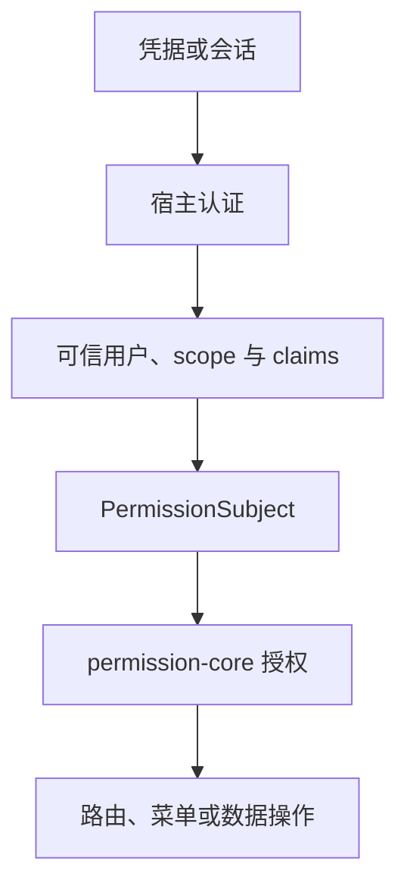

# 认证边界

宿主完成请求认证后，permission-core 才回答授权问题。它不签发会话、不校验密码或 Token、不刷新凭据，也不提供登录/退出接口。双方边界是可信 `PermissionSubject`：规范化用户身份、完整租户 scope，以及可选的可信 claims。

## 职责模型



<p className="pc-diagram-text" id="pc-diagram-authentication-boundary-zh-text" data-diagram-id="authentication-boundary"><strong>文字等价说明。</strong>凭据或会话先由宿主认证。宿主提供可信用户身份、scope 和 claims 来构造 `PermissionSubject`，之后 permission-core 才授权当前路由、菜单投影或数据操作。凭据校验、账号状态和身份恢复仍由宿主负责。</p>

认证负责凭据校验、账号状态、会话生命周期和身份恢复。permission-core 负责在给定 scope 内查询角色/规则、执行 deny-first 判断、投影菜单和执行授权数据操作。业务 handler 仍负责对象是否存在及领域不变量。

## Vext 接受的形态

内置 Vext 解析器要求 `isAuthenticated: true`，并且只能使用一种主体表示：

```ts
req.auth = {
  isAuthenticated: true,
  permissionSubject: {
    userId: session.userId,
    scope: { tenantId: session.tenantId, appId: 'admin' },
    claims: { merchantId: session.merchantId },
  },
};
```

```ts
req.auth = {
  isAuthenticated: true,
  userId: session.userId,
  scope: { tenantId: session.tenantId, appId: 'admin' },
  claims: { merchantId: session.merchantId },
};
```

不要混用 `permissionSubject` 与扁平的 `userId`/`scope` 表示。缺少 `req.auth`、认证状态为 false、身份不完整或形态冲突时，以 `VEXT_AUTH_REQUIRED` 或 `INVALID_SUBJECT` 失败。

这两个代码块是**认证插件写入的数据形态**，不是 permission-core 方法调用或响应。`req.auth` 必须在 permission middleware 之前由宿主建立；客户端提交同名 JSON 不会自动获得信任。

## 自定义主体解析

认证插件暴露其他内部结构时，使用 resolver：

```ts
permissionPlugin({
  monsqlize: msq,
  resolveSubject: async (auth, req) => ({
    userId: String(auth.accountId),
    scope: await trustedTenantResolver(auth.sessionId, req),
    claims: { merchantId: String(auth.merchantId) },
  }),
});
```

`permissionPlugin(options)` 同步返回 Vext plugin；`resolveSubject` 则在受保护请求首次需要权限上下文时调用，可同步或异步返回 `PermissionSubject`。resolver 的参数 `auth` 来自认证插件，`req` 只用于访问可信服务端状态；它的返回值不是 HTTP response。

如果 `req.auth` 同时携带规范化 `permissionSubject` 或 `userId + scope`，resolver 结果必须指向同一用户和完整 scope。不一致时返回 `SCOPE_CONFLICT`，插件不会静默选择其中一个。claims 可以提供策略值，但客户端请求头/请求体中的值不会因为被复制到 `claims` 就自动变可信。

## 受保护与公开路由

未配置 `permission` 或配置 `permission: false` 的路由对 permission-core 而言是公开路由，不会强制惰性解析主体。`permission: true` 和显式 requirement 会在 handler 前要求认证与授权。应用代码也可以请求惰性上下文：

```ts
const allowed = await req.auth.permission.can('read', 'db:orders');
await req.auth.permission.assert('invoke', 'api:POST:/api/orders/export');
```

| 方法 | 参数 | 原始返回/失败 |
|---|---|---|
| `req.auth.permission.can(action, resource, context?)` | 当前请求 action/resource 与可选策略 context | `Promise<boolean>`；默认拒绝也返回 false，不抛 403 |
| `req.auth.permission.assert(...)` | 与 can 相同 | 允许时 `Promise<void>`；拒绝时抛 `PermissionCoreError`，Vext 映射 403 |
| `requirePermissionContext(req)` | 已经过 permission middleware 的 Vext request | 惰性返回 `{ subject, can, assert }`；认证缺失时映射 401 |
| `hasPermissionContext(req)` | 当前 request | 只返回 boolean 类型守卫，不触发惰性解析 |

`can` 返回布尔值。`assert` 成功时返回 `void`，拒绝时映射为 `403`。这个 API 归原请求所有；把它保留给任务、队列或后续请求会 fail closed。

## 失败边界与下一步

缺失/无效的已认证主体使用 `401`，已认证但无权限使用 `403`，授权状态不可信时使用 `503`。不要把数据库、schema、路由重载或持久化状态故障降级成 allow。后台任务应构造新的可信 `PermissionSubject` 并直接调用 core。

继续阅读[多租户模型](/zh/guide/multi-tenant)、[Vext 插件](/zh/guide/vext-plugin)和[错误 API](/zh/api/errors)。
