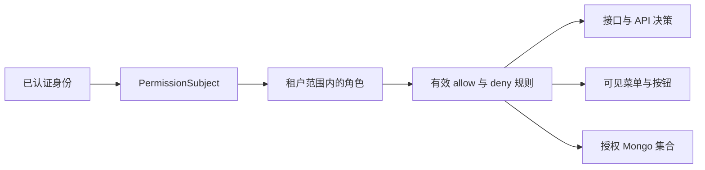

# 简介

permission-core 是面向 MonSQLize 3.1 Node.js 应用的细粒度授权库，将持久化 RBAC 管理与接口、菜单、API、数据行和字段的运行时检查统一起来。

## 模块负责什么

- 带租户范围的角色、单父角色继承和用户直接角色绑定
- 基于类型化 `action + resource` 的 allow 与 deny 规则
- 菜单节点、接口绑定、角色菜单授权、修订和审计记录
- 用户决策、解释、可见菜单投影和授权集合
- 可选的语义缓存，底层复用宿主 MonSQLize 缓存

每次管理写入都通过 MonSQLize 事务持久化，并返回修订与审计证据。必要的 scope、策略上下文、数据库状态或来源完整性不可用时，运行时默认拒绝。

## 宿主负责什么

应用仍然负责认证、请求身份、密钥、MonSQLize 连接、业务集合、HTTP 错误序列化和运维策略。宿主必须构造可信的 `PermissionSubject`；模块不会自动信任任意租户或用户请求头。

permission-core 不是身份提供方、登录模块、ORM、API 网关，也不是只在前端隐藏菜单的工具。

## 运行模型

scope 至少包含 `tenantId`，还可以包含 `appId`、`moduleId` 或 `namespace`。另一个 scope 可以使用相同 `userId` 和 `roleId`，但不会共享绑定或规则。

## 支持边界

| 范围 | 支持契约 |
|---|---|
| 运行时 | Node.js 18 或更高版本 |
| 持久化 | 已连接的 `monsqlize@3.1.0` 实例；MongoDB 是当前支持的数据库路径 |
| 框架 | 框架无关核心，以及可选的 `permission-core/plugins/vext` |
| 缓存 | 默认关闭；可选择使用调用方确认一致性的 MonSQLize 缓存 |
| 认证 | 由宿主提供；登录不属于本包职责 |

## 选择下一项任务

从[快速开始](/zh/guide/quick-start)进入。核心已经运行时，可继续处理[权限检查](/zh/guide/check-permission)、[数据权限](/zh/guide/data-permissions)或[菜单管理](/zh/guide/menu-management)。
