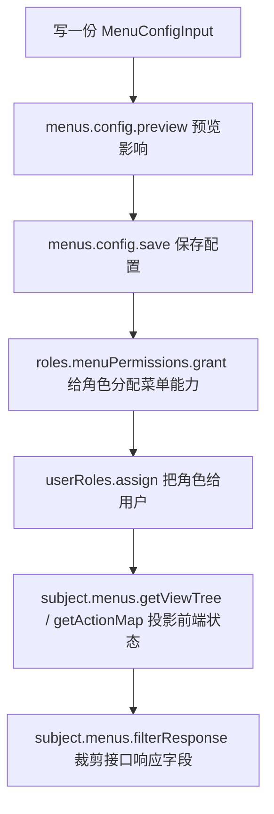

# 管理菜单

菜单管理只需要从一份 `MenuConfigInput` 开始：你声明菜单、页面、页面加载接口、按钮接口和接口响应字段，permission-core 会在保存时编译成内部库存。多数后台系统不需要手动维护底层节点或接口绑定。

最小心智模型是：



<p className="pc-diagram-text" id="pc-diagram-menu-config-lifecycle-zh-text" data-diagram-id="menu-config-lifecycle"><strong>文字等价说明。</strong>后端先编写 MenuConfigInput，预览影响并保存为后台菜单库存；角色菜单授权再分配其中的页面、加载接口、操作和响应字段；用户绑定该角色后，subject 菜单运行时会投影可见导航、操作状态、页面状态和裁剪后的接口响应。</p>

保存菜单不是授权用户。它只是把“系统有哪些菜单和接口”登记清楚；用户能看到什么、能调用什么，仍由角色授权决定。

## 一份完整配置

```ts
const menuConfig = {
  configId: 'admin',
  title: 'Admin console',
  menus: [{
    id: 'orders',
    title: 'Orders',
    icon: 'shopping-cart',
    views: [{
      id: 'orders-list',
      type: 'page',
      title: 'Orders',
      path: '/orders',
      component: 'OrdersPage',
      load: [{
        resource: 'api:GET:/api/orders',
        response: {
          target: 'items',
          preserve: ['total'],
          fields: [
            { field: 'orderNo', title: '订单号' },
            { field: 'status', title: '状态' },
            { field: 'amount', title: '金额' },
          ],
        },
      }],
      actions: [{
        id: 'export',
        title: '导出订单',
        resource: 'api:POST:/api/orders/export',
        response: [{ field: 'downloadUrl', title: '下载地址' }],
      }],
    }],
  }],
};
```

这份配置表达四件事：

| 字段 | 表达什么 | 运行时影响 |
|---|---|---|
| `configId` | 一套菜单配置的稳定 ID | 后续授权和运行时读取都用它定位这一套后台菜单。 |
| `menus[]` | 左侧导航分组 | 分组本身不是接口权限；通常用于组织页面。 |
| `views[]` | 可打开的页面、抽屉、弹窗或 tab | `getViewTree()` 和 `getViewState()` 会按用户权限投影这些视图。 |
| `load[].resource` | 页面进入时需要调用的接口 | 只写 `api:METHOD:/path`；省略 action，系统自动补成 `invoke`。 |
| `actions[].resource` | 页面按钮或操作调用的接口 | 支持 `api:*` 后端接口，也支持 `ui:*` 前端纯按钮资源。 |
| `response` | 允许返回给前端的字段清单 | 授权角色后，`filterResponse()` 会按用户拥有的字段裁剪响应。 |

`load.resource` 必须是 `api:` 资源，例如 `api:GET:/api/orders`。这样 Vext 路由守卫、角色菜单授权和响应字段投影才能使用同一份资源 ID。`actions[].resource` 可以是后端接口，也可以是纯 UI 资源；如果是接口，同样建议使用 `api:`。

## 响应字段怎么写

响应字段支持数组，也支持对象形式：

```ts
response: [
  { field: 'orderNo', title: '订单号' },
  { field: 'buyer.name', title: '买家姓名' },
]
```

数组形式适合接口直接返回一条对象或对象数组。字段名支持点路径，例如 `buyer.name`。

```ts
response: {
  target: 'items',
  preserve: ['total'],
  fields: [
    { field: 'orderNo', title: '订单号' },
    { field: 'status', title: '状态' },
  ],
}
```

对象形式适合常见分页响应 `{ items, total }`：`target` 表示要裁剪的数组字段，`preserve` 表示保留但不参与字段授权的外层字段。上例会裁剪 `items` 中每一行，只保留 `total` 作为分页信息。

## 预览并保存配置

```ts
const scoped = pc.scope({ tenantId: 'acme', appId: 'admin' });

const preview = await scoped.menus.config.preview(menuConfig, {
  actorId: 'admin',
});
if (!preview.executable) {
  throw new Error('菜单配置存在冲突，需要先处理');
}

const saved = await scoped.menus.config.save(menuConfig, {
  ...preview.expected,
  previewToken: preview.previewToken,
  actorId: 'admin',
  idempotencyKey: 'admin-menu-v1',
});
```

```json
{
  "changed": true,
  "data": {
    "config": {
      "configId": "admin",
      "revision": 1,
      "menus": [{ "id": "orders", "views": [{ "id": "orders-list" }] }]
    },
    "manifestOperations": { "total": 3 },
    "retainedGrantCount": 0,
    "revokedGrantCount": 0
  }
}
```

`menus.config.preview(config)` 只计算影响，不写数据库。`menus.config.save(config, options)` 才会写入配置，并同步内部菜单节点、接口绑定和可授权资源。执行时必须带上预览返回的 `expected` 和 `previewToken`，避免管理员保存一份已经过期的菜单模型。

## 修改和删除配置

读取配置：

```ts
const current = await scoped.menus.config.get('admin');
const page = await scoped.menus.config.list({ first: 20 });
```

删除配置：

```ts
const previewRemove = await scoped.menus.config.previewRemove('admin');
if (previewRemove.executable) {
  await scoped.menus.config.remove('admin', {
    ...previewRemove.expected,
    previewToken: previewRemove.previewToken,
    actorId: 'admin',
  });
}
```

批量变更：

```ts
const changes = [
  { operation: 'save', config: menuConfig },
  { operation: 'remove', configId: 'legacy-admin' },
];
const previewChanges = await scoped.menus.config.previewChanges(changes);
if (previewChanges.executable) {
  await scoped.menus.config.applyChanges(changes, {
    ...previewChanges.expected,
    previewToken: previewChanges.previewToken,
  });
}
```

单次保存适合普通后台菜单编辑；`previewChanges/applyChanges` 适合一次提交多个模块菜单，例如插件安装、应用升级或导入配置包。

## 给角色分配菜单能力

保存配置后，角色仍然没有权限。要让角色看到订单页、调用加载接口、看到导出按钮，并只拿到部分响应字段，需要单独授权：

```ts
const selection = {
  configId: 'admin',
  views: ['orders-list'],
  responseFields: [{
    apiResource: 'api:GET:/api/orders',
    fields: ['orderNo', 'status'],
  }],
  include: {
    loads: true,
    actions: true,
    responseFields: 'none',
  },
};

const grantPreview = await scoped.roles.menuPermissions.preview(
  'order-operator',
  { operation: 'grant', selection },
);
const granted = await scoped.roles.menuPermissions.grant(
  'order-operator',
  selection,
  {
    ...grantPreview.expected,
    previewToken: grantPreview.previewToken,
  },
);
```

`views` 是管理员勾选的页面。`include.loads: true` 会把页面加载接口一起授权；`include.actions: true` 会把页面按钮或操作一起授权；`responseFields` 明确允许哪些响应字段。`include.responseFields: 'none'` 表示不要自动全选字段，只使用 `responseFields` 中列出的字段。

完整授权规则见[角色菜单授权](/zh/guide/role-menu-authorization)。

## 用户端读取菜单和接口响应

```ts
await scoped.userRoles.assign('u-menu', 'order-operator');

const subjectMenus = pc.forSubject({
  userId: 'u-menu',
  scope: { tenantId: 'acme', appId: 'admin' },
}).menus;

const tree = await subjectMenus.getViewTree({ configId: 'admin' });
const state = await subjectMenus.getViewState({ configId: 'admin', viewId: 'orders-list' });
const actions = await subjectMenus.getActionMap({ configId: 'admin', viewId: 'orders-list' });
const response = await subjectMenus.filterResponse('api:GET:/api/orders', {
  items: [{ orderNo: 'O-1001', status: 'paid', amount: 88, internalCost: 51 }],
  total: 1,
  debug: true,
});
```

```json
{
  "viewTreeIds": ["orders"],
  "viewAllowed": true,
  "exportEnabled": true,
  "projectedResponse": {
    "items": [{ "orderNo": "O-1001", "status": "paid" }],
    "total": 1
  }
}
```

`getViewTree()` 给前端导航树；`getViewState()` 判断某个页面是否允许进入；`getActionMap()` 返回页面下每个按钮是否可见和可用；`filterResponse()` 先检查当前用户是否能 `invoke` 这个 `api:` 资源，再按响应字段授权裁剪数据。它不是前端隐藏字段，而是在后端返回前过滤。

## 常见误区

| 误区 | 正确理解 |
|---|---|
| 保存菜单后用户就有权限 | 保存只是登记系统能力；还要 `roles.menuPermissions.grant` 和 `userRoles.assign`。 |
| `load` 里还要写 `action: 'invoke'` | 不需要。`load.resource` 使用 `api:` 资源时系统自动补成 `invoke`。 |
| 响应字段只支持一层字段 | 支持点路径，也支持 `{ target, preserve, fields }` 处理分页响应。 |
| `filterResponse()` 可以替代接口鉴权 | 不能。它会做接口权限检查，但业务接口仍应使用 `subject.assert()` 或 Vext guard 保护入口。 |

可运行完整示例见[菜单管理示例](/zh/examples/menu-admin)，精确签名见[菜单 API](/zh/api/menus)和[配置接口与响应字段](/zh/api/api-bindings)。
