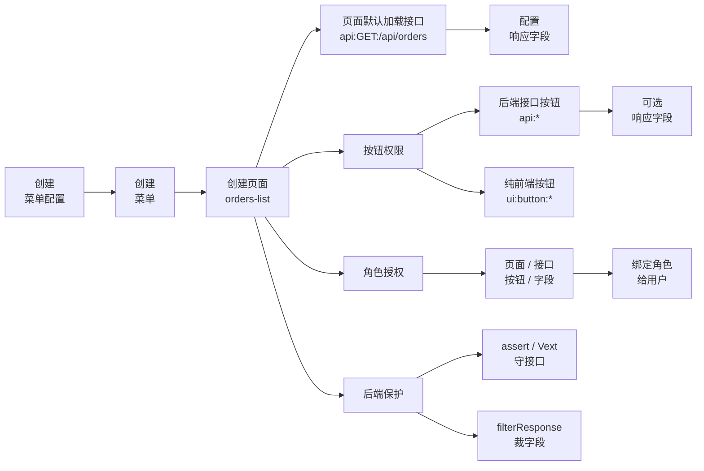

# 管理菜单

菜单管理的推荐用法是按后台页面的操作顺序来：先创建一套菜单配置，再创建菜单、页面、页面默认接口、按钮和响应字段。permission-core 会把这些操作编译成内部菜单节点、接口权限和字段库存；你不需要手动维护 `nodes`、`apiBindings` 或 owner 关系。

最小心智模型是：



<p className="pc-diagram-text" id="pc-diagram-menu-config-lifecycle-zh-text" data-diagram-id="menu-config-lifecycle"><strong>文字等价说明。</strong>管理端先创建菜单配置，在配置下创建菜单和页面；页面再分出默认加载接口、按钮权限、角色授权和后端保护几条线。加载接口和后端接口按钮可以继续配置响应字段；纯前端按钮只配置 UI 权限；角色授权选择页面、接口、按钮和字段，并通过用户角色绑定让权限生效；后端再用 assert、Vext 和 filterResponse 保护接口与响应字段。</p>

保存菜单不是授权用户。它只是把“系统有哪些菜单和接口”登记清楚；用户能看到什么、能调用什么，仍由角色授权决定。要让某个用户实际拥有这些权限，还需要用 `userRoles.assign()` 或 `userRoles.set()` 把角色交给用户。

如果你只是做后台管理页面，优先看前半部分的逐项方法；后面的 `MenuConfigInput`、`menus.config.save()` 和批量导入更适合插件、CI/CD 或配置即代码。

## 打开管理页：先读取完整菜单树

管理端菜单维护页打开时，通常第一步不是新增菜单，而是先把整棵菜单树读出来：

```ts
const current = await scoped.menus.configs.get('admin');
const menuTree = current.data.menus;
```

`menuTree` 是完整管理端配置树，包含菜单、子菜单、页面、页面默认接口、按钮和响应字段配置。

不要用 `list()` 读树。`menus.configs.list()` / `menus.config.list()` 只是列出多套菜单配置的摘要，例如 `admin`、`merchant-console`、`ops-console`，不会返回树节点。

也不要把它和用户运行时的 `subject.menus.getViewTree()` 混在一起：`getViewTree()` 会按当前用户权限过滤，只适合前端导航展示；管理端配置页要看完整树，应使用 `scoped.menus.configs.get(configId)`。

## 推荐后台页面布局

最容易理解的后台页面可以这样设计：

```text
左侧：菜单树
右侧：当前选中节点的配置区
  - 菜单信息
  - 页面
  - 页面默认接口
  - 按钮权限
  - 响应字段
```

用户在左侧选择一个菜单或页面，右侧只展示这个节点能配置的内容。这样前端表单和后端方法几乎是一一对应的：

| 右侧表单 | 保存方法 | 用户心智 |
|---|---|---|
| 菜单信息 | `menus.items.create()` / `update()` | 创建或修改左侧导航节点。 |
| 页面 | `menus.views.create()` / `update()` | 给菜单挂一个右侧页面、tab、弹窗或抽屉。 |
| 页面默认接口 | `menus.loadApis.add()` | 页面打开时默认调用哪个后端接口。 |
| 按钮权限 | `menus.actions.create()` | 页面里有哪些按钮；按钮是否调用后端看 `resource`。 |
| 响应字段 | `menus.responses.set()` | 某个接口响应里哪些字段可以被角色授权返回。 |

## 三套入口怎么选

普通后台优先用逐项方法；只有批量导入或配置即代码时再看高级入口。

| 场景 | 推荐入口 | 说明 |
|---|---|---|
| 后台管理页逐项保存 | `menus.configs/items/views/loadApis/actions/responses` | 默认选择；每个表单保存自己负责的对象。 |
| 一个保存按钮提交多个表单动作 | `menus.management.applyChanges()` | 例如同时创建菜单、页面和默认接口。 |
| 插件安装、CI/CD、一次导入整套菜单 | `MenuConfigInput` + `menus.config.save()` | 高级入口；表示“完整配置覆盖”。 |

## 推荐后台页面做法

有了左侧树和右侧表单后，每个表单保存时只调用自己对应的方法。

```ts
const scoped = pc.scope(
  { tenantId: 'acme', appId: 'admin' },
  { actorId: 'admin', requestId: 'req-menu-admin-save' },
);

await scoped.menus.configs.create({
  configId: 'admin',
  title: 'Admin console',
});

await scoped.menus.items.create('admin', {
  id: 'orders',
  title: '订单中心',
  icon: 'shopping-cart',
});

await scoped.menus.views.create('admin', 'orders', {
  id: 'orders-list',
  type: 'page',
  title: '订单列表',
  path: '/orders',
  component: 'OrdersPage',
});

await scoped.menus.loadApis.add('admin', 'orders-list', {
  resource: 'api:GET:/api/orders',
});

await scoped.menus.actions.create('admin', 'orders-list', {
  id: 'export',
  title: '导出订单',
  resource: 'api:POST:/api/orders/export',
});

await scoped.menus.responses.set('admin', {
  owner: {
    ownerType: 'load',
    viewId: 'orders-list',
    resource: 'api:GET:/api/orders',
  },
  response: {
    target: 'items',
    preserve: ['total'],
    fields: [
      { field: 'orderNo', title: '订单号' },
      { field: 'status', title: '状态' },
    ],
  },
});
```

`scope` 的第一个参数仍然只表示权限命名空间，例如租户和应用；第二个参数才是本次管理请求的审计默认值。这样不会把 `actorId` 混进租户 scope，也不用每个方法重复传。

这段代码就是一个后台菜单管理页最常见的落库顺序：

| 第几步 | 管理端表单 | 调用方法 | 保存什么 |
|---|---|---|---|
| 1 | 创建菜单配置 | `menus.configs.create()` | 创建一套空配置，例如 `admin`。 |
| 2 | 创建菜单 | `menus.items.create()` | 创建左侧菜单，例如订单中心。 |
| 3 | 创建页面 | `menus.views.create()` | 把订单列表页挂到订单中心下面。 |
| 4 | 配置页面接口 | `menus.loadApis.add()` | 页面打开时默认请求 `api:GET:/api/orders`。 |
| 5 | 配置按钮 | `menus.actions.create()` | 创建导出按钮；如果是 `api:*`，表示按钮会请求后端。 |
| 6 | 配置响应字段 | `menus.responses.set()` | 声明订单接口哪些字段可以被角色授权返回。 |

一个真实后台通常不止一个菜单，可以按同样模型扩展：

| 左侧菜单 | 右侧页面 | 页面默认接口 | 按钮或操作 |
|---|---|---|---|
| 订单中心 | 订单列表 | `api:GET:/api/orders` | 导出、审核、删除 |
| 商户中心 | 商户列表 | `api:GET:/api/merchants` | 禁用、查看详情 |
| 系统设置 | 用户管理 | `api:GET:/api/users` | 重置密码、分配角色 |

普通创建、更新、添加接口、设置字段时，可以像上面这样直接执行。permission-core 会在内部先预览，确认没有冲突后再提交；如果变更不可安全自动提交，会抛出 `MENU_MANAGEMENT_PREVIEW_CONFLICT`，这时再让管理员进入显式预览确认。

如果一个后台页面点击“保存”时需要同时提交多个表单动作，再用 `menus.management.applyChanges()`：

```ts
const result = await scoped.menus.management.applyChanges('admin', [
  {
    operation: 'menu.create',
    input: { id: 'merchant', title: '商户中心' },
  },
  {
    operation: 'view.create',
    menuId: 'merchant',
    input: { id: 'merchant-list', type: 'page', title: '商户列表', path: '/merchants', component: 'MerchantListPage' },
  },
  {
    operation: 'loadApi.add',
    viewId: 'merchant-list',
    input: { resource: 'api:GET:/api/merchants' },
  },
]);
```

| 管理端动作 | 方法 |
|---|---|
| 创建一套空配置 | `menus.configs.previewCreate()` / `menus.configs.create()` |
| 创建、改名、删除菜单 | `menus.items.previewCreate()` / `create()` / `previewUpdate()` / `update()` / `previewRemove()` / `remove()` |
| 创建、更新、删除页面 | `menus.views.*` |
| 添加页面默认接口 | `menus.loadApis.previewAdd()` / `add()` |
| 添加按钮或操作 | `menus.actions.previewCreate()` / `create()` |
| 配置接口响应字段 | `menus.responses.previewSet()` / `set()` |

`menus.configs.create()` 可以创建空配置，便于后台先建菜单树再慢慢补页面；但 `menus.config.save({ menus: [] })` 仍然会失败，因为批量入口表示“完整配置覆盖”，空数组很容易误删整套菜单。

什么时候需要显式 preview？

| 场景 | 建议 |
|---|---|
| 普通创建/更新菜单、页面、接口、按钮、字段 | 先在 `pc.scope(scope, defaults)` 绑定 `actorId/requestId`，然后直接调用 `create/update/add/set`。 |
| 删除时带 `cascade: true` 或 `revokeGrants: true` | 先 `previewRemove()`，展示影响，再带 `expected/previewToken` 执行。 |
| 返回 `MENU_MANAGEMENT_PREVIEW_CONFLICT` | 读取 `error.details.operations/conflicts`，让管理员确认或修改输入。 |
| 管理端需要先展示“将修改哪些内容” | 主动调用 `preview*()`，确认后用同一份输入执行。 |

`idempotencyKey` 是可选的高级覆盖项。日常代码不用手写；如果传了 `requestId`，permission-core 会自动派生内部幂等键，用来处理“用户双击保存、浏览器超时后重试、网关重复投递”这类重复提交问题。只有你需要接入外部网关、消息队列或已有幂等协议时，才显式传 `idempotencyKey`。

显式预览时，`preview.executable === true` 表示当前变更没有冲突，可以用同一份输入继续调用执行方法；`preview.executable === false` 表示不能提交，应把 `preview.conflicts` 展示给管理员处理。不要在 preview 后修改输入再提交。

## 管理端动作详解

管理端对象方法适合普通后台表单逐项保存。所有写操作都遵循同一个模式：

```ts
const result = await scoped.menus.items.create('admin', input);
```

`create/update/add/set()` 返回 `MutationResult<MenuManagementResult>`，会真正写入配置、同步内部菜单节点、接口契约和响应字段库存。`preview*()` 返回 `ImpactPreview<MenuManagementPlan>`，只读不写库，适合删除、容量风险或管理端想先展示影响的场景。

推荐在 `pc.scope(scope, defaults)` 里绑定本次管理请求的 `actorId/requestId`。单次方法的 `options` 只在需要覆盖默认值、提交显式 preview 凭证或确认容量风险时再传；`idempotencyKey` 不是权限模型的一部分，只是给高级接入场景覆盖默认策略。

下面只讲“什么时候用哪个方法”。详细返回结构、`revisions`、`operationId`、`auditId`、`manifestOperations` 等调试字段，可以先跳过，需要时再看[菜单 API](/zh/api/menus)。

### 创建空配置

初始化菜单管理配置时，管理端后台通常先按 `configId` 读取配置；如果配置不存在，再调用 `menus.configs.create()` 创建一套空配置。前端不需要维护单独的首次访问状态，也不要每次打开页面都重复 `create`；已有配置继续读取或更新，后续可逐步添加菜单和页面。

```ts
const input = {
  configId: 'admin',
  title: 'Admin console',
};

const created = await scoped.menus.configs.create(input);
```

如果管理端想先展示影响，也可以调用 `previewCreate()`。执行成功后会返回最新配置、操作摘要和审计 ID；精确返回结构见[菜单 API](/zh/api/menus)。

### 创建、更新和删除菜单

菜单是左侧导航节点。创建顶层菜单时不传 `parentId`；创建子菜单时传 `parentId`。

```ts
const menuInput = {
  id: 'orders',
  title: '订单中心',
  icon: 'shopping-cart',
};

const created = await scoped.menus.items.create('admin', menuInput);
```

创建成功后，`current.data.menus` 里会出现这个菜单节点。需要完整响应字段时看[菜单 API](/zh/api/menus)。

改名或调整图标：

```ts
await scoped.menus.items.update('admin', 'orders', {
  title: '订单管理',
  icon: 'receipt',
});
```

删除菜单：

```ts
const preview = await scoped.menus.items.previewRemove('admin', 'orders', {
  cascade: true,
  revokeGrants: true,
});

await scoped.menus.items.remove('admin', 'orders', {
  cascade: true,
  revokeGrants: true,
}, {
  ...preview.expected,
  previewToken: preview.previewToken,
});
```

`cascade: true` 表示连同后代菜单、页面、按钮和响应字段一起删除；`revokeGrants: true` 表示同步撤销已失效的角色菜单授权。

### 创建、更新和删除页面

页面挂在菜单下面。一个菜单可以有多个页面，也可以有 `tab`、`dialog` 或 `drawer` 类型视图。

```ts
const viewInput = {
  id: 'orders-list',
  type: 'page',
  title: '订单列表',
  path: '/orders',
  component: 'OrdersPage',
};

await scoped.menus.views.create('admin', 'orders', viewInput);
```

创建成功后，这个页面会出现在所属菜单的 `views` 里。

更新页面：

```ts
await scoped.menus.views.update('admin', 'orders-list', {
  title: '订单查询',
  component: 'OrderSearchPage',
});
```

删除页面：

```ts
const preview = await scoped.menus.views.previewRemove('admin', 'orders-list', {
  cascade: true,
  revokeGrants: true,
});

await scoped.menus.views.remove('admin', 'orders-list', {
  cascade: true,
  revokeGrants: true,
}, {
  ...preview.expected,
  previewToken: preview.previewToken,
});
```

删除页面会同时影响页面上的默认加载接口、按钮和响应字段；先看 `preview.plan.affectedRoles`，再决定是否执行。

### 添加、更新和删除页面默认接口

页面默认接口是页面打开时必须调用的后端接口。这里不需要写 `action: 'invoke'`，系统会自动把它编译成 `invoke + api:*`。

```ts
const loadInput = {
  resource: 'api:GET:/api/orders',
};

await scoped.menus.loadApis.add('admin', 'orders-list', loadInput);
```

保存后，这个接口会出现在页面的 `load` 里，并会进入后续角色授权和后端接口保护流程。

更新默认接口的响应字段或元数据：

```ts
await scoped.menus.loadApis.update(
  'admin',
  'orders-list',
  'api:GET:/api/orders',
  {
    response: {
      target: 'items',
      preserve: ['total'],
      fields: [
        { field: 'orderNo', title: '订单号' },
        { field: 'status', title: '状态' },
      ],
    },
  },
);
```

普通更新不需要额外传 `options`。如果你已经在 `pc.scope(scope, defaults)` 里绑定了 `actorId/requestId`，审计和幂等上下文会自动带上。

删除默认接口：

```ts
const preview = await scoped.menus.loadApis.previewRemove(
  'admin',
  'orders-list',
  'api:GET:/api/orders',
  { revokeGrants: true },
);

await scoped.menus.loadApis.remove(
  'admin',
  'orders-list',
  'api:GET:/api/orders',
  { revokeGrants: true },
  {
    ...preview.expected,
    previewToken: preview.previewToken,
  },
);
```

### 创建、更新和删除按钮

按钮或操作挂在页面下。`resource` 是 `api:*` 时表示会调用后端接口；`resource` 是 `ui:button:*` 时表示纯前端权限点。

```ts
const actionInput = {
  id: 'export',
  title: '导出订单',
  resource: 'api:POST:/api/orders/export',
};

await scoped.menus.actions.create('admin', 'orders-list', actionInput);
```

保存后，这个按钮会出现在页面的 `actions` 里。角色授权时可以选择它，运行时用 `getActionMap()` 投影按钮状态。

纯前端按钮：

```ts
await scoped.menus.actions.create('admin', 'orders-list', {
  id: 'show-cost-column',
  title: '显示成本列',
  resource: 'ui:button:orders.show-cost-column',
});
```

更新按钮：

```ts
await scoped.menus.actions.update('admin', 'orders-list', 'export', {
  title: '导出订单 Excel',
  enabled: true,
});
```

删除按钮：

```ts
const preview = await scoped.menus.actions.previewRemove('admin', 'orders-list', 'export', {
  revokeGrants: true,
});

await scoped.menus.actions.remove('admin', 'orders-list', 'export', {
  revokeGrants: true,
}, {
  ...preview.expected,
  previewToken: preview.previewToken,
});
```

### 设置和删除接口响应字段

响应字段权限属于接口响应 DTO，不属于数据库字段权限。字段配置必须指向一个已经存在的页面加载接口或 API 按钮。

```ts
const responseInput = {
  owner: {
    ownerType: 'load',
    viewId: 'orders-list',
    resource: 'api:GET:/api/orders',
  },
  response: {
    target: 'items',
    preserve: ['total'],
    fields: [
      { field: 'orderNo', title: '订单号' },
      { field: 'status', title: '状态' },
      { field: 'amount', title: '金额' },
    ],
  },
};

await scoped.menus.responses.set('admin', responseInput);
```

保存后，这些字段会成为角色授权时可选择的字段；用户是否真的拿到字段，还要看角色菜单授权。

按钮接口也可以配置响应字段：

```ts
await scoped.menus.responses.set('admin', {
  owner: {
    ownerType: 'action',
    viewId: 'orders-list',
    actionId: 'export',
  },
  response: {
    fields: [
      { field: 'downloadUrl', title: '下载地址' },
    ],
  },
});
```

删除部分字段：

```ts
const preview = await scoped.menus.responses.previewRemove('admin', {
  owner: {
    ownerType: 'load',
    viewId: 'orders-list',
    resource: 'api:GET:/api/orders',
  },
  target: 'items',
  fields: ['amount'],
  revokeGrants: true,
});

await scoped.menus.responses.remove('admin', {
  owner: {
    ownerType: 'load',
    viewId: 'orders-list',
    resource: 'api:GET:/api/orders',
  },
  target: 'items',
  fields: ['amount'],
  revokeGrants: true,
}, {
  ...preview.expected,
  previewToken: preview.previewToken,
});
```

删除整个接口的响应字段配置时省略 `fields`。如果字段已经授权给角色，建议带上 `revokeGrants: true`，避免保留失效字段授权。

### 一次提交多个后台表单动作

如果一个后台页面点击“保存”时要同时创建菜单、页面、接口和按钮，用 `menus.management.applyChanges()` 更合适。它和对象方法使用同一套底层编译逻辑，只是把多个动作合并为一次内部预览和一次提交；如果页面要先展示影响，再额外调用 `previewChanges()`。

```ts
const changes = [
  { operation: 'menu.create', input: { id: 'merchant', title: '商户中心' } },
  {
    operation: 'view.create',
    menuId: 'merchant',
    input: {
      id: 'merchant-list',
      type: 'page',
      title: '商户列表',
      path: '/merchants',
      component: 'MerchantListPage',
    },
  },
  {
    operation: 'loadApi.add',
    viewId: 'merchant-list',
    input: { resource: 'api:GET:/api/merchants' },
  },
] as const;

await scoped.menus.management.applyChanges('admin', changes);
```

如果这个保存页想先展示“会创建哪些资产”，可以先调用 `previewChanges()`。执行成功后会返回本次新增、更新、删除的摘要；精确响应结构见[菜单 API](/zh/api/menus)。

## 高级：配置即代码和批量导入

如果你从插件、CI/CD 或配置文件一次性导入完整菜单，不建议把大段 `MenuConfigInput` 放在普通后台流程里读。请看单独的高级页：[菜单配置即代码与批量导入](/zh/guide/menu-config-as-code)。

## 给角色分配菜单能力

保存配置后，角色仍然没有权限。要让角色看到订单页、调用加载接口、看到导出按钮，并只拿到部分响应字段，需要单独授权：

```ts
const selection = {
  configId: 'admin',
  views: ['orders-list'],
  responseFields: [{
    apiResource: 'api:GET:/api/orders',
    target: 'items',
    fields: ['orderNo', 'status'],
  }],
  include: {
    loads: true,
    actions: true,
    responseFields: 'none',
  },
};

const grantPreview = await scoped.roles.menuPermissions.preview(
  'order-operator',
  { operation: 'grant', selection },
);
const granted = await scoped.roles.menuPermissions.grant(
  'order-operator',
  selection,
  {
    ...grantPreview.expected,
    previewToken: grantPreview.previewToken,
  },
);
```

`views` 是管理员勾选的页面。默认会包含页面的加载接口，不会自动包含按钮，也不会自动全选响应字段。`include.loads: true` 会把页面加载接口一起授权；`include.actions: true` 会把页面按钮或操作一起授权；`responseFields` 明确允许哪些响应字段。分页响应使用 `target: 'items'` 指明裁剪哪一层数组；`include.responseFields: 'none'` 表示不要自动全选字段，只使用 `responseFields` 中列出的字段。

完整授权规则见[角色菜单授权](/zh/guide/role-menu-authorization)。

## 用户端读取菜单和接口响应

```ts
await scoped.userRoles.assign('u-menu', 'order-operator');

const subjectMenus = pc.forSubject({
  userId: 'u-menu',
  scope: { tenantId: 'acme', appId: 'admin' },
}).menus;

const tree = await subjectMenus.getViewTree({ configId: 'admin' });
const state = await subjectMenus.getViewState({ configId: 'admin', viewId: 'orders-list' });
const actions = await subjectMenus.getActionMap({ configId: 'admin', viewId: 'orders-list' });
const response = await subjectMenus.filterResponse('api:GET:/api/orders', {
  items: [{ orderNo: 'O-1001', status: 'paid', amount: 88, internalCost: 51 }],
  total: 1,
  debug: true,
});
const projectedResponse = response.data;
```

```json
{
  "viewTreeIds": ["orders"],
  "viewAllowed": true,
  "exportEnabled": true,
  "projectedResponse": {
    "items": [{ "orderNo": "O-1001", "status": "paid" }],
    "total": 1
  }
}
```

`getViewTree()` 给前端导航树；`getViewState()` 判断某个页面是否允许进入；`getActionMap()` 返回页面下每个按钮是否可见和可用；`filterResponse()` 先检查当前用户是否能 `invoke` 这个 `api:` 资源，再按响应字段授权裁剪数据，裁剪后的业务数据在 `response.data`。它不是前端隐藏字段，而是在后端返回前过滤。

## 常见误区

| 误区 | 正确理解 |
|---|---|
| 保存菜单后用户就有权限 | 保存只是登记系统能力；还要 `roles.menuPermissions.grant` 和 `userRoles.assign`。 |
| `load` 里还要写 `action: 'invoke'` | 不需要。`load.resource` 使用 `api:` 资源时系统自动补成 `invoke`。 |
| 响应字段只支持一层字段 | 支持点路径，也支持 `{ target, preserve, fields }` 处理分页响应。 |
| 选中页面会自动拥有全部响应字段 | 不会。默认只给页面加载接口，不给字段；要么显式写 `responseFields`，要么主动设置 `include.responseFields: 'all'`。 |
| `filterResponse()` 可以替代接口鉴权 | 不能。它会做接口权限检查，但业务接口仍应使用 `subject.assert()` 或 Vext guard 保护入口。 |

下一步通常是配置页面默认接口、按钮接口和响应字段，见[接口与响应字段](/zh/guide/api-bindings)。可运行完整示例见[菜单管理示例](/zh/examples/menu-admin)，精确签名见[菜单 API](/zh/api/menus)和[配置接口与响应字段 API](/zh/api/api-bindings)。
