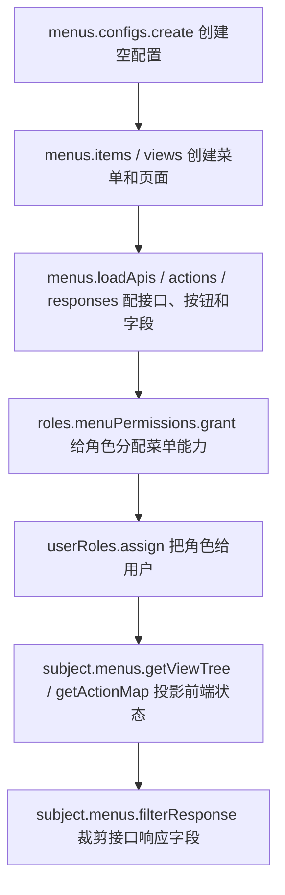

# 管理菜单

菜单管理的推荐用法是按后台页面的操作顺序来：先创建一套菜单配置，再创建菜单、页面、页面默认接口、按钮和响应字段。permission-core 会把这些操作编译成内部菜单节点、接口权限和字段库存；你不需要手动维护 `nodes`、`apiBindings` 或 owner 关系。

最小心智模型是：



<p className="pc-diagram-text" id="pc-diagram-menu-config-lifecycle-zh-text" data-diagram-id="menu-config-lifecycle"><strong>文字等价说明。</strong>管理端先创建空配置，再逐项创建菜单、页面、加载接口、按钮和响应字段；角色菜单授权再分配其中的页面、加载接口、操作和响应字段；用户绑定该角色后，subject 菜单运行时会投影可见导航、操作状态、页面状态和裁剪后的接口响应。</p>

保存菜单不是授权用户。它只是把“系统有哪些菜单和接口”登记清楚；用户能看到什么、能调用什么，仍由角色授权决定。

## 推荐后台页面做法

后台管理系统通常有多个表单：菜单表单、页面表单、接口表单、按钮表单、字段表单。对应到 permission-core，就是下面这些对象方法。

```ts
const scoped = pc.scope({ tenantId: 'acme', appId: 'admin' });

const result = await scoped.menus.management.applyChanges('admin', [
  { operation: 'config.create', input: { configId: 'admin', title: 'Admin console' } },
  { operation: 'menu.create', input: { id: 'orders', title: '订单中心', icon: 'shopping-cart' } },
  {
    operation: 'view.create',
    menuId: 'orders',
    input: {
      id: 'orders-list',
      type: 'page',
      title: '订单列表',
      path: '/orders',
      component: 'OrdersPage',
    },
  },
  { operation: 'loadApi.add', viewId: 'orders-list', input: { resource: 'api:GET:/api/orders' } },
  { operation: 'action.create', viewId: 'orders-list', input: { id: 'export', title: '导出订单', resource: 'api:POST:/api/orders/export' } },
  {
    operation: 'response.set',
    input: {
      owner: { ownerType: 'load', viewId: 'orders-list', resource: 'api:GET:/api/orders' },
      response: {
        target: 'items',
        preserve: ['total'],
        fields: [
          { field: 'orderNo', title: '订单号' },
          { field: 'status', title: '状态' },
        ],
      },
    },
  },
], {
  actorId: 'admin',
  idempotencyKey: 'admin-menu-bootstrap-v1',
});
```

普通创建、更新、添加接口、设置字段时，可以像上面这样直接执行。permission-core 会在内部先预览，确认没有冲突后再提交；如果变更不可安全自动提交，会抛出 `MENU_MANAGEMENT_PREVIEW_CONFLICT`，这时再让管理员进入显式预览确认。

上面用 `management.applyChanges()` 一次提交多个表单变更；如果你的页面是单项保存，也可以用对象方法：

| 管理端动作 | 方法 |
|---|---|
| 创建一套空配置 | `menus.configs.previewCreate()` / `menus.configs.create()` |
| 创建、改名、删除菜单 | `menus.items.previewCreate()` / `create()` / `previewUpdate()` / `update()` / `previewRemove()` / `remove()` |
| 创建、更新、删除页面 | `menus.views.*` |
| 添加页面默认接口 | `menus.loadApis.previewAdd()` / `add()` |
| 添加按钮或操作 | `menus.actions.previewCreate()` / `create()` |
| 配置接口响应字段 | `menus.responses.previewSet()` / `set()` |

`menus.configs.create()` 可以创建空配置，便于后台先建菜单树再慢慢补页面；但 `menus.config.save({ menus: [] })` 仍然会失败，因为批量入口表示“完整配置覆盖”，空数组很容易误删整套菜单。

什么时候需要显式 preview？

| 场景 | 建议 |
|---|---|
| 普通创建/更新菜单、页面、接口、按钮、字段 | 直接调用 `create/update/add/set`，传 `actorId/idempotencyKey`。 |
| 删除时带 `cascade: true` 或 `revokeGrants: true` | 先 `previewRemove()`，展示影响，再带 `expected/previewToken` 执行。 |
| 返回 `MENU_MANAGEMENT_PREVIEW_CONFLICT` | 读取 `error.details.operations/conflicts`，让管理员确认或修改输入。 |
| 管理端需要先展示“将修改哪些内容” | 主动调用 `preview*()`，确认后用同一份输入执行。 |

显式预览时，`preview.executable === true` 表示当前变更没有冲突，可以用同一份输入继续调用执行方法；`preview.executable === false` 表示不能提交，应把 `preview.conflicts` 展示给管理员处理。不要在 preview 后修改输入再提交。

## 管理端动作详解

管理端对象方法适合普通后台表单逐项保存。所有写操作都遵循同一个模式：

```ts
const result = await scoped.menus.items.create('admin', input, {
  actorId: 'admin',
  idempotencyKey: 'menu-change-unique-key',
});
```

`create/update/add/set()` 返回 `MutationResult<MenuManagementResult>`，会真正写入配置、同步内部菜单节点、接口契约和响应字段库存。`preview*()` 返回 `ImpactPreview<MenuManagementPlan>`，只读不写库，适合删除、容量风险或管理端想先展示影响的场景。

下面的响应示例只保留关键字段，真实返回还会包含 `revisions`、`operationId`、`auditId`、`cache`、`warnings` 和 `detailBudget`。

### 创建空配置

后台第一次进入菜单管理时，先创建一套空配置。空配置可以后续逐步添加菜单和页面。

```ts
const input = {
  configId: 'admin',
  title: 'Admin console',
};

const created = await scoped.menus.configs.create(input, {
  actorId: 'admin',
  idempotencyKey: 'config-admin-create-v1',
});
```

如果管理端想先展示影响，也可以调用 `previewCreate()`。预览响应节选：

```json
{
  "executable": true,
  "previewToken": "preview_...",
  "expected": {
    "expectedRevisions": {
      "menu": 1
    }
  },
  "plan": {
    "configId": "admin",
    "operations": {
      "total": 1,
      "items": [
        { "operation": "config.create", "targetId": "admin", "outcome": "created" }
      ]
    },
    "manifestOperations": { "total": 0, "sampleIds": [] }
  },
  "conflicts": { "total": 0, "items": [] }
}
```

执行响应节选：

```json
{
  "committed": true,
  "changed": true,
  "data": {
    "configId": "admin",
    "config": {
      "configId": "admin",
      "title": "Admin console",
      "menus": []
    },
    "operations": {
      "inserted": 1,
      "updated": 0,
      "unchanged": 0,
      "deleted": 0
    },
    "retainedGrantCount": 0,
    "revokedGrantCount": 0
  },
  "auditId": "audit_..."
}
```

### 创建、更新和删除菜单

菜单是左侧导航节点。创建顶层菜单时不传 `parentId`；创建子菜单时传 `parentId`。

```ts
const menuInput = {
  id: 'orders',
  title: '订单中心',
  icon: 'shopping-cart',
};

const created = await scoped.menus.items.create('admin', menuInput, {
  actorId: 'admin',
  idempotencyKey: 'menu-orders-create-v1',
});
```

执行响应节选：

```json
{
  "changed": true,
  "data": {
    "configId": "admin",
    "config": {
      "menus": [
        { "id": "orders", "title": "订单中心", "views": [] }
      ]
    },
    "operations": {
      "inserted": 1,
      "samples": {
        "items": [
          { "id": "mc-m-...", "outcome": "inserted" }
        ]
      }
    }
  }
}
```

改名或调整图标：

```ts
await scoped.menus.items.update('admin', 'orders', {
  title: '订单管理',
  icon: 'receipt',
}, {
  actorId: 'admin',
  idempotencyKey: 'menu-orders-rename-v1',
});
```

删除菜单：

```ts
const preview = await scoped.menus.items.previewRemove('admin', 'orders', {
  cascade: true,
  revokeGrants: true,
});

await scoped.menus.items.remove('admin', 'orders', {
  cascade: true,
  revokeGrants: true,
}, {
  ...preview.expected,
  previewToken: preview.previewToken,
  actorId: 'admin',
});
```

删除响应节选：

```json
{
  "changed": true,
  "data": {
    "configId": "admin",
    "operations": {
      "deleted": 3,
      "samples": {
        "items": [
          { "id": "mc-m-...", "outcome": "deleted" },
          { "id": "mc-v-...", "outcome": "deleted" }
        ]
      }
    },
    "revokedGrantCount": 1
  }
}
```

`cascade: true` 表示连同后代菜单、页面、按钮和响应字段一起删除；`revokeGrants: true` 表示同步撤销已失效的角色菜单授权。

### 创建、更新和删除页面

页面挂在菜单下面。一个菜单可以有多个页面，也可以有 `tab`、`dialog` 或 `drawer` 类型视图。

```ts
const viewInput = {
  id: 'orders-list',
  type: 'page',
  title: '订单列表',
  path: '/orders',
  component: 'OrdersPage',
};

await scoped.menus.views.create('admin', 'orders', viewInput, {
  actorId: 'admin',
  idempotencyKey: 'view-orders-list-create-v1',
});
```

执行响应节选：

```json
{
  "changed": true,
  "data": {
    "configId": "admin",
    "config": {
      "menus": [
        {
          "id": "orders",
          "views": [
            {
              "id": "orders-list",
              "type": "page",
              "title": "订单列表",
              "path": "/orders"
            }
          ]
        }
      ]
    },
    "operations": { "inserted": 1, "updated": 1 }
  }
}
```

更新页面：

```ts
await scoped.menus.views.update('admin', 'orders-list', {
  title: '订单查询',
  component: 'OrderSearchPage',
}, {
  actorId: 'admin',
  idempotencyKey: 'view-orders-list-update-v1',
});
```

删除页面：

```ts
const preview = await scoped.menus.views.previewRemove('admin', 'orders-list', {
  cascade: true,
  revokeGrants: true,
});

await scoped.menus.views.remove('admin', 'orders-list', {
  cascade: true,
  revokeGrants: true,
}, {
  ...preview.expected,
  previewToken: preview.previewToken,
  actorId: 'admin',
});
```

删除页面会同时影响页面上的默认加载接口、按钮和响应字段；先看 `preview.plan.affectedRoles`，再决定是否执行。

### 添加、更新和删除页面默认接口

页面默认接口是页面打开时必须调用的后端接口。这里不需要写 `action: 'invoke'`，系统会自动把它编译成 `invoke + api:*`。

```ts
const loadInput = {
  resource: 'api:GET:/api/orders',
};

await scoped.menus.loadApis.add('admin', 'orders-list', loadInput, {
  actorId: 'admin',
  idempotencyKey: 'orders-list-load-add-v1',
});
```

执行响应节选：

```json
{
  "changed": true,
  "data": {
    "configId": "admin",
    "config": {
      "menus": [
        {
          "views": [
            {
              "id": "orders-list",
              "load": [
                { "resource": "api:GET:/api/orders" }
              ]
            }
          ]
        }
      ]
    },
    "manifestOperations": {
      "inserted": 1,
      "samples": {
        "items": [
          { "id": "api_GET_/api/orders", "outcome": "inserted" }
        ]
      }
    }
  }
}
```

更新默认接口的响应字段或元数据：

```ts
await scoped.menus.loadApis.update(
  'admin',
  'orders-list',
  'api:GET:/api/orders',
  {
    response: {
      target: 'items',
      preserve: ['total'],
      fields: [
        { field: 'orderNo', title: '订单号' },
        { field: 'status', title: '状态' },
      ],
    },
  },
  {
    actorId: 'admin',
    idempotencyKey: 'orders-list-load-response-v1',
  },
);
```

删除默认接口：

```ts
const preview = await scoped.menus.loadApis.previewRemove(
  'admin',
  'orders-list',
  'api:GET:/api/orders',
  { revokeGrants: true },
);

await scoped.menus.loadApis.remove(
  'admin',
  'orders-list',
  'api:GET:/api/orders',
  { revokeGrants: true },
  {
    ...preview.expected,
    previewToken: preview.previewToken,
    actorId: 'admin',
  },
);
```

### 创建、更新和删除按钮

按钮或操作挂在页面下。`resource` 是 `api:*` 时表示会调用后端接口；`resource` 是 `ui:button:*` 时表示纯前端权限点。

```ts
const actionInput = {
  id: 'export',
  title: '导出订单',
  resource: 'api:POST:/api/orders/export',
};

await scoped.menus.actions.create('admin', 'orders-list', actionInput, {
  actorId: 'admin',
  idempotencyKey: 'action-orders-export-create-v1',
});
```

执行响应节选：

```json
{
  "changed": true,
  "data": {
    "configId": "admin",
    "config": {
      "menus": [
        {
          "views": [
            {
              "id": "orders-list",
              "actions": [
                {
                  "id": "export",
                  "title": "导出订单",
                  "resource": "api:POST:/api/orders/export"
                }
              ]
            }
          ]
        }
      ]
    },
    "manifestOperations": { "inserted": 1 }
  }
}
```

纯前端按钮：

```ts
await scoped.menus.actions.create('admin', 'orders-list', {
  id: 'show-cost-column',
  title: '显示成本列',
  resource: 'ui:button:orders.show-cost-column',
}, {
  actorId: 'admin',
  idempotencyKey: 'action-show-cost-column-v1',
});
```

更新按钮：

```ts
await scoped.menus.actions.update('admin', 'orders-list', 'export', {
  title: '导出订单 Excel',
  enabled: true,
}, {
  actorId: 'admin',
  idempotencyKey: 'action-orders-export-update-v1',
});
```

删除按钮：

```ts
const preview = await scoped.menus.actions.previewRemove('admin', 'orders-list', 'export', {
  revokeGrants: true,
});

await scoped.menus.actions.remove('admin', 'orders-list', 'export', {
  revokeGrants: true,
}, {
  ...preview.expected,
  previewToken: preview.previewToken,
  actorId: 'admin',
});
```

### 设置和删除接口响应字段

响应字段权限属于接口响应 DTO，不属于数据库字段权限。字段配置必须指向一个已经存在的页面加载接口或 API 按钮。

```ts
const responseInput = {
  owner: {
    ownerType: 'load',
    viewId: 'orders-list',
    resource: 'api:GET:/api/orders',
  },
  response: {
    target: 'items',
    preserve: ['total'],
    fields: [
      { field: 'orderNo', title: '订单号' },
      { field: 'status', title: '状态' },
      { field: 'amount', title: '金额' },
    ],
  },
};

await scoped.menus.responses.set('admin', responseInput, {
  actorId: 'admin',
  idempotencyKey: 'orders-response-fields-v1',
});
```

执行响应节选：

```json
{
  "changed": true,
  "data": {
    "configId": "admin",
    "config": {
      "menus": [
        {
          "views": [
            {
              "id": "orders-list",
              "load": [
                {
                  "resource": "api:GET:/api/orders",
                  "response": {
                    "target": "items",
                    "preserve": ["total"],
                    "fields": [
                      { "field": "orderNo", "title": "订单号" },
                      { "field": "status", "title": "状态" },
                      { "field": "amount", "title": "金额" }
                    ]
                  }
                }
              ]
            }
          ]
        }
      ]
    },
    "detachedResponseFieldCount": 0
  }
}
```

按钮接口也可以配置响应字段：

```ts
await scoped.menus.responses.set('admin', {
  owner: {
    ownerType: 'action',
    viewId: 'orders-list',
    actionId: 'export',
  },
  response: {
    fields: [
      { field: 'downloadUrl', title: '下载地址' },
    ],
  },
}, {
  actorId: 'admin',
  idempotencyKey: 'orders-export-response-fields-v1',
});
```

删除部分字段：

```ts
const preview = await scoped.menus.responses.previewRemove('admin', {
  owner: {
    ownerType: 'load',
    viewId: 'orders-list',
    resource: 'api:GET:/api/orders',
  },
  target: 'items',
  fields: ['amount'],
  revokeGrants: true,
});

await scoped.menus.responses.remove('admin', {
  owner: {
    ownerType: 'load',
    viewId: 'orders-list',
    resource: 'api:GET:/api/orders',
  },
  target: 'items',
  fields: ['amount'],
  revokeGrants: true,
}, {
  ...preview.expected,
  previewToken: preview.previewToken,
  actorId: 'admin',
});
```

删除整个接口的响应字段配置时省略 `fields`。如果字段已经授权给角色，建议带上 `revokeGrants: true`，避免保留失效字段授权。

### 一次提交多个后台表单动作

如果一个后台页面点击“保存”时要同时创建菜单、页面、接口和按钮，用 `menus.management.applyChanges()` 更合适。它和对象方法使用同一套底层编译逻辑，只是把多个动作合并为一次内部预览和一次提交；如果页面要先展示影响，再额外调用 `previewChanges()`。

```ts
const changes = [
  { operation: 'menu.create', input: { id: 'merchant', title: '商户中心' } },
  {
    operation: 'view.create',
    menuId: 'merchant',
    input: {
      id: 'merchant-list',
      type: 'page',
      title: '商户列表',
      path: '/merchants',
      component: 'MerchantListPage',
    },
  },
  {
    operation: 'loadApi.add',
    viewId: 'merchant-list',
    input: { resource: 'api:GET:/api/merchants' },
  },
] as const;

await scoped.menus.management.applyChanges('admin', changes, {
  actorId: 'admin',
  idempotencyKey: 'merchant-menu-bootstrap-v1',
});
```

如果这个保存页想先展示“会创建哪些资产”，可以先调用 `previewChanges()`。预览响应节选：

```json
{
  "executable": true,
  "plan": {
    "configId": "admin",
    "operations": {
      "total": 3,
      "items": [
        { "operation": "menu.create", "targetId": "merchant", "outcome": "created" },
        { "operation": "view.create", "targetId": "merchant-list", "outcome": "created" },
        { "operation": "loadApi.add", "targetId": "api:GET:/api/merchants", "outcome": "created" }
      ]
    },
    "manifestOperations": {
      "total": 3
    },
    "affectedRoles": {
      "total": 0
    }
  },
  "conflicts": { "total": 0, "items": [] }
}
```

执行响应节选：

```json
{
  "committed": true,
  "changed": true,
  "data": {
    "configId": "admin",
    "operations": {
      "inserted": 3,
      "updated": 1,
      "deleted": 0,
      "conflicted": 0
    },
    "manifestOperations": {
      "inserted": 3,
      "updated": 1,
      "deleted": 0,
      "conflicted": 0
    },
    "retainedGrantCount": 0,
    "refreshedGrantCount": 0,
    "revokedGrantCount": 0,
    "detachedResponseFieldCount": 0
  },
  "auditId": "audit_..."
}
```

## 配置即代码和批量导入

如果你从插件、CI/CD 或配置文件一次性导入完整菜单，仍然可以使用 `MenuConfigInput`：

```ts
const menuConfig = {
  configId: 'admin',
  title: 'Admin console',
  menus: [{
    id: 'orders',
    title: 'Orders',
    icon: 'shopping-cart',
    views: [{
      id: 'orders-list',
      type: 'page',
      title: 'Orders',
      path: '/orders',
      component: 'OrdersPage',
      load: [{
        resource: 'api:GET:/api/orders',
        response: {
          target: 'items',
          preserve: ['total'],
          fields: [
            { field: 'orderNo', title: '订单号' },
            { field: 'status', title: '状态' },
            { field: 'amount', title: '金额' },
          ],
        },
      }],
      actions: [{
        id: 'export',
        title: '导出订单',
        resource: 'api:POST:/api/orders/export',
        response: [{ field: 'downloadUrl', title: '下载地址' }],
      }],
    }],
  }],
};
```

这份配置表达四件事：

| 字段 | 表达什么 | 运行时影响 |
|---|---|---|
| `configId` | 一套菜单配置的稳定 ID | 后续授权和运行时读取都用它定位这一套后台菜单。 |
| `menus[]` | 左侧导航分组 | 分组本身不是接口权限；通常用于组织页面。 |
| `views[]` | 可打开的页面、抽屉、弹窗或 tab | `getViewTree()` 和 `getViewState()` 会按用户权限投影这些视图。 |
| `load[].resource` | 页面进入时需要调用的接口 | 只写 `api:METHOD:/path`；省略 action，系统自动补成 `invoke`。 |
| `actions[].resource` | 页面按钮或操作调用的接口 | 支持 `api:*` 后端接口，也支持 `ui:*` 前端纯按钮资源。 |
| `response` | 允许返回给前端的字段清单 | 授权角色后，`filterResponse()` 会按用户拥有的字段裁剪响应。 |

`load.resource` 必须是 `api:` 资源，例如 `api:GET:/api/orders`。这样 Vext 路由守卫、角色菜单授权和响应字段投影才能使用同一份资源 ID。`actions[].resource` 可以是后端接口，也可以是纯 UI 资源；如果是接口，同样建议使用 `api:`。

## 响应字段怎么写

响应字段支持数组，也支持对象形式：

```ts
response: [
  { field: 'orderNo', title: '订单号' },
  { field: 'buyer.name', title: '买家姓名' },
]
```

数组形式适合接口直接返回一条对象或对象数组。字段名支持点路径，例如 `buyer.name`。

```ts
response: {
  target: 'items',
  preserve: ['total'],
  fields: [
    { field: 'orderNo', title: '订单号' },
    { field: 'status', title: '状态' },
  ],
}
```

对象形式适合常见分页响应 `{ items, total }`：`target` 表示要裁剪的数组字段，`preserve` 表示保留但不参与字段授权的外层字段。上例会裁剪 `items` 中每一行，只保留 `total` 作为分页信息。

## 预览并保存配置

```ts
const scoped = pc.scope({ tenantId: 'acme', appId: 'admin' });

const preview = await scoped.menus.config.preview(menuConfig, {
  actorId: 'admin',
});
if (!preview.executable) {
  throw new Error('菜单配置存在冲突，需要先处理');
}

const saved = await scoped.menus.config.save(menuConfig, {
  ...preview.expected,
  previewToken: preview.previewToken,
  actorId: 'admin',
  idempotencyKey: 'admin-menu-v1',
});
```

```json
{
  "changed": true,
  "data": {
    "config": {
      "configId": "admin",
      "revision": 1,
      "menus": [{ "id": "orders", "views": [{ "id": "orders-list" }] }]
    },
    "manifestOperations": { "total": 3 },
    "retainedGrantCount": 0,
    "revokedGrantCount": 0
  }
}
```

`menus.config.preview(config)` 只计算影响，不写数据库。`menus.config.save(config, options)` 才会写入配置，并同步内部菜单节点、接口绑定和可授权资源。执行时必须带上预览返回的 `expected` 和 `previewToken`，避免管理员保存一份已经过期的菜单模型。

## 修改和删除配置

读取配置：

```ts
const current = await scoped.menus.config.get('admin');
const page = await scoped.menus.config.list({ first: 20 });
```

删除配置：

```ts
const previewRemove = await scoped.menus.config.previewRemove('admin');
if (previewRemove.executable) {
  await scoped.menus.config.remove('admin', {
    ...previewRemove.expected,
    previewToken: previewRemove.previewToken,
    actorId: 'admin',
  });
}
```

批量变更：

```ts
const changes = [
  { operation: 'save', config: menuConfig },
  { operation: 'remove', configId: 'legacy-admin' },
];
const previewChanges = await scoped.menus.config.previewChanges(changes);
if (previewChanges.executable) {
  await scoped.menus.config.applyChanges(changes, {
    ...previewChanges.expected,
    previewToken: previewChanges.previewToken,
  });
}
```

单次保存适合普通后台菜单编辑；`previewChanges/applyChanges` 适合一次提交多个模块菜单，例如插件安装、应用升级或导入配置包。

## 给角色分配菜单能力

保存配置后，角色仍然没有权限。要让角色看到订单页、调用加载接口、看到导出按钮，并只拿到部分响应字段，需要单独授权：

```ts
const selection = {
  configId: 'admin',
  views: ['orders-list'],
  responseFields: [{
    apiResource: 'api:GET:/api/orders',
    target: 'items',
    fields: ['orderNo', 'status'],
  }],
  include: {
    loads: true,
    actions: true,
    responseFields: 'none',
  },
};

const grantPreview = await scoped.roles.menuPermissions.preview(
  'order-operator',
  { operation: 'grant', selection },
);
const granted = await scoped.roles.menuPermissions.grant(
  'order-operator',
  selection,
  {
    ...grantPreview.expected,
    previewToken: grantPreview.previewToken,
  },
);
```

`views` 是管理员勾选的页面。默认会包含页面的加载接口，不会自动包含按钮，也不会自动全选响应字段。`include.loads: true` 会把页面加载接口一起授权；`include.actions: true` 会把页面按钮或操作一起授权；`responseFields` 明确允许哪些响应字段。分页响应使用 `target: 'items'` 指明裁剪哪一层数组；`include.responseFields: 'none'` 表示不要自动全选字段，只使用 `responseFields` 中列出的字段。

完整授权规则见[角色菜单授权](/zh/guide/role-menu-authorization)。

## 用户端读取菜单和接口响应

```ts
await scoped.userRoles.assign('u-menu', 'order-operator');

const subjectMenus = pc.forSubject({
  userId: 'u-menu',
  scope: { tenantId: 'acme', appId: 'admin' },
}).menus;

const tree = await subjectMenus.getViewTree({ configId: 'admin' });
const state = await subjectMenus.getViewState({ configId: 'admin', viewId: 'orders-list' });
const actions = await subjectMenus.getActionMap({ configId: 'admin', viewId: 'orders-list' });
const response = await subjectMenus.filterResponse('api:GET:/api/orders', {
  items: [{ orderNo: 'O-1001', status: 'paid', amount: 88, internalCost: 51 }],
  total: 1,
  debug: true,
});
```

```json
{
  "viewTreeIds": ["orders"],
  "viewAllowed": true,
  "exportEnabled": true,
  "projectedResponse": {
    "items": [{ "orderNo": "O-1001", "status": "paid" }],
    "total": 1
  }
}
```

`getViewTree()` 给前端导航树；`getViewState()` 判断某个页面是否允许进入；`getActionMap()` 返回页面下每个按钮是否可见和可用；`filterResponse()` 先检查当前用户是否能 `invoke` 这个 `api:` 资源，再按响应字段授权裁剪数据。它不是前端隐藏字段，而是在后端返回前过滤。

## 常见误区

| 误区 | 正确理解 |
|---|---|
| 保存菜单后用户就有权限 | 保存只是登记系统能力；还要 `roles.menuPermissions.grant` 和 `userRoles.assign`。 |
| `load` 里还要写 `action: 'invoke'` | 不需要。`load.resource` 使用 `api:` 资源时系统自动补成 `invoke`。 |
| 响应字段只支持一层字段 | 支持点路径，也支持 `{ target, preserve, fields }` 处理分页响应。 |
| 选中页面会自动拥有全部响应字段 | 不会。默认只给页面加载接口，不给字段；要么显式写 `responseFields`，要么主动设置 `include.responseFields: 'all'`。 |
| `filterResponse()` 可以替代接口鉴权 | 不能。它会做接口权限检查，但业务接口仍应使用 `subject.assert()` 或 Vext guard 保护入口。 |

可运行完整示例见[菜单管理示例](/zh/examples/menu-admin)，精确签名见[菜单 API](/zh/api/menus)和[配置接口与响应字段](/zh/api/api-bindings)。
