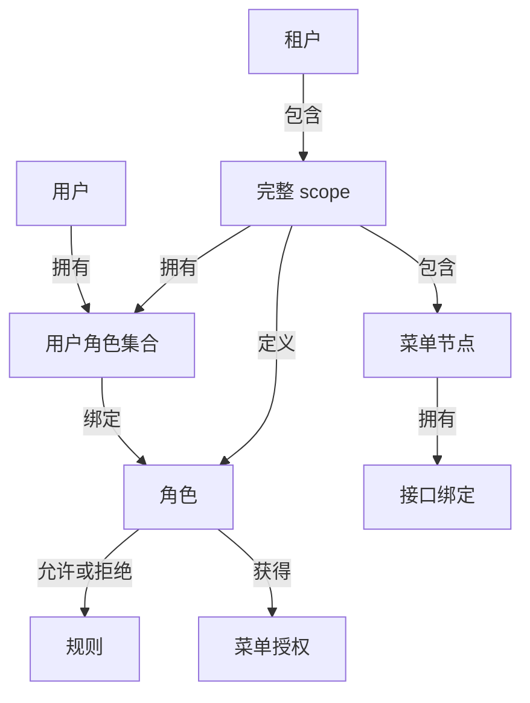

# 多租户模型

> **租户隔离。** `tenantId` 和其他 scope 字段必须来自可信宿主上下文，不能直接信任请求参数或请求头。scope 缺失、冲突或映射不完整时默认拒绝。

租户隔离属于每个授权身份的一部分，不是靠约定附加的 filter。角色、用户绑定、规则、菜单、接口绑定、修订、审计状态、缓存键和数据操作都位于规范化 scope 内。

## 关系模型



<p className="pc-diagram-text" id="pc-diagram-tenant-relationship-zh-text" data-diagram-id="tenant-relationship"><strong>文字等价说明。</strong>一个租户包含一个或多个完整 scope。每个 scope 独立拥有角色、用户角色集合、菜单节点及其接口绑定；用户通过用户角色集合绑定角色，角色持有 allow/deny 规则和菜单授权。在另一个 scope 复用相同 userId 或 roleId，不会共享授权状态。</p>

`tenantId` 必填，`appId`、`moduleId` 和 `namespace` 是可选附加维度。用户由 `userId` 加完整 scope 标识；role ID 也只在相同完整 scope 内有意义。

## 相同标识、隔离状态

```ts
const scopeA = { tenantId: 'tenant-a', appId: 'admin' };
const scopeB = { tenantId: 'tenant-b', appId: 'admin' };
const tenantA = pc.scope(scopeA);
const tenantB = pc.scope(scopeB);

await tenantA.roles.create({ id: 'manager', label: 'A manager' });
await tenantA.roles.allow('manager', {
  action: 'read', resource: 'ui:page:tenant-a-dashboard',
});
await tenantA.userRoles.assign('same-user', 'manager');

await tenantB.roles.create({ id: 'manager', label: 'B manager' });
await tenantB.roles.allow('manager', {
  action: 'read', resource: 'ui:page:tenant-b-dashboard',
});
await tenantB.userRoles.assign('same-user', 'manager');

const subjectA = pc.forSubject({ userId: 'same-user', scope: scopeA });
const subjectB = pc.forSubject({ userId: 'same-user', scope: scopeB });
const tenantAOwnResource = await subjectA.can('read', 'ui:page:tenant-a-dashboard');
const tenantACrossResource = await subjectA.can('read', 'ui:page:tenant-b-dashboard');
const tenantBOwnResource = await subjectB.can('read', 'ui:page:tenant-b-dashboard');
const tenantBCrossResource = await subjectB.can('read', 'ui:page:tenant-a-dashboard');
```

```json
{
  "tenantAOwnResource": true,
  "tenantACrossResource": false,
  "tenantBOwnResource": true,
  "tenantBCrossResource": false
}
```

该 JSON 是把四个 `can()` 布尔值按租户并列后的教程汇总，不是角色创建、分配或某次判定的原始响应。

| 调用 | scope 从哪里来 | 状态/原始返回 |
|---|---|---|
| [`pc.scope(scope)`](/zh/api/core-and-contexts#core-scope) | 可信租户与 app 维度 | 同步返回管理 facade；A/B facade 的库存完全隔离 |
| [`roles.create/allow`](/zh/api/roles#roles-create) | facade 已锁定 scope | 分别返回 mutation envelope；相同 roleId 在两个 scope 是两条独立记录 |
| [`userRoles.assign`](/zh/api/user-roles#user-roles-assign) | facade scope + userId | 分别追加各自 scope 内的直接角色 |
| [`pc.forSubject(input)`](/zh/api/core-and-contexts#core-for-subject) | userId 与完整可信 scope | 返回请求期 facade；subjectA 不能读取 subjectB 的授权状态 |
| [`subject.can(action, resource)`](/zh/api/core-and-contexts#core-can) | subject 自带 scope | 每次返回独立 boolean；跨租户资源因没有该 scope 内 allow 而默认拒绝 |

数据库可以在两个租户保存相同 `roleId` 与 `userId`，但它们的规范 scope key 和索引不同。公开管理 API 不存在全局角色查询或无 scope 用户分配。

## 构造可信 subject

scope 必须来自服务端已认证状态或可信服务端 resolver。不能因为请求里存在任意 `x-tenant-id` 或 body 字段，就直接复制到 `PermissionSubject`。两个可信来源不一致时返回 `SCOPE_CONFLICT`，不能任选一个。

```ts
const subject = pc.forSubject({
  userId: session.userId,
  scope: {
    tenantId: session.tenantId,
    appId: 'admin',
  },
  claims: { merchantId: session.merchantId },
});
```

`forSubject()` 不会自行认证 session；它只校验并冻结调用方交付的 subject。返回值是同步 facade，不是登录结果。`claims` 只供策略条件读取，不能覆盖 `scope` 或 `userId`。

scope 与 subject ID 会去除首尾空白，限制为 128 UTF-8 字节，并拒绝控制字符、异常 Unicode、未知字段和保留标识。

## 在业务数据中强制 scope

授权集合必须给使用中的每个 scope 维度配置字段映射：

```ts
const orders = subject.data.collection('orders', {
  resource: 'db:orders',
  scopeFields: {
    tenantId: 'tenantId',
    appId: 'applicationId',
  },
});
```

`data.collection()` 同步返回 `AuthorizedCollection`。`name='orders'` 选择物理 collection，`resource='db:orders'` 选择授权规则，`scopeFields` 则决定每次真实 Mongo 查询强制加入哪些字段 equality；三者不可互相替代。

读写会为这些字段添加精确标量相等条件。数组、对象、缺失或不一致值都不算该租户值。插入会注入可信 scope 值；更新不能把 scope 字段改到授权范围外。

## 持久化、缓存与审计隔离

权限集合使用规范 scope key 和 scope 感知唯一索引，修订向量也在该 scope 内推进。语义缓存键包含 core namespace、scope、subject、claims/context 指纹和读取族；失效只针对受影响的 scope/role/user 键族，不会清理另一个租户。

变更审计证据包含 scope 所属修订与操作身份。日志和指标应暴露租户安全 hash 或已批准标签，不能把不可信租户字符串作为唯一关联键。

## 运维检查

- 在两个 scope 使用相同用户和角色 ID，包含跨资源拒绝测试。
- 对每个 `scopeFields` 维度测试 find、count、insert、update 和 delete。
- 每个服务实例与 Vext 认证接入必须使用相同 scope 维度。
- scope 模型变化属于 Schema 契约变化，不是一个 UI 配置项。

先运行[多租户示例](/zh/examples/multi-tenant)，再通过[核心与上下文 API](/zh/api/core-and-contexts)查看准确 subject 与 scope 签名。
