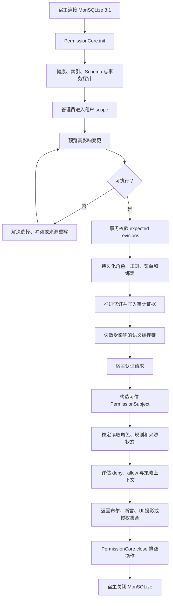

# 权限生命周期

授权是一条生命周期，不是一次 `can()` 调用。宿主建立可信身份和数据库所有权；管理写入产生持久化状态；请求读取构造一致快照；缓存与审计证据跟随已提交修订。

## 端到端流程



<p className="pc-diagram-text" id="pc-diagram-permission-lifecycle-zh-text" data-diagram-id="permission-lifecycle"><strong>文字等价说明。</strong>宿主连接 MonSQLize 并初始化 PermissionCore。管理员先预览，再在事务中提交带修订的角色、规则、菜单、绑定、审计证据和缓存失效。每个已认证请求都会成为可信主体，基于稳定快照得到判定或授权操作。关闭时先排空 PermissionCore，再由宿主关闭 MonSQLize。</p>

与流程图对应的最小代码顺序如下：

```ts
const pc = new PermissionCore({ monsqlize: msq, tokenSecret });
const initialHealth = await pc.init();

const scoped = pc.scope({ tenantId: 'acme' });
await scoped.roles.create({ id: 'reader', label: 'Reader' });
const ruleResult = await scoped.roles.allow('reader', {
  action: 'read', resource: 'db:orders',
});
await scoped.userRoles.assign('u-1', 'reader');

const subject = pc.forSubject({
  userId: 'u-1', scope: { tenantId: 'acme' },
});
const allowed = await subject.can('read', 'db:orders');

await pc.close();
await msq.close();
```

| 调用 | 原始返回 | 生命周期作用 |
|---|---|---|
| `pc.init()` | `PermissionCoreHealth` | 从 new/initializing 进入 ready，失败则启动失败 |
| `pc.scope()` / `forSubject()` | 同步 facade | 绑定管理 scope 或请求 subject，不写数据库 |
| `roles.create/allow`、`userRoles.assign` | 各自 mutation envelope | 在事务中提交管理状态与审计证据 |
| `subject.can()` | boolean | 从当前稳定授权状态做请求判定 |
| `pc.close()` | `Promise<void>` | 停止新 lease 并排空权限操作；不关闭 msq |
| `msq.close()` | MonSQLize 自身关闭结果 | 由宿主在 core 完成后关闭数据库 |

## 初始化

`init()` 会校验 MonSQLize 能力契约、数据库健康、权限索引、事务支持、Schema 契约、自定义资源探针和可选缓存后端。达到 `lifecycle: 'ready'` 前，运行时操作会以 `NOT_INITIALIZED` 或更准确的配置/数据库错误失败。

配置 `tokenSecret` 后，共享同一权限命名空间的实例可以稳定验证 preview 和 cursor token。自动生成的默认值只在当前进程有效，不适用于 token 跨实例或跨重启的场景。

## 管理写入路径

创建角色、添加一条规则等小型增量写可以直接执行。破坏性、结构性、替换或高影响变更必须先 preview 再 execute。签名 preview 会绑定请求、影响计划、容量评估和预期修订向量。

运行时在一个 MonSQLize 事务内重新校验修订、来源完整性、层级、容量和幂等性后提交。成功的 `MutationResult` 包含：

```json
{
  "committed": true,
  "changed": true,
  "revision": 12,
  "revisions": { "global": 12, "rbac": 7, "menu": 5, "audit": 12 },
  "operationId": "...",
  "auditId": "...",
  "replayed": false,
  "cache": { "status": "completed" },
  "warnings": { "total": 0, "items": [], "truncated": false }
}
```

这是上例 `ruleResult` 一类管理写入的原始 envelope 结构节选；领域结果仍位于 `ruleResult.data`。它不是 `can()`、`init()` 或 `close()` 的返回结构。

`revision` 是便捷的聚合修订，`revisions` 标识受影响的域和实体。管理客户端必须使用读取或 preview 返回的 expected revision，正确处理 `REVISION_CONFLICT`，不能自行编造新的 expected 值。

## 请求决策路径

宿主把服务端已认证状态转换为 `PermissionSubject`。一次决策会稳定读取用户角色集合、激活的角色链、手工和菜单生成规则、来源完整性、claims 及显式策略上下文。适用 deny 优先于 allow；没有 allow 时默认拒绝；必需上下文未知时收紧授权。

`can` 返回布尔值，`assert` 在拒绝时抛错，`explain` 返回有界轨迹，菜单方法投影安全 UI 状态，`AuthorizedCollection` 使用同一授权快照执行数据操作。认证不属于这条生命周期。

## 缓存与审计顺序

数据库是真相源。启用缓存后，读取可以使用绑定修订的语义条目；变更先提交，再失效受影响的键族。缓存失败会降低健康状态，并在安全时回退数据库，不能让旧 allow 成为权威状态。

每个已提交管理变更都在同一事务工作流中写入持久审计证据，并返回 `operationId` 和 `auditId`。公开 API 暴露这些标识和审计修订证据；宿主应把它们与请求及业务审计日志关联，但不能把不可信租户输入当作权威。

## 失败与关闭

Schema 不匹配、持久化状态损坏、策略上下文缺失、preview 过期、数据库不可用和路由 manifest 重载都会关闭受影响路径。恢复必须重建一致真相源；绕过检查或继续提供陈旧授权不是受支持的回退方式。

`close()` 会停止新 lease，并在 `closeDrainTimeoutMs` 内等待活动操作和借用事务，只关闭权限模块拥有的状态。permission-core 排空后，再由宿主关闭 MonSQLize。

就绪与事件处理见[生产运维](/zh/guide/production-operations)，精确公开证据面见[审计与健康 API](/zh/api/audit-and-health)。
