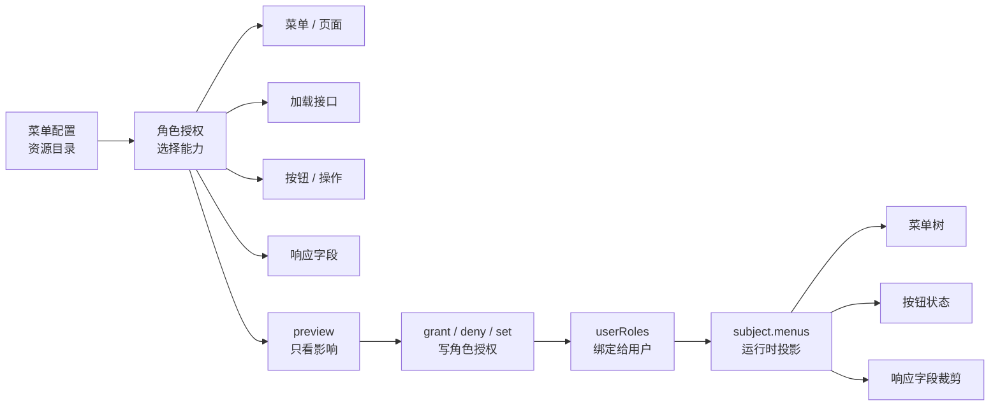

# 角色菜单授权

角色菜单授权回答一个后台管理系统最常见的问题：某个角色可以看到哪些菜单、进入哪些页面、使用哪些按钮、调用哪些接口，以及接口响应里能拿到哪些字段。

它不会自动绑定用户。流程是先给角色保存菜单授权，再用 `userRoles.assign()` 或 `userRoles.set()` 把角色交给用户。

## 后台授权页最小流程

如果你正在做一个后台“角色授权”页面，先按这个顺序想：

| 步骤 | 后台动作 | 对应方法 |
|---|---|---|
| 1 | 打开角色授权页，读取可勾选的授权树 | `roles.menuPermissions.getAuthorizationTree()` |
| 2 | 管理员勾选菜单、页面、按钮和字段 | 组装 `selection` 或 `assignments` |
| 3 | 点击保存前先预览影响 | `roles.menuPermissions.preview()` |
| 4 | 无冲突时确认保存 | 常用 `roles.menuPermissions.set()`；追加授权可用 `grant()` |
| 5 | 把角色分给用户 | `userRoles.assign()` 或 `userRoles.set()` |
| 6 | 用户请求时投影结果 | `subject.menus.getViewTree()` / `getActionMap()` / `filterResponse()` |

普通后台页面最常见的是“保存整棵授权树”，也就是读取 `getAuthorizationTree()`，用户勾选后调用 `preview({ operation: 'set', assignments })`，确认后再调用 `set()`。下面用 `grant()` 演示，是为了让例子更短；如果你做的是完整角色授权表单，优先用 `set()`。

## 对象怎样连在一起



<p className="pc-diagram-text" id="pc-diagram-role-menu-relationship-zh-text" data-diagram-id="role-menu-relationship"><strong>文字等价说明。</strong>菜单配置只是可授权的资源目录；角色授权界面从目录里选择菜单、页面、加载接口、按钮操作和响应字段。preview 只展示影响；grant、deny 或 set 才写入角色授权。通过 userRoles 把角色绑定给用户后，subject.menus 才会投影该用户可见的菜单树、按钮状态和可返回字段。</p>

一条主线是：

菜单配置 → 角色菜单授权 → 用户角色绑定 → 当前用户运行时投影

不要把 `MenuConfigInput` 当成“权限结果”。它只是可被授权的资源目录。真正决定用户能不能访问的是角色授权和用户角色绑定。

## 后台勾选如何变成 selection

`selection` 可以理解成“这次后台表单勾了哪些能力”。不用先记住完整类型，先记住这张映射表：

| 后台页面操作 | 写到哪里 | 说明 |
|---|---|---|
| 勾选菜单分组 | `menus` | 只选菜单节点本身；如果要包含后代，配合 `include.descendants`。 |
| 勾选页面 | `views` | 最常见；页面通常再带出默认加载接口。 |
| 勾选页面默认接口 | `loads` 或 `include.loads` | 精确选某些接口用 `loads`；选中页面后自动带出用 `include.loads: true`。 |
| 勾选按钮权限 | `actions` 或 `include.actions` | 精确选按钮用 `actions`；选中页面后自动带出所有按钮用 `include.actions: true`。 |
| 勾选接口响应字段 | `responseFields` | 字段必须已经在“接口与响应字段”里声明过。 |
| 不想自动给字段 | `include.responseFields: 'none'` | 推荐默认值，避免新增敏感字段后旧角色自动获得。 |
| 明确全选字段 | `include.responseFields: 'all'` | 只在你确认该角色应获得该页面所有已声明字段时使用。 |

## 构造选择

下面的选择表示：给 `order-operator` 角色分配 `admin` 配置里的订单列表页；页面加载接口和页面按钮也一起授权；订单列表接口只允许返回 `orderNo` 和 `status` 两个字段。

```ts
const selection = {
  configId: 'admin',
  views: ['orders-list'],
  responseFields: [{
    apiResource: 'api:GET:/api/orders',
    target: 'items',
    fields: ['orderNo', 'status'],
  }],
  include: {
    loads: true,
    actions: true,
    responseFields: 'none',
  },
};
```

| 字段 | 本例值 | 作用 |
|---|---|---|
| `configId` | `admin` | 指向哪一套菜单配置。 |
| `views` | `['orders-list']` | 勾选订单列表页。 |
| `menus` | 未填写 | 可选；用于勾选导航分组并配合 `descendants` 包含后代。 |
| `loads` | 未填写 | 可选；精确选择某些页面加载接口。 |
| `actions` | 未填写 | 可选；精确选择某些按钮或操作 ID。 |
| `responseFields` | 订单列表字段 | 给指定接口选择可返回字段。 |
| `include.loads` | `true` | 自动包含所选页面的 `load.resource`。 |
| `include.actions` | `true` | 自动包含所选页面的 `actions[].resource`。 |
| `include.responseFields` | `'none'` | 不自动全选字段，只使用显式 `responseFields`。 |

默认值是：`descendants: false`、`loads: true`、`actions: false`、`responseFields: 'none'`。也就是说，勾选一个页面时会默认给页面加载接口，但不会默认给按钮，也不会默认给响应字段。如果你希望“选中页面时默认拥有所有已声明响应字段”，可以把 `include.responseFields` 设为 `'all'`。后台管理系统一般更建议显式选择字段，避免页面后来新增敏感字段时自动泄漏给旧角色。

分页响应或多层响应要写 `target`。例如接口返回 `{ items, total }` 时，`target: 'items'` 表示授权的是 `items` 每一行里的字段；`total` 这类分页字段应在响应配置的 `preserve` 中声明，不要放进角色字段授权。

## 预览再提交

和前面创建菜单、页面、接口不同，角色菜单授权会真正改变某个角色的访问范围，可能立刻影响很多用户。因此这里仍然要求显式 preview，再把同一份选择和 preview 凭证交给写入方法。普通管理员不用理解 revision 细节，只要记住：授权页先预览影响，确认后提交。

先预览：

```ts
const scoped = pc.scope(
  { tenantId: 'acme', appId: 'admin' },
  { actorId: 'admin', requestId: 'req-grant-order-operator-menu' },
);

const preview = await scoped.roles.menuPermissions.preview(
  'order-operator',
  { operation: 'grant', selection },
);

if (!preview.executable) {
  throw new Error('ROLE_MENU_PERMISSION_CONFLICT');
}
```

无冲突时，管理端重点看 `executable: true`、影响用户数量和本次会生成的授权内容。返回结构可以理解成这样：

```json
{
  "executable": true,
  "previewToken": "preview_...",
  "summary": {
    "affectedUsers": { "total": 1, "sampleIds": ["u-menu"] },
    "grants": { "total": 1 },
    "removals": { "total": 0 }
  }
}
```

确认保存时，把同一个 `selection` 和 preview 返回的凭证传给写入方法：

```ts
const granted = await scoped.roles.menuPermissions.grant(
  'order-operator',
  selection,
  {
    ...preview.expected,
    previewToken: preview.previewToken,
  },
);
```

```json
{
  "changed": true,
  "data": {
    "roleId": "order-operator",
    "grantIds": { "total": 1, "items": ["grant_..."] },
    "generatedSources": 3,
    "generatedResponseFields": 2,
    "removedSources": 0
  }
}
```

`menuPermissions.preview(roleId, change)` 不写数据库，只计算这次授权会生成多少来源、影响哪些用户、是否有冲突。`menuPermissions.grant(roleId, selection, options)` 才写入 allow 授权。执行时必须传入预览返回的 `expected` 和 `previewToken`。

`generatedSources` 表示生成了多少条可追踪规则来源，例如视图、加载接口、按钮接口。`generatedResponseFields` 表示这次授权了多少个响应字段。它们是审计和排查用的计数，不是权限判断 API。

## 授权、拒绝、撤销和替换

这四个方法不是平级心智。普通后台授权页面优先使用 `set()` 保存整棵授权树；其他方法更多用于追加、覆盖或精确删除。

| 方法 | 适合场景 | 写入语义 |
|---|---|---|
| `set(roleId, assignments, options)` | 保存完整授权树表单 | 用传入 assignments 替换该角色的全部直接菜单授权。 |
| `grant(roleId, selection, options)` | 追加一组允许菜单能力 | 新增 allow grant，不删除已有菜单授权。 |
| `deny(roleId, selection, options)` | 明确拒绝一组菜单能力 | 新增 deny grant，用于覆盖继承或其他 allow。 |
| `revoke(roleId, { grantIds }, options)` | 删除指定授权记录 | 按 `grantId` 精确移除，不影响其他 grant。 |

`set()` 只替换菜单授权，不替换手工 `roles.allow()` / `roles.deny()` 规则，也不修改用户绑定了哪些角色。每个写方法都要先用对应 `operation` 预览。

## 读取角色授权

```ts
const direct = await scoped.roles.menuPermissions.getDirect('order-operator');
const effective = await scoped.roles.menuPermissions.getEffective('order-operator');
const tree = await scoped.roles.menuPermissions.getAuthorizationTree(
  'order-operator',
  { configId: 'admin' },
);
```

| 方法 | 什么时候用 |
|---|---|
| `getAuthorizationTree(roleId, { configId })` | 打开后台角色授权页时用，渲染可勾选树和 direct、inherited、conflict、partial 状态。 |
| `getDirect(roleId)` | 排查这个角色自己保存了哪些菜单 grant。 |
| `getEffective(roleId)` | 排查继承父角色后最终有哪些菜单授权。 |
| `listDirect(roleId, query?)` | 直接授权记录很多时分页读取。 |

精确返回类型见[角色菜单权限 API](/zh/api/role-menu-permissions)。这里先记住：`getAuthorizationTree()` 面向管理员编辑界面，不是用户侧菜单树。用户侧菜单树使用 `subject.menus.getViewTree({ configId })`。

## 用户端运行时结果

### 验收菜单和按钮

授权保存后，如果要验证某个用户最终能看到什么，先把角色绑定给用户，再用用户 subject 读取菜单树和按钮状态：

```ts
await scoped.userRoles.assign('u-menu', 'order-operator');

const menus = pc.forSubject({
  userId: 'u-menu',
  scope: { tenantId: 'acme', appId: 'admin' },
}).menus;

const tree = await menus.getViewTree({ configId: 'admin' });
const actions = await menus.getActionMap({ configId: 'admin', viewId: 'orders-list' });
const state = await menus.getViewState({ configId: 'admin', viewId: 'orders-list' });
```

### 裁剪接口响应

业务接口返回前，用同一个 subject 裁剪响应字段：

```ts
const projected = await menus.filterResponse('api:GET:/api/orders', {
  items: [{ orderNo: 'O-1001', status: 'paid', amount: 88, internalCost: 51 }],
  total: 1,
});
const projectedData = projected.data;
```

```json
{
  "tree": [{ "id": "orders", "enabled": true }],
  "actions": { "export": { "visible": true, "enabled": true } },
  "state": { "allowed": true, "navigationReachable": true },
  "projectedData": {
    "items": [{ "orderNo": "O-1001", "status": "paid" }],
    "total": 1
  }
}
```

`filterResponse(apiResource, payload)` 会先检查当前用户是否拥有 `invoke + apiResource`，再根据该用户的响应字段授权裁剪数据；裁剪后的业务 payload 在 `projected.data`。没有授权的字段会被移除；没有接口调用权限时会拒绝，而不是返回未裁剪数据。

## 角色、用户、菜单的边界

| 对象 | 由谁提供 | permission-core 保存什么 |
|---|---|---|
| 用户 | 宿主登录系统 | 只保存 `userId` 与角色绑定，不负责登录或密码。 |
| 角色 | permission-core 管理 API | 保存角色、父角色、手工规则和菜单授权。 |
| 菜单配置 | 后台管理端或插件 | 保存可授权的菜单、视图、接口、按钮和响应字段。 |
| Subject | 已认证请求 | 只用于判断当前用户在当前 scope 下的有效权限。 |

完整示例见[菜单管理示例](/zh/examples/menu-admin)，精确签名见[角色菜单权限 API](/zh/api/role-menu-permissions)。
