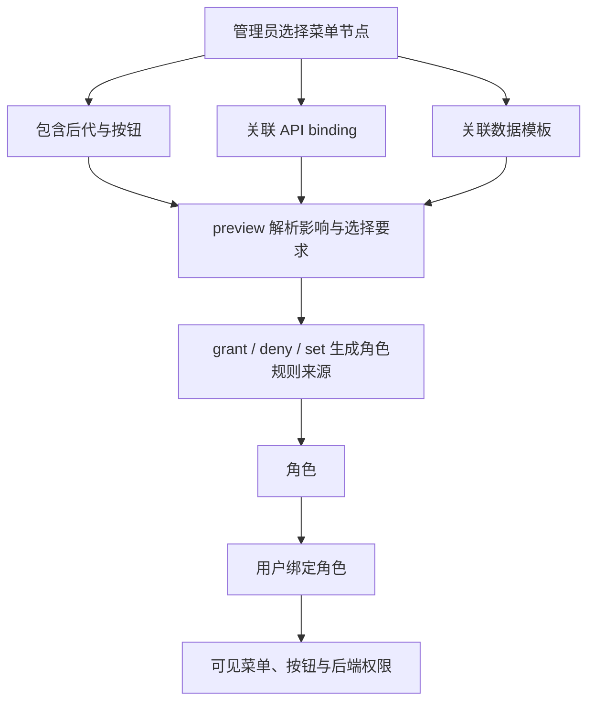

# 角色菜单授权

角色菜单授权把管理员选择的结构转换为持久化、可追踪来源的权限规则。它不会自动绑定用户；用户仍通过常规角色绑定获得结果。

## 对象怎样连在一起



<p className="pc-diagram-text" id="pc-diagram-role-menu-relationship-zh-text" data-diagram-id="role-menu-relationship"><strong>文字等价说明。</strong>管理员不是直接把菜单 ID 当成最终权限，而是先选择菜单节点及是否包含后代、按钮、接口和数据模板。preview 将这些对象解析成带来源的角色规则；执行 grant、deny 或 set 后，规则归属角色，用户再通过常规角色绑定获得可见菜单、按钮状态和后端资源权限。</p>

`nodes` 是菜单节点集合，`apiBindings` 是真实后端接口及其 owner 关系。角色菜单授权读取两者并生成可追踪规则，但不会把接口定义复制进角色，也不会自动给任何用户绑定角色。

## 构造选择

```ts
const selection = {
  nodeIds: ['orders'],
  include: {
    descendants: true,
    buttons: true,
    apis: 'required',
    dataPermissions: true,
  },
  apiChoices: {
    bindingIds: [],
    permissionsByBinding: {},
  },
};
```

- `nodeIds` 是管理员选择的锚点节点。
- `descendants` 包含子导航节点。
- `buttons` 单独包含按钮子项；按钮不属于可见导航树。
- `apis` 可选择不包含、包含必需 owner 绑定或包含全部 owner 绑定。
- `dataPermissions` 包含选中节点声明的数据模板。
- `apiChoices` 解决预览返回的显式 `any` 备选项。

| 字段 | 本例值 | 实际效果 |
|---|---|---|
| `nodeIds` | `['orders']` | 以 orders 为锚点建立一个稳定 grant；不是直接提交规则 ID。 |
| `descendants/buttons` | 都为 `true` | 包含后代导航与按钮；按钮需要单独开关。 |
| `apis` | `required` | 只展开 owner 关系中 `required=true` 的 binding；`all` 才连可选 binding 一并展开。 |
| `dataPermissions` | `true` | 把节点声明的数据模板变成带 menu 来源的角色规则。 |
| `apiChoices` | 空数组/对象 | 第一次预览的起点；只有 preview 返回 any-choice 时再填候选 ID/semantic key。 |

完整字段约束及 `availability-any` 与 `authorization-any` 的区别见[角色菜单权限 API](/zh/api/role-menu-permissions#role-menu-selection)。

## 执行前预览

> **预览与执行一致性。** preview 只计算计划，不写数据库；执行时必须提交同一角色、同一选择、`expected` 和 `previewToken`。状态变化后重新预览。

```ts
const preview = await scoped.roles.menuPermissions.preview(
  'order-operator',
  { operation: 'grant', selection },
  { actorId: 'admin' },
);
```

```json
{
  "executable": true,
  "plan": {
    "roleId": "order-operator",
    "operation": "grant",
    "choiceRequirements": { "total": 0 },
    "grants": { "total": 1 }
  },
  "previewToken": "signed-token",
  "expected": { "expectedRevisions": { "rbac": 3, "menu": 8 } }
}
```

这是 `preview()` 原始 `ImpactPreview<MenuPermissionPlan>` 的节选。`plan` 说明将生成什么，`expected/previewToken` 只用于执行这份完全相同的输入；它们不是角色权限数据。

`executable` 为 false 时，应完整展示 `conflicts` 和 `choiceRequirements`，根据要求的绑定或权限 semantic key 重建选择后再次预览。token 绑定准确的角色、选择、计划和修订向量；相关状态变化后不能复用。

## 授予、拒绝、撤销或替换

```ts
if (!preview.executable) throw new Error('Resolve the preview first');
const granted = await scoped.roles.menuPermissions.grant(
  'order-operator',
  selection,
  {
    ...preview.expected,
    previewToken: preview.previewToken,
    actorId: 'admin',
    idempotencyKey: 'role-order-operator-orders-v1',
  },
);
```

```json
{
  "changed": true,
  "data": {
    "roleId": "order-operator",
    "generatedSources": 4,
    "generatedSemanticRules": 4,
    "removedSources": 0
  },
  "auditId": "..."
}
```

这是 `grant()` 原始 `MutationResult<MenuPermissionGrantResult>` 的节选。`data.grantIds.items` 才是之后 `revoke()` 使用的稳定 ID；`generatedSources` 只是数量，不可作为权限判断。

`grant` 和 `deny` 生成效果相反的菜单来源规则；`revoke` 移除指定 grant ID；`set` 替换角色的完整菜单授权列表，适合保存完整授权树表单。每个执行方法都需要匹配的预览和修订向量。

| 方法 | 对应 preview change | 是否追加 | 原始返回 |
|---|---|---|---|
| [`grant(roleId, selection, options)`](/zh/api/role-menu-permissions#role-menu-grant) | `{ operation:'grant', selection }` | 追加 allow grant | `MutationResult<MenuPermissionGrantResult>` |
| [`deny(...)`](/zh/api/role-menu-permissions#role-menu-deny) | `{ operation:'deny', selection }` | 追加 deny grant | 同上 |
| [`revoke(roleId, { grantIds }, options)`](/zh/api/role-menu-permissions#role-menu-revoke) | `{ operation:'revoke', grantIds }` | 精确移除指定 grant | `MutationResult<BatchMutationSummary>` |
| [`set(roleId, assignments, options)`](/zh/api/role-menu-permissions#role-menu-set) | `{ operation:'set', assignments }` | 否，替换完整直接菜单 grant 集合 | `MutationResult<BatchMutationSummary>` |

## 绑定用户并读取授权

```ts
await scoped.userRoles.assign('u-1', 'order-operator');

const direct = await scoped.roles.menuPermissions.getDirect('order-operator');
const effective = await scoped.roles.menuPermissions.getEffective('order-operator');
const tree = await scoped.roles.menuPermissions.getAuthorizationTree('order-operator');
```

| 变量 | 原始返回 | 用途 |
|---|---|---|
| `direct` | `VersionedResult<DirectMenuPermissionSnapshot>` | 编辑本角色自己的 grant，并取得 grantId/revision/source 状态 |
| `effective` | `VersionedResult<EffectiveMenuPermissionSnapshot>` | 查看父角色继承、sourceRoleId、depth 和 conflicts |
| `tree` | `VersionedResult<AuthorizationTreeNode[]>` | 生成管理员授权树；每个节点含 direct/inherited/partial/conflict 状态 |

直接读取只显示该角色拥有的 grant；有效读取还包含继承 grant、来源角色 ID、冲突、完整性、可用性和漂移。授权树面向管理员，不等同于用户的可见菜单树。

## 投影用户界面

> **后端最终鉴权。** 可见树和按钮状态只用于界面体验。真实 API 仍必须在后端使用 `subject.can()`、`assert()` 或框架 guard 检查。

```ts
const menus = pc.forSubject({
  userId: 'u-1',
  scope: { tenantId: 'acme', appId: 'admin' },
}).menus;

const visible = await menus.getVisibleTree();
const buttons = await menus.getButtonMap('orders');
const route = await menus.getRouteState('/orders');
```

```json
{
  "visibleNodeIds": ["operations", "orders"],
  "button": { "visible": true, "enabled": true, "reason": "allowed" },
  "route": { "allowed": true, "navigationReachable": true }
}
```

这个 JSON 是从 `visible.data`、`buttons.data` 与 `route.data` 选取字段后的教程汇总。三个方法各自返回 `SubjectRuntimeResult<T>`，并各自带 `detailBudget`。

| 方法 | 参数 | 回答的问题 |
|---|---|---|
| [`getVisibleTree({ rootId? })`](/zh/api/menus#subject-menus-get-visible-tree) | 可选树根 | 当前用户能看到且可导航的非按钮树是什么 |
| [`getButtonMap(ownerNodeId)`](/zh/api/menus#subject-menus-get-button-map) | page/menu 节点 ID | 该 owner 下每个 button code 是否 visible/enabled，为什么 |
| [`getRouteState(path)`](/zh/api/menus#subject-menus-get-route-state) | 前端 route path | 路由是否允许，以及在导航层级上是否可达 |

路由可能权限允许但导航不可达，因为祖先被隐藏、停用、拒绝或接口不可用。前端路由必须分别处理 `allowed` 与 `navigationReachable`。

## 处理资源变化

每条生成规则都记录 grant、资源、绑定、贡献类型和快照摘要。菜单权限或接口绑定变化后，来源可能变为 `refresh-available`；引用缺失则变为 stale 或 invalid。只有向管理员展示计划变化后，才调用 `listStale`、`previewRepairStale` 和 `repairStale`。持久化完整性失败会收紧授权，不会静默退回旧权限。

`listStale(query?)` 返回分页 stale source；`previewRepairStale(input)` 只生成替换/撤销计划；`repairStale(input, options)` 必须使用匹配 token 才写入。三者的参数和响应见[角色菜单权限 API 的修复章节](/zh/api/role-menu-permissions#role-menu-list-stale)。

可运行的[菜单管理示例](/zh/examples/menu-admin)展示完整顺序；精确方法与响应类型见[角色菜单权限 API](/zh/api/role-menu-permissions)。
