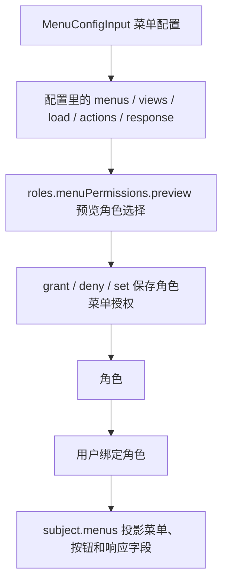

# 角色菜单授权

角色菜单授权回答一个后台管理系统最常见的问题：某个角色可以看到哪些菜单、进入哪些页面、使用哪些按钮、调用哪些接口，以及接口响应里能拿到哪些字段。

它不会自动绑定用户。流程是先给角色保存菜单授权，再用 `userRoles.assign()` 或 `userRoles.set()` 把角色交给用户。

## 对象怎样连在一起



<p className="pc-diagram-text" id="pc-diagram-role-menu-relationship-zh-text" data-diagram-id="role-menu-relationship"><strong>文字等价说明。</strong>管理员先保存菜单配置，再在角色授权界面选择配置中的菜单、页面、接口、按钮和响应字段。preview 只展示影响；grant、deny 或 set 才写入角色授权。用户绑定该角色后，subject runtime 会投影用户可见菜单、按钮状态和可返回字段。</p>

一条主线是：

`菜单配置 -> 角色菜单授权 -> 用户角色绑定 -> 当前用户运行时投影`

不要把 `MenuConfigInput` 当成“权限结果”。它只是可被授权的资源目录。真正决定用户能不能访问的是角色授权和用户角色绑定。

## 构造选择

下面的选择表示：给 `order-operator` 角色分配 `admin` 配置里的订单列表页；页面加载接口和页面按钮也一起授权；订单列表接口只允许返回 `orderNo` 和 `status` 两个字段。

```ts
const selection = {
  configId: 'admin',
  views: ['orders-list'],
  responseFields: [{
    apiResource: 'api:GET:/api/orders',
    fields: ['orderNo', 'status'],
  }],
  include: {
    loads: true,
    actions: true,
    responseFields: 'none',
  },
};
```

| 字段 | 本例值 | 作用 |
|---|---|---|
| `configId` | `admin` | 指向哪一套菜单配置。 |
| `views` | `['orders-list']` | 勾选订单列表页。 |
| `menus` | 未填写 | 可选；用于勾选导航分组并配合 `descendants` 包含后代。 |
| `loads` | 未填写 | 可选；精确选择某些页面加载接口。 |
| `actions` | 未填写 | 可选；精确选择某些按钮或操作 ID。 |
| `responseFields` | 订单列表字段 | 给指定接口选择可返回字段。 |
| `include.loads` | `true` | 自动包含所选页面的 `load.resource`。 |
| `include.actions` | `true` | 自动包含所选页面的 `actions[].resource`。 |
| `include.responseFields` | `'none'` | 不自动全选字段，只使用显式 `responseFields`。 |

如果你希望“选中页面时默认拥有所有已声明响应字段”，可以把 `include.responseFields` 设为 `'all'`。后台管理系统一般更建议显式选择字段，避免页面后来新增敏感字段时自动泄漏给旧角色。

## 预览再提交

```ts
const preview = await scoped.roles.menuPermissions.preview(
  'order-operator',
  { operation: 'grant', selection },
  { actorId: 'admin' },
);

if (!preview.executable) {
  throw new Error('角色菜单授权存在冲突，需要先处理');
}

const granted = await scoped.roles.menuPermissions.grant(
  'order-operator',
  selection,
  {
    ...preview.expected,
    previewToken: preview.previewToken,
    actorId: 'admin',
    idempotencyKey: 'grant-order-operator-menu-v1',
  },
);
```

```json
{
  "changed": true,
  "data": {
    "roleId": "order-operator",
    "grantIds": { "total": 1, "items": ["grant_..."] },
    "generatedSources": 3,
    "generatedResponseFields": 2,
    "removedSources": 0
  }
}
```

`menuPermissions.preview(roleId, change)` 不写数据库，只计算这次授权会生成多少来源、影响哪些用户、是否有冲突。`menuPermissions.grant(roleId, selection, options)` 才写入 allow 授权。执行时必须传入预览返回的 `expected` 和 `previewToken`。

`generatedSources` 表示生成了多少条可追踪规则来源，例如视图、加载接口、按钮接口。`generatedResponseFields` 表示这次授权了多少个响应字段。它们是审计和排查用的计数，不是权限判断 API。

## 授权、拒绝、撤销和替换

| 方法 | 适合场景 | 写入语义 |
|---|---|---|
| `grant(roleId, selection, options)` | 追加一组允许菜单能力 | 新增 allow grant，不删除已有菜单授权。 |
| `deny(roleId, selection, options)` | 明确拒绝一组菜单能力 | 新增 deny grant，用于覆盖继承或其他 allow。 |
| `revoke(roleId, { grantIds }, options)` | 删除指定授权记录 | 按 `grantId` 精确移除，不影响其他 grant。 |
| `set(roleId, assignments, options)` | 保存完整授权树表单 | 用传入 assignments 替换该角色的全部直接菜单授权。 |

`set()` 只替换菜单授权，不替换手工 `roles.allow()` / `roles.deny()` 规则，也不修改用户绑定了哪些角色。每个写方法都要先用对应 `operation` 预览。

## 读取角色授权

```ts
const direct = await scoped.roles.menuPermissions.getDirect('order-operator');
const effective = await scoped.roles.menuPermissions.getEffective('order-operator');
const tree = await scoped.roles.menuPermissions.getAuthorizationTree(
  'order-operator',
  { configId: 'admin' },
);
```

| 方法 | 返回 | 用途 |
|---|---|---|
| `getDirect(roleId)` | `VersionedResult<MenuBusinessDirectPermissionSnapshot>` | 读取该角色自己保存的菜单 grant。 |
| `listDirect(roleId, query?)` | `PageResult<MenuBusinessGrantSnapshot>` | 分页读取大量直接授权。 |
| `getEffective(roleId)` | `VersionedResult<MenuBusinessEffectivePermissionSnapshot>` | 合并父角色继承后的有效菜单授权。 |
| `getAuthorizationTree(roleId, { configId })` | `VersionedResult<MenuBusinessAuthorizationTree>` | 给后台授权树展示 direct、inherited、conflict、partial 状态。 |

`getAuthorizationTree()` 面向管理员编辑界面，不是用户侧菜单树。用户侧菜单树使用 `subject.menus.getViewTree({ configId })`。

## 用户端运行时结果

```ts
await scoped.userRoles.assign('u-menu', 'order-operator');

const menus = pc.forSubject({
  userId: 'u-menu',
  scope: { tenantId: 'acme', appId: 'admin' },
}).menus;

const tree = await menus.getViewTree({ configId: 'admin' });
const actions = await menus.getActionMap({ configId: 'admin', viewId: 'orders-list' });
const state = await menus.getViewState({ configId: 'admin', viewId: 'orders-list' });
const projected = await menus.filterResponse('api:GET:/api/orders', {
  items: [{ orderNo: 'O-1001', status: 'paid', amount: 88, internalCost: 51 }],
  total: 1,
});
```

```json
{
  "tree": [{ "id": "orders", "enabled": true }],
  "actions": { "export": { "visible": true, "enabled": true } },
  "state": { "allowed": true, "navigationReachable": true },
  "projected": {
    "items": [{ "orderNo": "O-1001", "status": "paid" }],
    "total": 1
  }
}
```

`filterResponse(apiResource, payload)` 会先检查当前用户是否拥有 `invoke + apiResource`，再根据该用户的响应字段授权裁剪数据。没有授权的字段会被移除；没有接口调用权限时会拒绝，而不是返回未裁剪数据。

## 角色、用户、菜单的边界

| 对象 | 由谁提供 | permission-core 保存什么 |
|---|---|---|
| 用户 | 宿主登录系统 | 只保存 `userId` 与角色绑定，不负责登录或密码。 |
| 角色 | permission-core 管理 API | 保存角色、父角色、手工规则和菜单授权。 |
| 菜单配置 | 后台管理端或插件 | 保存可授权的菜单、视图、接口、按钮和响应字段。 |
| Subject | 已认证请求 | 只用于判断当前用户在当前 scope 下的有效权限。 |

完整示例见[菜单管理示例](/zh/examples/menu-admin)，精确签名见[角色菜单权限 API](/zh/api/role-menu-permissions)。
